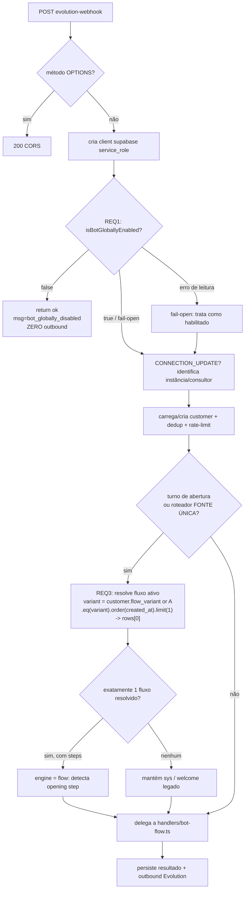

# Design Document

## Overview

Este design implementa, de forma **enxuta e cirúrgica**, os 5 requisitos funcionais (mais o grupo transversal de processo) necessários para tornar o canal **Evolution** seguro para o onboarding de **novos consultores** — cada um conectando sua própria instância via QR code — **sem perturbar a operação atual do Rafael no Whapi**.

O trabalho é organizado em **5 workstreams independentes e reversíveis**, ordenados do **menor para o maior raio de impacto (blast-radius)**. Cada workstream que toca banco, política RLS ou webhook é **gated por backup prévio + aprovação humana explícita** e **não é auto-aplicável**.

Ordem de execução (baixo → alto blast-radius):

1. **REQ 1 — Kill switch global no Evolution** (apenas edge function; espelha o Whapi; fail-open). Adiciona uma rede de segurança sem alterar caminho-feliz.
2. **REQ 3 — Resolução de fluxo ativo robusta** (apenas edge function; espelha a seleção determinística por variante já usada no Whapi). Corrige degradação silenciosa quando há múltiplos fluxos ativos.
3. **REQ 2 — Consultor novo nasce na variante padrão D** (1 migração focada em `seed_default_camila_flow` + default de `active_variants`; **não muta as linhas do Rafael**).
4. **REQ 5 — Guarda IDOR em 5 edge functions service_role** (1 helper compartilhado novo + 1 segredo de ambiente; preserva a chamada interna `evolution-webhook → ai-agent-router`).
5. **REQ 4 — `WITH CHECK` no UPDATE de `customers`** (1 migração focada DROP/CREATE de uma política RLS; maior blast-radius porque um erro pode bloquear updates legítimos).

Princípios aplicados em todos os workstreams:

- **Necessário e barato primeiro** — só entra o que impede quebra/mau comportamento no Evolution.
- **Isolamento multi-tenant preservado** — nenhuma mudança pode permitir que um consultor leia/altere dados de outro.
- **Reversibilidade** — toda mudança de banco/RLS é uma migração única com rollback documentado; toda mudança de webhook é revertível por redeploy do artefato anterior.
- **Sem regressão no Whapi** — mudanças de webhook validadas no Evolution e confirmadas como não-regressivas no Whapi (canal A/B/D do Rafael) antes do rollout.
- **Consistência com o spec arquivado** — o helper de autorização (`_shared/caller-auth.ts`, segredo `SERVICE_SHARED_SECRET`, header `x-service-secret`) usa exatamente os mesmos nomes descritos no design arquivado `security-hardening-lgpd`, para que aquele spec possa reaproveitá-lo sem retrabalho.

## Architecture

### Mapa Requisito → mudança

| Req | Arquivos / funções | Abordagem | Migração / segredo | Rollback | Blast-radius |
|-----|--------------------|-----------|--------------------|----------|--------------|
| **1 — Kill switch Evolution** | `supabase/functions/evolution-webhook/index.ts` (topo do handler, após criação do client supabase, antes do parsing/bot); reusa `supabase/functions/_shared/bot/global-flag.ts` | Inserir a guarda `isBotGloballyEnabled(supabase)` espelhando o Whapi (~linha 62). Se `false` → retorna `{ ok: true, msg: "bot_globally_disabled" }` sem outbound. Fail-open no erro de leitura. **Reusa o helper existente — não cria novo.** | Nenhuma migração; nenhum segredo | Remover a guarda (redeploy do artefato anterior) | **Baixo** — adiciona um early-return; caminho-feliz inalterado |
| **3 — Resolução de fluxo robusta** | `supabase/functions/evolution-webhook/index.ts` (~linhas 1052–1057 bloco `isOpeningTurn` e ~1300–1305 bloco "FONTE ÚNICA DE VERDADE") | Substituir `.eq("is_active",true).maybeSingle()` por seleção determinística: derivar `variant = customer.flow_variant || "A"`, filtrar `.eq("variant", variant).order("created_at",{ascending:true}).limit(1)` e tomar `rows[0]`. Espelha o Whapi (~linha 1445). Apenas código de edge function. | Nenhuma migração; nenhum segredo | Reverter os 2 blocos (redeploy anterior) | **Baixo/Médio** — só código; precisa não regredir consultor de 1 fluxo |
| **2 — Variante padrão D** | `public.seed_default_camila_flow(_consultant_id)`; default de `public.consultants.active_variants` | 1 migração focada: (a) `seed_default_camila_flow` cria o `bot_flow` com `variant = 'D'`; (b) novos consultores nascem com `active_variants` incluindo `'D'`. **Single source of truth no seed/trigger** para evitar drift. Escopo: **apenas novas inserções** — não toca linhas do Rafael. | 1 migração (`CREATE OR REPLACE FUNCTION` + `ALTER COLUMN ... SET DEFAULT`) | Restaura o corpo anterior do seed e o default anterior (`ARRAY['A']`) | **Médio** — toca função de provisionamento; mitigado por escopo "novos apenas" |
| **5 — Guarda IDOR (service_role)** | Novo `supabase/functions/_shared/caller-auth.ts`; aplicado em `capture-extract`, `upload-documents-minio`, `ai-agent-router`, `ai-sales-agent`, `facebook-capi` | Helper `resolveCaller` (modo `jwt` via `anonClient.auth.getUser` + `has_role`; modo `service` via header `x-service-secret` em tempo constante; senão 401) + `assertOwnership` (admin ok; divergência → 403; ausente/malformado/inexistente → 400; modo `service` dispensa posse). Chamada interna `evolution-webhook → ai-agent-router` passa o segredo de serviço. | Segredo de ambiente `SERVICE_SHARED_SECRET` (header `x-service-secret`) | Redeploy do artefato anterior das 5 funções; desprovisionar segredo | **Médio** — toca 5 funções de produção; mitigado preservando chamadas legítimas |
| **4 — `WITH CHECK` em customers** | RLS de `public.customers`, política `Owner update customers` | 1 migração focada DROP/CREATE: mantém `USING (consultant_id = auth.uid())` e adiciona `WITH CHECK (consultant_id = auth.uid())`. **Todas as outras políticas preservadas intactas** (inclusive `Assigned consultant update customers`). | 1 migração; backup de `pg_policy` antes | Recriar a política sem `WITH CHECK` | **Alto** — erro de política pode bloquear updates legítimos |

### Fluxo de decisão do evolution-webhook (onde entram as correções)

O diagrama mostra os dois pontos tocados por este spec: a **guarda do kill switch (REQ 1)** no topo e a **resolução determinística de fluxo (REQ 3)** nos dois sites de `bot_flows`.



Observações de arquitetura:

- A guarda do kill switch (REQ 1) fica **antes** da guarda já existente de `isConsultantAIDisabled` (que é por consultor). São complementares: o kill switch é **global**; o `isConsultantAIDisabled` é **por consultor**.
- A correção de REQ 3 **não** cria DB novo: reaproveita o conceito já comprovado no Whapi (e disponível em `_shared/resolve-flow.ts` via `resolveFlowId`, que já filtra por variante com `limit(1)`).
- A constraint parcial `uniq_bot_flows_active_per_consultant_variant` (verificada: `UNIQUE (consultant_id, variant) WHERE is_active`) garante **no máximo 1 fluxo ativo por (consultor, variante)** — portanto a seleção `.eq(variant).limit(1)` é determinística por construção e nunca pode lançar "multiple rows".

## Components and Interfaces

### REQ 1 — Guarda do kill switch no evolution-webhook

Ponto de inserção: no início do `try` do `Deno.serve`, **logo após** `const supabase = createClient(...)` e **antes** do `await req.json()` / processamento. Espelha `whapi-webhook/index.ts` ~linha 62.

Comportamento (pseudo-contrato, sem código final):

```
// após criar o client supabase service_role, antes de parsear o corpo
if (!(await isBotGloballyEnabled(supabase as any))) {
  // log neutro
  return Response(JSON { ok: true, msg: "bot_globally_disabled" }, 200, corsHeaders)
}
// segue o processamento normal
```

- `isBotGloballyEnabled` já implementa **fail-open** internamente (try/catch retornando `true`) e cache de 5s — **reusar como está**, sem novo helper.
- O `as any` segue o mesmo workaround de pinning de tipos já usado no arquivo (comentado em `isConsultantAIDisabled`).

### REQ 3 — Resolução determinística de fluxo ativo (2 sites)

**Site A — bloco `isOpeningTurn`** (`evolution-webhook/index.ts` ~linhas 1052–1057). Hoje:

```
const { data: activeFlow } = await supabase
  .from("bot_flows").select("id")
  .eq("consultant_id", instanceData.consultant_id)
  .eq("is_active", true)
  .maybeSingle();              // ← lança com múltiplos fluxos ativos
const flowId = (activeFlow as any)?.id ?? null;
```

**Site B — bloco "FONTE ÚNICA DE VERDADE"** (`evolution-webhook/index.ts` ~linhas 1300–1305). Padrão idêntico ao Site A.

Edição proposta para **ambos** os sites (espelha Whapi ~1445):

```
const variant = (customer as any)?.flow_variant || "A";   // default 'A' já é o padrão do código
const { data: activeFlows } = await supabase
  .from("bot_flows").select("id")
  .eq("consultant_id", instanceData.consultant_id)
  .eq("is_active", true)
  .eq("variant", variant)
  .order("created_at", { ascending: true })
  .limit(1);
const activeFlow = activeFlows?.[0] || null;
const flowId = (activeFlow as any)?.id ?? null;
```

- **Determinismo:** `.eq("variant", variant).limit(1)` + `order("created_at")` retorna **no máximo uma linha** e **nunca lança**, para 0, 1 ou N fluxos ativos.
- **Não-regressão de consultor com 1 fluxo:** se o consultor tem só 1 fluxo ativo na variante do cliente, ele é resolvido normalmente; se o único fluxo ativo está em variante diferente da do cliente, o comportamento passa a ser consistente com o Whapi (resolve pela variante do cliente).
- **Sem mudança de DB.** Opcionalmente, ambos os sites podem delegar a `resolveFlowId(supabase, consultantId, variant)` de `_shared/resolve-flow.ts`, que já encapsula exatamente essa lógica (próprio → público → legado). A decisão entre inline (espelho fiel do Whapi) vs. helper compartilhado fica registrada nas tasks; o design recomenda o **espelho inline** nos dois sites para manter paridade 1:1 com o Whapi e minimizar a superfície de mudança.

### REQ 2 — Mudança no seed/provisionamento

`public.seed_default_camila_flow(_consultant_id uuid)` hoje insere o fluxo **sem** `variant` (logo, default `'A'`):

```
INSERT INTO public.bot_flows (consultant_id, name, is_active, strict_mode)
VALUES (_consultant_id, 'Fluxo da Camila', true, false)
```

Mudança proposta (incluir `variant`):

```
INSERT INTO public.bot_flows (consultant_id, name, variant, is_active, strict_mode)
VALUES (_consultant_id, 'Fluxo da Camila', 'D', true, false)
```

- O `SELECT ... reutiliza fluxo ativo existente` no topo da função permanece — preserva idempotência (re-chamada para o mesmo consultor não duplica).
- A constraint `uniq_bot_flows_active_per_consultant_variant` é respeitada: um consultor novo terá 1 fluxo ativo na variante `'D'`.
- `seed_camila_flow_on_consultant_insert` (trigger `trg_seed_camila_flow`) chama a função no insert — **sem alteração** no trigger.

### REQ 5 — Helper `_shared/caller-auth.ts` (assinaturas)

Novo módulo `supabase/functions/_shared/caller-auth.ts`. Assinaturas (contrato; implementação nas tasks):

```ts
type Caller =
  | { mode: "jwt"; consultantId: string; isAdmin: boolean }
  | { mode: "service" };

// 401 → retorna Response pronta (sem efeito colateral)
async function resolveCaller(
  req: Request,
  admin: SupabaseClient,            // client service_role
): Promise<Caller | Response>;

// ok → null; falha → Response 400/403 pronta
async function assertOwnership(
  caller: Caller,
  target: { consultantId?: string; customerId?: string },
  admin: SupabaseClient,
): Promise<null | Response>;
```

Semântica:

- `resolveCaller`:
  - Header `x-service-secret` presente e **igual** a `SERVICE_SHARED_SECRET` (comparação em **tempo constante**) → `{ mode: "service" }`.
  - Senão, `Authorization: Bearer <jwt>` válido via `anonClient.auth.getUser(token)` → `{ mode: "jwt", consultantId: user.id, isAdmin: has_role(user.id,'admin') }`.
  - Senão → `Response 401` (sem efeito colateral).
- `assertOwnership`:
  - `caller.mode === "service"` → `null` (dispensa posse — caso da chamada interna `evolution-webhook → ai-agent-router`).
  - `caller.isAdmin` → `null`.
  - `target.customerId` informado → busca `customers.consultant_id` por id (via `admin`); inexistente/malformado → `400`; pertence a outro consultor → `403`; bate com `caller.consultantId` → `null`.
  - `target.consultantId` informado → diverge de `caller.consultantId` → `403`; ausente/malformado → `400`; igual → `null`.

Aplicação nas 5 funções (todas `verify_jwt=false`, service_role): no topo do handler, `const caller = await resolveCaller(req, admin); if (caller instanceof Response) return caller;` seguido de `const deny = await assertOwnership(caller, {...}, admin); if (deny) return deny;` **antes** de qualquer leitura/gravação/efeito colateral. Para `ai-agent-router`, o `evolution-webhook` passa a enviar `x-service-secret: SERVICE_SHARED_SECRET` na invocação interna.

### REQ 4 — Mudança de política RLS (interface DDL)

Política `Owner update customers` em `public.customers` (role `authenticated`), hoje `USING (consultant_id = auth.uid())`, `WITH CHECK = NULL`. A mudança DROP/CREATE adiciona `WITH CHECK (consultant_id = auth.uid())` mantendo o `USING`. Detalhe DDL em Data Models.

## Data Models

Nenhuma tabela nova. Nenhuma coluna nova. Apenas: (1) corpo da função de seed; (2) default de coluna; (3) uma política RLS.

### REQ 2 — Seed + default de `active_variants`

Estado verificado:

- `public.consultants.active_variants` default `ARRAY['A'::text]`.
- `public.bot_flows.variant` default `'A'::text`.
- `seed_default_camila_flow` insere sem `variant` (→ `'A'`).

Migração focada (1 arquivo), abordagem precisa (sem código final):

1. `CREATE OR REPLACE FUNCTION public.seed_default_camila_flow(...)` idêntica à atual, **alterando apenas** o `INSERT INTO public.bot_flows` para incluir `variant => 'D'`. Mantém o `SELECT` de reuso (idempotência) e os 6 `bot_flow_steps` inalterados.
2. `ALTER TABLE public.consultants ALTER COLUMN active_variants SET DEFAULT ARRAY['D'::text];` — afeta **apenas novas inserções**; não reescreve linhas existentes.
3. **Não** alterar o default de `bot_flows.variant` (a fonte de verdade do provisionamento é o seed; mudar o default da coluna criaria drift com inserts manuais/UI). Registrar isso como decisão de design.

Decisão **default de coluna vs. seed/trigger**: a fonte única de verdade do provisionamento é a função `seed_default_camila_flow` (chamada pelo trigger no insert). O `active_variants` precisa de default de coluna porque é gravado na própria linha de `consultants` (não há seed que o defina). Para `bot_flows.variant`, deixamos o seed gravar `'D'` explicitamente em vez de mudar o default da coluna, evitando que inserts fora do seed mudem de comportamento silenciosamente.

Escopo "novos apenas" / Rafael preservado:

- O bloco `DO $$ ... seed_default_camila_flow(r.id) ... $$` que existia na migração original (backfill de todos os consultores) **não** é replicado nesta migração — só a definição da função muda. Rafael já tem seus fluxos A/B/D ativos e a função, ao ser chamada para ele, encontra fluxo ativo no `SELECT` inicial e **retorna sem inserir** (idempotência). Nenhuma linha existente é alterada.

Rollback: restaurar o corpo anterior da função (sem `variant` no insert) e `ALTER COLUMN active_variants SET DEFAULT ARRAY['A'::text]`.

### REQ 4 — `WITH CHECK` em `Owner update customers`

Estado verificado das políticas de `public.customers` (todas preservadas, exceto a recriação de `Owner update customers`):

| Política | cmd | role | USING | WITH CHECK |
|----------|-----|------|-------|------------|
| Owner select customers | SELECT | authenticated | `consultant_id = auth.uid()` | — |
| Admins read all customers | SELECT | authenticated | `has_role(auth.uid(),'admin')` | — |
| Leader reads team customers | SELECT | authenticated | `is_team_member(auth.uid(),consultant_id)` | — |
| managers can read customers | SELECT | public | `can_view_consultant(auth.uid(),consultant_id)` | — |
| Assigned consultant select customers | SELECT | public | `assigned_consultant_id = auth.uid()` | — |
| Owner insert customers | INSERT | authenticated | — | `consultant_id = auth.uid()` |
| Owner delete customers | DELETE | authenticated | `consultant_id = auth.uid()` | — |
| Assigned consultant update customers | UPDATE | public | `assigned_consultant_id = auth.uid()` | `assigned_consultant_id = auth.uid()` |
| **Owner update customers** | **UPDATE** | **authenticated** | `consultant_id = auth.uid()` | **NULL → alvo da mudança** |

Migração focada (1 arquivo), abordagem DDL (sem código final):

```
-- backup das definições via pg_policy ANTES (anexar ao PR/rollback)
DROP POLICY "Owner update customers" ON public.customers;
CREATE POLICY "Owner update customers" ON public.customers
  FOR UPDATE TO authenticated
  USING (consultant_id = auth.uid())
  WITH CHECK (consultant_id = auth.uid());
```

- A política `Assigned consultant update customers` (`assigned_consultant_id = auth.uid()`) **permanece como está** — atende ao caso do consultor designado.
- Nenhuma outra política é tocada; acesso de admin/líder/manager preservado.
- Rollback: recriar `Owner update customers` sem a cláusula `WITH CHECK`.
- **Aprovação humana explícita** e **não auto-aplicável** (não usar `apply_migration` sem o sinal verde do operador).

## Correctness Properties

*Uma propriedade é uma característica ou comportamento que deve valer em todas as execuções válidas do sistema — essencialmente, uma afirmação formal sobre o que o sistema deve fazer. Propriedades são a ponte entre a especificação legível por humanos e garantias de correção verificáveis por máquina.*

As propriedades abaixo derivam do prework. Itens de processo (6.x), parida estrutural (1.4) e higiene de segredo (5.8) não são propriedades computáveis e são cobertos por smoke/checklist. As correções de webhook (P1, P2) e as guardas de auth (P5, P6) são lógica pura e ideais para PBT; P3 e P4 são invariantes nítidas executadas via banco isolado (integração).

### Property 1: Kill switch desliga todo outbound no Evolution

*Para qualquer* evento de entrada do evolution-webhook, quando o gate global resolve como desabilitado (`bot_global_enabled=false`), o número de envios outbound é exatamente zero e a resposta é um sucesso neutro; e quando a leitura da flag falha, o gate resolve como **habilitado** (fail-open).

**Validates: Requirements 1.1, 1.3**

### Property 2: Resolução de fluxo é determinística, única e nunca lança

*Para qualquer* conjunto de fluxos ativos de um consultor (0, 1 ou N, em quaisquer variantes e ordens de `created_at`) e qualquer variante do cliente, o seletor de fluxo ativo retorna **no máximo um** fluxo, **nunca lança**, é **invariante à permutação** da entrada, e seleciona o fluxo de menor `created_at` dentre os que casam com a variante do cliente — coincidindo com o seletor de referência do whapi-webhook para as mesmas entradas.

**Validates: Requirements 3.1, 3.2, 3.4**

### Property 3: Consultor novo nasce provisionado na variante D

*Para qualquer* consultor recém-criado, após o provisionamento (trigger → `seed_default_camila_flow`), existe exatamente um `bot_flow` ativo com `variant = 'D'` para esse consultor e `consultants.active_variants` inclui `'D'`; re-executar o seed para o mesmo consultor não cria fluxo adicional (idempotência) e não altera linhas de consultores pré-existentes.

**Validates: Requirements 2.1, 2.2, 2.3**

### Property 4: UPDATE em customers não pode reatribuir consultant_id

*Para qualquer* tentativa de UPDATE em `public.customers` por um consultor autenticado, a operação só é aceita se o `consultant_id` resultante permanecer igual a `auth.uid()`; qualquer UPDATE que tente definir `consultant_id` para outro consultor é rejeitado, enquanto os acessos de admin, líder e consultor designado permanecem inalterados.

**Validates: Requirements 4.1, 4.2, 4.3**

### Property 5: resolveCaller classifica o chamador corretamente

*Para qualquer* combinação de cabeçalhos de requisição, `resolveCaller` retorna `service` se e somente se o header `x-service-secret` casar com `SERVICE_SHARED_SECRET` (comparação em tempo constante); caso contrário retorna `jwt` se e somente se o `Authorization: Bearer` for um JWT válido (role `authenticated`); caso contrário retorna `401`, sem produzir qualquer efeito colateral.

**Validates: Requirements 5.1, 5.4**

### Property 6: assertOwnership autoriza apenas dono, admin ou serviço

*Para qualquer* chamador e recurso-alvo (`customer_id` e/ou `consultant_id`), `assertOwnership` retorna ok se e somente se o chamador está em modo `service`, OU é admin, OU o recurso pertence ao consultor do chamador; retorna `403` quando o recurso pertence a outro consultor, `400` quando o identificador está ausente, malformado ou inexistente, e em nenhum caso de negação lê ou modifica o recurso.

**Validates: Requirements 5.2, 5.3, 5.5, 5.6**

## Error Handling

- **REQ 1 (kill switch):** a leitura de `app_settings.bot_global_enabled` é **fail-open** (o helper `isBotGloballyEnabled` já captura erro e retorna `true`). Quando desabilitado, retorna `200 { ok: true, msg: "bot_globally_disabled" }` — nunca 5xx — para não fazer o provedor reenviar o evento.
- **REQ 3 (resolução de fluxo):** a seleção com `.limit(1)` + `rows[0]` **elimina a exceção "multiple rows"** que hoje cai no `try/catch` e zera `activeFlow`. O `try/catch` existente é preservado como defesa; em erro residual, mantém o comportamento atual (degradação para `sys`/welcome), sem crash.
- **REQ 2 (seed):** a função mantém o `SELECT` de reuso de fluxo ativo → idempotente; respeita `uniq_bot_flows_active_per_consultant_variant`. Em conflito improvável de unicidade, a transação do insert falha e o provisionamento é reexecutável após correção, sem estado parcial.
- **REQ 5 (auth):** todas as funções retornam respostas de erro **antes de qualquer efeito colateral**: `401` (auth ausente/inválida), `403` (posse divergente), `400` (id ausente/malformado/inexistente). Erros internos inesperados continuam retornando 5xx sem vazar `customer_id`/`consultant_id` em mensagens. Comparação de segredo em **tempo constante** evita timing oracle.
- **REQ 4 (RLS):** se a nova política bloquear um update legítimo (erro de cláusula), o rollback (recriar sem `WITH CHECK`) restaura o comportamento; por isso o backup de `pg_policy` é tirado **antes** e a aplicação é gated por aprovação.

## Testing Strategy

Abordagem dual: **property-based tests** (fast-check + Vitest, ≥100 iterações) para a lógica pura, e **testes de exemplo/integração** (Vitest, Deno test, integração RLS) para infraestrutura, banco e regressão.

Ferramentas confirmadas no repo: `@fast-check/vitest ^0.1.0`, `fast-check ^3.23.0`, `vitest ^3.2.4` (script `test: vitest run`). Edge functions Deno testáveis com `deno test`.

### Property-based tests (≥100 iterações cada)

Cada teste deve referenciar a propriedade do design no formato de tag:
`// Feature: evolution-multiconsultor-pronto, Property {n}: {texto}`

- **P1 — kill switch (lógica pura):** extrair a decisão de gating para uma função pura testável (entrada: estado da flag incluindo o caso de erro; saída: `{enabled, outboundAllowed}`); gerar eventos/flags aleatórios; afirmar zero outbound quando desabilitado e `enabled=true` no ramo de erro. Sender mockado, contador de chamadas = 0.
- **P2 — seletor de fluxo (lógica pura):** o coração da correção. Extrair/colher o seletor (espelho inline do whapi ou `resolveFlowId`) como função pura sobre `(flows[], variant)`; gerar conjuntos com 0/1/N fluxos, variantes e `created_at` aleatórios; afirmar: retorna ≤1, nunca lança, invariante à permutação, escolhe menor `created_at` da variante, e coincide com o seletor de referência (model-based vs. whapi).
- **P5 — resolveCaller (lógica pura):** mockar `auth.getUser` e `has_role`; gerar combinações de header (token presente/ausente/válido/inválido × segredo presente/ausente/correto/incorreto); afirmar a classificação `service`/`jwt`/`401` e ausência de efeito colateral no ramo 401.
- **P6 — assertOwnership (lógica pura):** mockar o lookup de `customers.consultant_id`; gerar pares chamador/alvo (incluindo `service`, admin, dono, outro dono, id ausente/malformado/inexistente); afirmar ok/403/400 conforme a regra e nenhuma mutação nos ramos de negação.

### Testes de exemplo / unidade

- **1.2** flag=true → handler segue além da guarda (1–2 eventos representativos).
- **3.3** fluxo resolvido com steps → opening step = primeiro step ativo por `position`.
- **5.7** por função: 1 chamada JWT legítima (dono) e 1 chamada interna com `x-service-secret` válido seguem funcionando.

### Testes de integração

- **P3 / 2.1–2.4 (seed/variante D):** em banco isolado (PGlite snapshot, como em `flow-diagram-view/migration-15-3-validation.md`, ou branch Supabase): inserir consultor novo → afirmar 1 `bot_flow` ativo `variant='D'` + `active_variants` contém `'D'`; re-chamar seed → idempotente; snapshot das linhas do Rafael pré/pós migração → inalteradas; aplicar rollback → função/coluna restauradas.
- **P4 / 4.1–4.3 (RLS WITH CHECK):** integração com **roles simuladas** (`SET request.jwt.claims` / `set_config('request.jwt.claim.sub', ...)` e `SET ROLE authenticated`): consultor A atualiza própria linha mantendo `consultant_id=A` → sucede; A tenta `consultant_id=B` → rejeitado (0 linhas/erro); admin/líder/assigned mantêm acesso anterior.
- **5.x (edge functions):** `deno test` por função verificando os códigos 401/403/400/200 e a invocação interna webhook→router com segredo.

### Smoke / estático

- **1.4** presença da guarda no topo do evolution-webhook.
- **5.8** segredo lido de `Deno.env`, sem literal no código, sem log do valor.
- **6.x** checklist de rollout (migração única, backup, rollback, aprovação humana).

### Nota dual-channel (validação obrigatória)

Toda mudança de webhook (REQ 1 e REQ 3) deve ser **validada no canal Evolution** e ter **ausência de regressão confirmada no Whapi** antes do rollout. Especificamente: rodar um lead de ponta a ponta numa instância Evolution de teste (kill switch on/off; consultor com 1 fluxo e com múltiplos fluxos), e confirmar que o canal Whapi do Rafael (variantes A/B/D) continua resolvendo fluxo e respondendo idêntico ao baseline (o seletor de P2 é o mesmo já usado no Whapi, então a paridade é estrutural, mas a validação manual/end-to-end é obrigatória).

## Rollout & Rollback

Ordem de aplicação (baixo → alto blast-radius), cada passo **gated por aprovação humana** e **não auto-aplicável**:

1. **REQ 1 — Kill switch Evolution** (edge function). Backup: artefato anterior da função. Rollback: redeploy anterior. Validar: flag off → zero outbound; flag on → fluxo normal; Whapi inalterado.
2. **REQ 3 — Resolução de fluxo** (edge function). Backup: artefato anterior. Rollback: redeploy anterior. Validar: consultor 1-fluxo resolve; consultor N-fluxos resolve 1 determinístico; Whapi inalterado.
3. **REQ 2 — Variante D** (1 migração). Backup: `pg_get_functiondef('seed_default_camila_flow')` + default atual de `active_variants`. Rollback: restaurar corpo da função (sem `variant` no insert) e `SET DEFAULT ARRAY['A']`. Validar em banco isolado antes; checar Rafael inalterado (idempotência).
4. **REQ 5 — Guarda IDOR** (helper + 5 funções + segredo). Backup: artefatos anteriores das 5 funções. Pré-requisito: provisionar `SERVICE_SHARED_SECRET` e configurar a chamada interna webhook→router. Rollback: redeploy anterior das 5 funções; desprovisionar segredo. Validar: 401/403/400/200 e chamada interna ok.
5. **REQ 4 — WITH CHECK customers** (1 migração RLS). Backup: definições via `pg_policy` (todas as políticas de `customers`). Rollback: recriar `Owner update customers` sem `WITH CHECK`. Validar com roles simuladas antes do rollout.

Itens que **exigem backup prévio**: REQ 2 (definição da função + default), REQ 4 (definições `pg_policy`), REQ 5 (artefatos das funções + registro do segredo), REQ 1 e REQ 3 (artefatos das funções para redeploy).

**Verificação explícita "não perturbar Rafael/Whapi"** (obrigatória em cada passo de webhook e na migração REQ 2):
- REQ 1/REQ 3: nenhum arquivo do `whapi-webhook` é tocado; rodar o baseline do Whapi (A/B/D) e confirmar paridade.
- REQ 2: a migração só altera a definição da função e o default da coluna; **não** re-executa o backfill de todos os consultores; as linhas A/B/D do Rafael permanecem byte-idênticas (idempotência do seed garante no-op para quem já tem fluxo ativo).
- REQ 4/REQ 5: isolamento multi-tenant preservado; nenhuma política/segredo afeta o caminho do Whapi.
