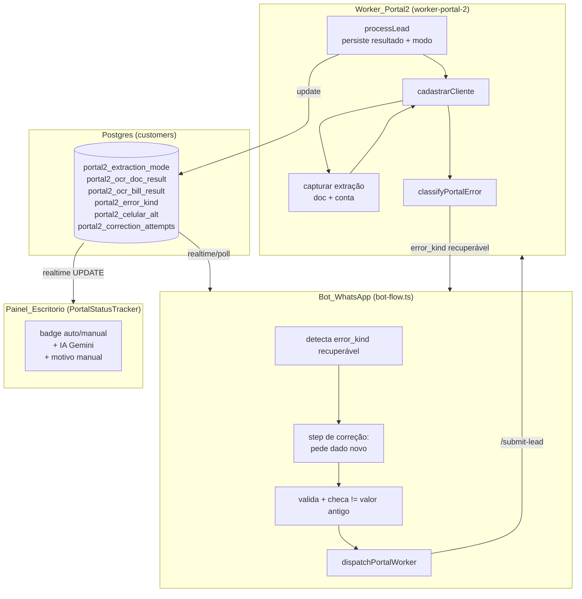
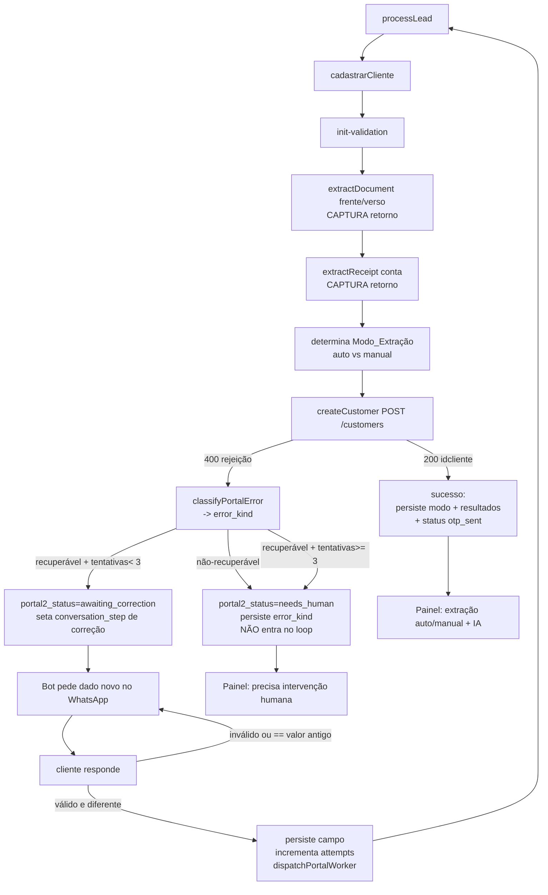
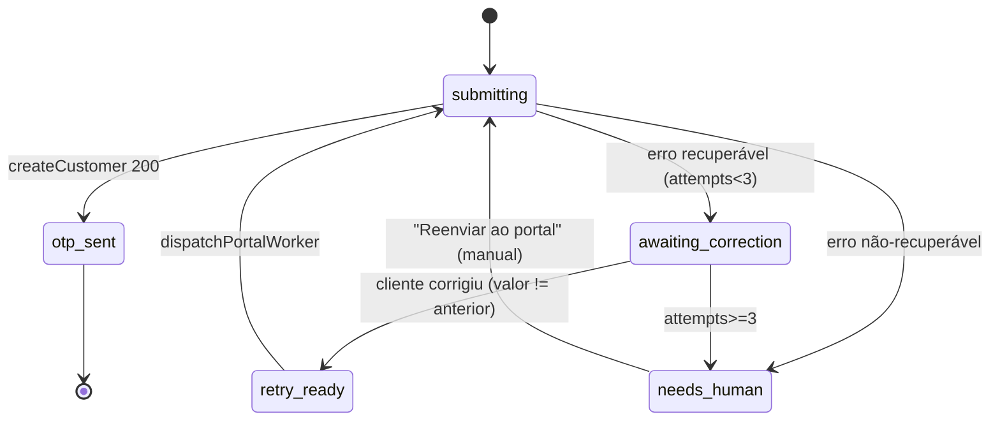

# Design Document

## Overview

Este documento traduz os 12 requisitos aprovados em `requirements.md` num plano técnico de implementação para fechar o ciclo de cadastro automático no **Portal 2** (iGreen / autoconexao). Ele descreve com exatidão *onde* e *como* cada mudança será feita, sem ainda escrever o código final.

A feature ataca as três lacunas verificadas e tem **três objetivos encadeados**:

- **(A) Caminho feliz — extração aceita automaticamente.** Capturar o retorno dos extractors da IA do Portal 2 (`extract-document` + `extract-receipt`), que hoje é descartado, e classificar o cadastro como `auto` (a IA leu tudo) ou `manual` (caiu no preenchimento manual).
- **(B) Observabilidade no escritório.** Persistir o resultado da extração (com PII mascarada) e exibir no `PortalStatusTracker` se foi `auto`/`manual`, se a nossa IA (Gemini) analisou, e o motivo quando cair em manual.
- **(C) Loop de correção via WhatsApp.** Classificar a rejeição do `POST /customers` em uma `Classe_de_Erro`; para erros recuperáveis (telefone/email/instalação), pedir o dado novo ao cliente, substituir e re-despachar — sem repetir o valor errado e com limite de tentativas. Erros não-recuperáveis vão para intervenção humana.

### Princípio organizador: 4 planos, mudança incremental sobre padrões existentes

A feature toca quatro planos do sistema. **Nada é reinventado** — cada plano estende um mecanismo que já existe e está comprovado no repositório:

1. **Worker (`worker-portal-2/`)** — captura da extração, classificação de erro e priorização do celular alternativo. Estende `cadastrarCliente` (`portal2-api-client.mjs`) e `processLead` (`server.mjs`).
2. **Banco (`customers` + migração)** — novas colunas `portal2_*`, seguindo o padrão da migração `20260526230001_portal2_routing_and_state.sql`.
3. **Bot (`bot-flow.ts` evolution + whapi)** — novos `conversation_step` de correção, espelhando o caso já existente de auto-correção de consumo no step `portal_submitting`.
4. **Painel (`PortalStatusTracker.tsx`)** — novos indicadores `auto`/`manual` + estado da IA_Gemini, reaproveitando o subscribe realtime já existente.

### Postura: extração nunca bloqueia o cadastro

Princípio derivado dos Requisitos 1.6 e 3: a captura/classificação da extração é **observacional** — informa o `Modo_Extração` e alimenta o histórico, mas **não** impede a criação do cliente. O gate de bloqueio continua sendo apenas a ausência física de documentos (`ensureDocumentsAttachedAndGate`, já existente). O loop de correção é acionado apenas pela **rejeição do `POST /customers`**, não pelo resultado dos extractors.

### Fatos de base verificados no código (ground truth)

- `worker-portal-2/portal2-api-client.mjs#cadastrarCliente`: hoje faz `await this.extractDocument(...)` (frente + verso) e `await this.extractReceipt(...)` descartando o retorno; só em exceção HTTP chama `manualFallback`. O `createCustomer(payload).catch(...)` já extrai `e.body.errors/details` e anexa `| detail=...` à `e.message`.
- O fix de campo `files` (extract-document) já foi aplicado — a extração da IA do Portal 2 agora roda de verdade.
- Schema real dos extractors (capturado em chamadas reais, documentado em `docs/portal-api/PORTAL2_EXTRACTOR_VEREDITO.md`):
  - documento → `{ success, data:{nome,cpf,data_nascimento,validade,tipo_documento,...}, error, corrections, idsolcontratovalidacao }`
  - conta → `{ success, data:{...}, error, corrections, matched, is_authentic, rejection_reason, cross_validation, idsolcontratovalidacao }`
- `worker-portal-2/server.mjs#processLead`: no sucesso grava `portal2_status='created'→'otp_sent'`, `status='awaiting_otp'`, `conversation_step='aguardando_otp'`; no catch grava `portal2_status='failed'`+`portal2_error` e **re-lança** (retry BullMQ `attempts:3`).
- `worker-portal-2/ai-audit.mjs#sanitize`: já mascara CPF/documento (4 últimos dígitos) e omite `bill_base64`/`document_front_base64`/`fileB64`/`buffer`. É o padrão de mascaramento reutilizado.
- `supabase/functions/_shared/portal-worker.ts#buildPortal2Payload`: monta `dados.whatsapp = c.phone_whatsapp`. O worker faz `celular: formatPhone(d.whatsapp)` em `montarPayloadCadastro`.
- `supabase/functions/evolution-webhook/handlers/bot-flow.ts`: step `portal_submitting` já detecta erro "Consumo médio não informado" → recalcula `media_consumo` → `dispatchPortalWorker`. Steps `ask_phone`/`ask_email`/`ask_installation_number` já validam entrada; `ask_phone` grava `phone_landline` (nunca `phone_whatsapp`).
- `src/components/captacao/PortalStatusTracker.tsx`: subscribe realtime em `customers` (UPDATE) + `portal2_audit_traces` (INSERT); `friendlyPortalError` traduz duplicate phone/cpf/email e "nenhuma cobertura ativa".
- Tabela `customers` (1013 linhas) já tem `portal2_status/error/idcliente/idsolcontratovalidacao/...`, `ocr_done`, `ocr_confianca`, `phone_whatsapp` (única), `phone_landline`, `email`, `numero_instalacao`.

## Architecture

### Visão de alto nível



### Fluxo end-to-end (caminho feliz + loop de correção)



### Tabela de rastreabilidade: Requisito → mudança

| Req | Arquivos / objetos afetados | Abordagem | Risco |
|-----|------------------------------|-----------|-------|
| **1 — Capturar extração doc** | `worker-portal-2/portal2-api-client.mjs` (`cadastrarCliente`) | Guardar retorno de `extractDocument` (frente+verso) em variáveis locais; derivar `docExtraction = {success, mode, error, corrections}`. Mantém `manualFallback` em exceção. | Baixo — leitura adicional, não muda decisão |
| **2 — Capturar extração conta** | `worker-portal-2/portal2-api-client.mjs` (`cadastrarCliente`) | Idem para `extractReceipt`; inclui `is_authentic`/`rejection_reason`. Respeita `billAlreadyExtracted`. | Baixo |
| **3 — Modo_Extração** | `portal2-api-client.mjs` (retorno de `cadastrarCliente`) + `server.mjs` (`processLead`) | `cadastrarCliente` retorna também `{extraction:{mode, doc, bill}}`; `processLead` persiste `portal2_extraction_mode`. | Baixo |
| **4 — Persistir resultado** | `server.mjs` (`processLead`), reusa `ai-audit.mjs#sanitize` | Gravar `portal2_ocr_doc_result`/`portal2_ocr_bill_result` (sanitizados) best-effort; incluir no `portal2_audit_traces`. | Baixo |
| **5 — Painel auto/manual + IA** | `src/components/captacao/PortalStatusTracker.tsx` | Estender `select` e `Row`; novos badges; reusa subscribe realtime. | Baixo — UI |
| **6 — Classificar erro** | novo `worker-portal-2/portal-errors.mjs`; usado em `portal2-api-client.mjs`/`server.mjs` | `classifyPortalError(message)` → `{kind, recoverable}`. Persistir `portal2_error_kind`. | Médio — afeta roteamento do loop |
| **7 — Loop de correção** | `bot-flow.ts` (evolution + whapi), `_shared/portal-worker.ts` | Novos steps `corrigir_*`; ao receber valor válido, persiste + `dispatchPortalWorker`. Espelha caso do consumo. | **Alto** — fluxo de conversa ativo |
| **8 — Celular alternativo** | migração + `_shared/portal-worker.ts#buildPortal2Payload` + `server.mjs#fetchDadosFromSupabase` | `buildPortal2Payload` usa `portal2_celular_alt ?? phone_whatsapp` como `whatsapp`. Nunca toca `phone_whatsapp`. | Médio |
| **9 — Anti-loop** | migração (`portal2_correction_attempts jsonb`), `bot-flow.ts` | Comparação normalizada valor novo≠antigo; contador por classe; limite 3. | Médio |
| **10 — Intervenção humana** | `server.mjs`, `bot-flow.ts`, `PortalStatusTracker.tsx` | `portal2_status='needs_human'`; painel exibe banner + mantém "Reenviar". | Médio |
| **11 — Migração** | nova migração `supabase/migrations/` | `ADD COLUMN IF NOT EXISTS` (anuláveis), CHECK em `portal2_extraction_mode`. Aprovação humana. | **Alto** — DDL em tabela quente |
| **12 — LGPD/PII** | `ai-audit.mjs#sanitize` (reuso), `server.mjs`, `bot-flow.ts` | Mascarar antes de persistir/logar; celular alt tratado como telefone. | Médio |

### Princípio de roteamento do loop (Req 6, 7, 9, 10)

```mermaid
flowchart TD
    R[rejeição POST /customers\nmensagem detalhada] --> CL[classifyPortalError]
    CL --> K{kind}
    K -->|duplicate_document\nno_coverage\nunknown| NR[NÃO recuperável\nstatus=needs_human]
    K -->|duplicate_phone\nduplicate_email\nduplicate_installation\nmissing_consumo| REC{attempts[kind] < 3?}
    REC -->|não| NR
    REC -->|sim| MAP[mapeia kind -> step + campo]
    MAP --> STEP[conversation_step:\ncorrigir_celular_portal\ncorrigir_email\ncorrigir_instalacao]
```

## Components and Interfaces

### 1. `worker-portal-2/portal-errors.mjs` (novo — Req 6)

Módulo puro (sem I/O) com a classificação determinística. Isolado para ser testável e reaproveitado por `portal2-api-client.mjs` e `server.mjs`.

```text
// Conjunto fechado de classes (glossário)
ERROR_KINDS = {
  duplicate_phone:        { recoverable: true,  field: 'celular' },
  duplicate_email:        { recoverable: true,  field: 'email' },
  duplicate_installation: { recoverable: true,  field: 'numero_instalacao' },
  missing_consumo:        { recoverable: true,  field: 'media_consumo' },
  duplicate_document:     { recoverable: false },
  no_coverage:            { recoverable: false },
  unknown:                { recoverable: false },
}

classifyPortalError(message: string): { kind: string, recoverable: boolean }
```

Regras (Req 6.1–6.10), aplicadas sobre `message` em case-insensitive, com **precedência das não-recuperáveis** (Req 6.10):

1. `duplicateDocument` ou ("cpf"/"documento" + "já"/"existe") → `duplicate_document`.
2. "nenhuma cobertura ativa" / "não atendida" / "sem regra ativa" → `no_coverage`.
3. `duplicatePhone` ou ("celular"/"telefone" + "já"/"existe") → `duplicate_phone`.
4. `duplicateEmail` ou ("email"/"e-mail" + "já"/"existe") → `duplicate_email`.
5. "instala" + ("já"/"existe"/"inválid"/"duplicad") ou rejeição de `check-installation` → `duplicate_installation`.
6. "consumo médio não informado" → `missing_consumo`.
7. nenhum match → `unknown`.

A ordem de avaliação coloca os não-recuperáveis (1–2) antes dos recuperáveis (3–6), garantindo determinismo quando a mensagem casa com mais de uma classe.

### 2. `worker-portal-2/portal2-api-client.mjs#cadastrarCliente` (Req 1, 2, 3)

Mudança cirúrgica: deixar de descartar o retorno dos extractors. Hoje:

```text
await this.extractDocument({...});   // retorno ignorado
await this.extractReceipt({...});    // retorno ignorado
```

Passa a:

```text
const docResp = await this.extractDocument({...}).catch(e => { manualFallback(...); return { __transport_error: e.message }; });
// idem docBackResp (RG) e billResp

const extraction = buildExtractionResult({ docResp, docBackResp, billResp, isCnh, billAlreadyExtracted });
// extraction = {
//   mode: 'auto' | 'manual',
//   doc:  { success, mode, error, corrections },
//   bill: { success, mode, error, corrections, is_authentic, rejection_reason },
// }
```

- **Determinação do modo** (Req 1.2/1.3/1.5, 2.2/2.3): documento é `auto` quando frente (e verso, se RG) têm `success===true` e sem `error`; conta é `auto` quando `success===true && is_authentic===true && !error`. Objeto nulo/vazio/sem `success` → `manual`. `__transport_error` → `manual` + `manualFallback` (já disparado no catch).
- **Modo do cadastro** (Req 3.1/3.2): `auto` somente se documento e conta forem ambos `auto`; senão `manual`.
- **`billAlreadyExtracted=true`** (Req 2.5): não chama `extractReceipt`; usa o resultado já registrado pelo `server.mjs` (ver `_buildDadosObject`), preservando-o.
- **Não bloqueia** (Req 1.6): segue para `createCustomer` independentemente do modo.

`cadastrarCliente` passa a retornar `{ idcliente, idsolcontratovalidacao, extraction }`. Em caso de rejeição do `createCustomer`, o erro propagado carrega `extraction` para o `processLead` persistir o modo mesmo em falha (Req 3.3 — antes do estado terminal).

```text
// no createCustomer.catch, antes de throw:
e.extraction = extraction;
throw e;
```

### 3. `worker-portal-2/server.mjs#processLead` (Req 3, 4, 6, 10, 12)

No bloco de **sucesso**, adicionar ao `updates`:

```text
portal2_extraction_mode: extraction.mode,                  // 'auto' | 'manual'
portal2_ocr_doc_result:  sanitize(extraction.doc),         // PII mascarada
portal2_ocr_bill_result: sanitize(extraction.bill),
```

No bloco de **catch** (rejeição), antes do `throw e` para retry:

```text
const { kind, recoverable } = classifyPortalError(e.message);
const updates = {
  portal2_error: e.message.slice(0, 2000),                 // Req 6.8
  portal2_error_kind: kind,                                // Req 6.1
  portal2_extraction_mode: e.extraction?.mode ?? null,     // Req 3.3
  portal2_ocr_doc_result: e.extraction ? sanitize(e.extraction.doc) : undefined,
  portal2_ocr_bill_result: e.extraction ? sanitize(e.extraction.bill) : undefined,
};
if (!recoverable) {
  updates.portal2_status = 'needs_human';                  // Req 10.1
} else {
  // checa limite de tentativas (Req 9.5/9.6)
  const attempts = (customer.portal2_correction_attempts?.[kind] ?? 0);
  updates.portal2_status = attempts >= 3 ? 'needs_human' : 'awaiting_correction';
}
```

**Decisão de retry BullMQ (importante):** hoje o catch faz `throw e` sempre (3 retries). Para erros **recuperáveis ou não-recuperáveis determinísticos**, repetir o mesmo payload é inútil (e contraria Req 9.1). Logo:

- erro classificado (≠ `unknown` transitório) → **NÃO** re-lança (retorna normalmente); o re-despacho passa a ser responsabilidade do loop de correção / intervenção humana.
- erro de transporte/worker_offline/`unknown` por instabilidade → mantém `throw e` (retry BullMQ é útil).

Toda persistência de resultado de extração é **best-effort** (Req 4.5, 3.6): envolvida em `.then(()=>{},()=>{})`, nunca interrompe o cadastro nem altera o `idcliente`.

A auditoria IA (`runAuditPipeline`) passa a receber `extraction` para incluir modo + motivo no `portal2_audit_traces` (Req 4.4), já sanitizado.

### 4. `_shared/portal-worker.ts#buildPortal2Payload` + `server.mjs#fetchDadosFromSupabase` (Req 8)

Ambos os montadores de payload selecionam o `whatsapp`/`celular`. Regra única (Req 8.3/8.4):

```text
// SELECT passa a incluir portal2_celular_alt
whatsapp: c.portal2_celular_alt || c.phone_whatsapp || ""
```

`phone_whatsapp` **nunca** é alterado (Req 8.6) — só lido. A priorização vale enquanto houver `portal2_celular_alt` preenchido.

### 5. `bot-flow.ts` (evolution + whapi) — loop de correção (Req 7, 8, 9, 10)

#### 5.1 Disparo da correção

Reaproveita o ponto onde o step `portal_submitting` já roda. Generaliza o caso do consumo: ao detectar `portal2_status='awaiting_correction'` (ou `portal2_error_kind` recuperável), mapeia a classe para o step e a mensagem:

| `portal2_error_kind` | `conversation_step` | pergunta ao cliente | campo persistido |
|----------------------|---------------------|---------------------|------------------|
| `duplicate_phone` | `corrigir_celular_portal` | "Esse celular já consta no sistema. Me envia outro número de celular (com DDD) pra concluir." | `portal2_celular_alt` |
| `duplicate_email` | `corrigir_email_portal` | "Esse e-mail já está cadastrado. Me envia um e-mail diferente." | `email` |
| `duplicate_installation` | `corrigir_instalacao_portal` | "O número de instalação não foi aceito. Confere na conta e me envia de novo (7+ dígitos)." | `numero_instalacao` |
| `missing_consumo` | (já tratado no `portal_submitting`) | — | `media_consumo` |

#### 5.2 Handlers dos novos steps

Cada step segue o padrão dos handlers existentes (`ask_phone`/`ask_email`/`ask_installation_number`):

```text
case "corrigir_celular_portal": {
  const digits = onlyDigits(messageText);
  // Req 8.1/8.3 + 9.2: válido e diferente do whatsapp E do valor anterior
  if (digits.length < 10) { reask("Número inválido..."); break; }
  if (digits === onlyDigits(customer.phone_whatsapp)) { reask("Precisa ser um número diferente do atual..."); break; }
  if (sameAsPrevious('duplicate_phone', digits)) { reask("Esse número já foi tentado e recusado. Me envia outro..."); break; }
  updates.portal2_celular_alt = digits;             // NUNCA phone_whatsapp (Req 8.2)
  await persistAndRedispatch(customer, 'duplicate_phone');
  break;
}
```

`corrigir_email_portal` (valida `@` com 1+ char antes/depois, Req 7.2) grava `email`; `corrigir_instalacao_portal` (≥7 dígitos) grava `numero_instalacao`.

#### 5.3 `persistAndRedispatch` (helper local no bot-flow)

```text
async function persistAndRedispatch(customer, kind) {
  // Req 9.3/9.4 — incrementa contador por classe
  const attempts = { ...(customer.portal2_correction_attempts || {}) };
  attempts[kind] = (attempts[kind] || 0) + 1;
  updates.portal2_correction_attempts = attempts;
  updates.portal2_status = 'retry_ready';
  updates.conversation_step = 'portal_submitting';
  updates.portal2_error = null;
  // grava o último valor tentado por classe p/ checagem anti-repetição (5.4)
  // persiste updates...
  await dispatchPortalWorker(supabase, customer.id);   // Despachante existente
}
```

#### 5.4 Anti-repetição (Req 9.1, 9.2)

Para garantir "valor novo ≠ valor rejeitado" sem nova coluna, o **último valor tentado por classe** é derivado do próprio campo persistido no momento da rejeição:

- `duplicate_phone` → compara com `portal2_celular_alt` corrente (ou `phone_whatsapp` na 1ª vez).
- `duplicate_email` → compara com `email` corrente.
- `duplicate_installation` → compara com `numero_instalacao` corrente.

A comparação é **normalizada** (telefone/instalação: só dígitos; email: trim + lowercase) antes de igualar (Req 9.1). Como o re-despacho só ocorre após gravar o novo valor, o valor "anterior" é exatamente o que está no campo quando o cliente responde — então `novo === atual` ⇒ rejeita e re-pergunta (Req 9.2). Isso evita uma coluna extra de histórico para o caso comum; o contador `portal2_correction_attempts` cobre o limite global.

#### 5.5 Guarda de não-recuperável (Req 10.4)

Antes de abrir qualquer step de correção, o bot checa `portal2_error_kind`: se não-recuperável ou `attempts[kind] >= 3`, **não** abre correção — mantém `portal2_status='needs_human'` e não pergunta nada ao cliente.

### 6. `src/components/captacao/PortalStatusTracker.tsx` (Req 5, 10)

Estende a interface `Row` e o `select`:

```text
portal2_extraction_mode, portal2_error_kind, portal2_status,
ocr_done, ocr_confianca,
portal2_ocr_doc_result, portal2_ocr_bill_result
```

Novos elementos visuais (reusa o subscribe realtime já existente em `customers`, Req 5.6):

- **Badge de extração** (Req 5.1/5.2/5.3): `auto` → verde "✅ Extração automática (IA do portal)"; `manual` → âmbar "✋ Preenchimento manual"; nulo/inválido → cinza "⏳ Extração não determinada".
- **Badge IA_Gemini** (Req 5.4/5.5): `ocr_done` → "🤖 IA analisou (confiança {ocr_confianca}%)" ou "confiança indisponível"; senão "IA não analisou".
- **Motivo do manual** (Req 5.7/5.8): quando `mode==='manual'`, lê `rejection_reason` (bill) / `error` (doc) do resultado persistido; se ausente → "motivo não disponível".
- **Banner needs_human** (Req 10.3/10.5): quando `portal2_status==='needs_human'`, banner vermelho com tradução do `portal2_error_kind` (estende `friendlyPortalError` por `error_kind`) + botão "Reenviar ao portal" já existente.
- **Mascaramento** (Req 5.9/12.3): exibe apenas o que vem mascarado do banco; nunca reconstrói PII.

`friendlyPortalError` ganha um mapa por `error_kind` (mais robusto que o match textual atual):

```text
ERROR_KIND_LABELS = {
  duplicate_phone: "Celular já cadastrado no iGreen — pedido número alternativo ao cliente.",
  duplicate_email: "E-mail já cadastrado — pedida correção ao cliente.",
  duplicate_installation: "Nº de instalação recusado — pedida correção ao cliente.",
  duplicate_document: "❌ CPF já cadastrado no iGreen — requer ação manual.",
  no_coverage: "❌ Sem cobertura ativa para a região — requer ação manual.",
  unknown: "❌ Falha não classificada — requer ação manual.",
}
```

### 7. Migração de banco (Req 11)

Arquivo novo em `supabase/migrations/` seguindo o padrão de `20260526230001_portal2_routing_and_state.sql` (idempotente, `IF NOT EXISTS`). **Aplicação exige aprovação humana explícita** (Req 11.5) — o design descreve, não aplica.

```sql
ALTER TABLE customers
  ADD COLUMN IF NOT EXISTS portal2_celular_alt text,
  ADD COLUMN IF NOT EXISTS portal2_ocr_doc_result jsonb,
  ADD COLUMN IF NOT EXISTS portal2_ocr_bill_result jsonb,
  ADD COLUMN IF NOT EXISTS portal2_extraction_mode text,
  ADD COLUMN IF NOT EXISTS portal2_error_kind text,
  ADD COLUMN IF NOT EXISTS portal2_correction_attempts jsonb NOT NULL DEFAULT '{}'::jsonb;

-- Req 11.3: restrição de valores do modo (aceita auto/manual/NULL)
ALTER TABLE customers DROP CONSTRAINT IF EXISTS customers_portal2_extraction_mode_chk;
ALTER TABLE customers ADD CONSTRAINT customers_portal2_extraction_mode_chk
  CHECK (portal2_extraction_mode IS NULL OR portal2_extraction_mode IN ('auto','manual'));

CREATE INDEX IF NOT EXISTS customers_portal2_error_kind_idx
  ON customers (portal2_error_kind) WHERE portal2_error_kind IS NOT NULL;
```

- Todas as colunas anuláveis (ou default `{}`), preservando as 1013 linhas (Req 11.2).
- Não toca a unicidade de `phone_whatsapp` nem cria unicidade em `portal2_celular_alt` (Req 11.4).
- `portal2_correction_attempts` é `jsonb` mapa `{kind: int}` com default `{}` — atende Req 9.3 e o "armazenamento de Tentativas_por_Classe" do Req 11.1/11.6 (inteiros não-negativos por convenção da escrita; valida-se no código).

Após a migração, regenerar `src/integrations/supabase/types.ts`.

## Data Models

### Novas colunas em `customers`

| Coluna | Tipo | Uso | Req |
|--------|------|-----|-----|
| `portal2_extraction_mode` | `text` (`auto`/`manual`/NULL) | modo do cadastro | 3 |
| `portal2_ocr_doc_result` | `jsonb` | resultado sanitizado da extração do documento | 4 |
| `portal2_ocr_bill_result` | `jsonb` | resultado sanitizado da extração da conta | 4 |
| `portal2_error_kind` | `text` | Classe_de_Erro da última rejeição | 6 |
| `portal2_celular_alt` | `text` | celular alternativo p/ o Portal 2 (≠ phone_whatsapp) | 8 |
| `portal2_correction_attempts` | `jsonb` `{kind:int}` default `{}` | contador por classe (limite 3) | 9 |

### Shape persistido de `portal2_ocr_doc_result` / `portal2_ocr_bill_result` (após `sanitize`)

```text
// doc
{ success: true, mode: "auto", error: null, corrections: [],
  data: { nome: "VIVIANE...", cpf: "***-48", data_nascimento: "1974", validade: "31/08/2031", tipo_documento: "CNH" } }

// bill
{ success: true, mode: "auto", is_authentic: true, rejection_reason: null,
  error: null, corrections: [], tipo_comprovante: "BOLETO", beneficiario: "CPFL..." }
```

`sanitize` (de `ai-audit.mjs`) reduz CPF/documento aos 4 últimos dígitos e omite buffers/base64 (Req 4.2, 12.1, 12.2).

### Estados de `portal2_status` (estendidos)

Existentes: `created`, `failed`, `otp_sent`, `otp_validated`, `contract_signed`, `blocked_missing_documents`, `worker_offline`. **Novos**:

- `awaiting_correction` — rejeição recuperável; bot vai pedir o dado novo.
- `retry_ready` — valor corrigido recebido; re-despacho disparado (reusa o conceito já citado no fluxo do consumo).
- `needs_human` — não-recuperável ou limite de tentativas esgotado (Req 10).

### Máquina de estados do cadastro (Portal 2)



## Correctness Properties

Invariantes que devem valer em qualquer execução (servem de oráculo para os testes):

### Property 1: Não-bloqueio da extração
Para todo cadastro com documentos presentes, o resultado da extração (`auto`/`manual`) nunca impede a chamada a `createCustomer`. O único gate de bloqueio continua sendo a ausência física de anexo.
**Validates: Requirements 1.6, 3.1, 3.2**

### Property 2: phone_whatsapp imutável pelo loop
Nenhum caminho do loop de correção escreve em `phone_whatsapp`; correções de telefone gravam exclusivamente `portal2_celular_alt`.
**Validates: Requirements 8.2, 8.6**

### Property 3: Prioridade do celular alternativo
Sempre que `portal2_celular_alt` está preenchido, o `celular` enviado ao Portal 2 é derivado dele; caso contrário, de `phone_whatsapp`.
**Validates: Requirements 8.3, 8.4**

### Property 4: Classificação total e única
`classifyPortalError` mapeia qualquer mensagem para exatamente uma `Classe_de_Erro` do conjunto fechado; mensagens ambíguas resolvem para a classe não-recuperável de maior precedência.
**Validates: Requirements 6.1, 6.10**

### Property 5: Não-repetição do valor rejeitado
Um re-despacho só ocorre quando o valor corrigido, normalizado, difere do valor que originou a rejeição daquela classe.
**Validates: Requirements 9.1, 9.2**

### Property 6: Terminação do loop
Para cada `Classe_de_Erro`, há no máximo 3 re-despachos; ao atingir o limite, o cadastro vai para `needs_human` e o bot não pede mais correção.
**Validates: Requirements 9.5, 9.6, 10.2**

### Property 7: Não-recuperável nunca entra no loop
`duplicate_document`, `no_coverage` e `unknown` levam direto a `needs_human`, sem solicitar dado ao cliente.
**Validates: Requirements 10.1, 10.4**

### Property 8: PII sempre mascarada na borda de saída
Nenhum valor gravado em `portal2_ocr_*`/`portal2_audit_traces` nem emitido em log contém CPF/documento completo ou base64.
**Validates: Requirements 4.2, 12.1, 12.2, 12.4**

### Property 9: Best-effort de persistência
Falha ao gravar modo/resultado de extração nunca altera o `idcliente` já criado nem aborta o job.
**Validates: Requirements 3.6, 4.5**

## Error Handling

- **Extração (Req 1.4, 2.4):** `extractDocument`/`extractReceipt` em `try/catch`; erro de transporte/HTTP/timeout 30s → modo `manual` + `manualFallback`. Nunca aborta o cadastro.
- **Persistência de extração (Req 3.6, 4.5):** best-effort `.then(()=>{},()=>{})`; falha só loga (sem PII) e não altera o `idcliente`.
- **Classificação (Req 6.7):** sem match → `unknown` (não-recuperável); evita loop em erro desconhecido.
- **Re-despacho (Req 9):** só ocorre com valor normalizado diferente do anterior e `attempts[kind] < 3`; caso contrário → `needs_human`.
- **Idempotência do loop:** se o cliente já foi cadastrado (`idcliente` presente) e chega correção atrasada, o worker detecta via `checkCustomerExists`/`portal2_idcliente` e não duplica.
- **Logs (Req 12.4):** todo log do loop usa o `sanitize`/máscara; nunca CPF/documento em claro.

## Testing Strategy

Não há framework de teste no `worker-portal-2/` hoje (só `node`). O design adota o padrão de **scripts de validação** já usado no repo (`probe-extractor.mjs`, `.tmp/pg-snapshot-validate`).

### Unit (módulo puro)
- `portal-errors.mjs#classifyPortalError`: tabela de casos com as mensagens reais (`duplicatePhone`, `duplicateDocument`, `duplicateEmail`, "nenhuma cobertura ativa", "Consumo médio não informado", instalação, desconhecido) + casos de múltiplo match (precedência não-recuperável) (Req 6).
- `buildExtractionResult`: matriz de `success`/`error`/`is_authentic`/nulo/verso → modo esperado (Req 1, 2, 3).
- Normalização anti-repetição (telefone/email/instalação) (Req 9.1).

### Integração (worker, manual com customer real)
- Reusar o customer de referência (CNH + conta) do probe para validar que `cadastrarCliente` agora retorna `extraction.mode='auto'` e persiste `portal2_ocr_*` mascarado.
- Simular rejeição (`createCustomer` 400 mock) por classe → verificar `portal2_error_kind`, `portal2_status` e (não-)entrada no loop.

### Fluxo (bot, staging)
- `duplicate_phone`: bot pede celular alternativo; valida que `portal2_celular_alt` é gravado, `phone_whatsapp` intacto, re-despacho usa o alternativo (Req 8).
- Reenvio do mesmo número → rejeitado (Req 9.2). 3 tentativas → `needs_human` (Req 9.6).
- Não-recuperável (CPF) → nunca abre correção; painel mostra banner (Req 10).

### UI (painel)
- Render dos três estados de badge (auto/manual/indeterminado), IA Gemini (analisou/não), motivo do manual, banner needs_human; confirmar que só PII mascarada aparece (Req 5, 12.3).

### LGPD
- Asserções de que `portal2_ocr_doc_result`/`bill_result` nunca contêm CPF completo nem base64 (Req 12.1, 12.2).

## Open Questions / Decisões assumidas

- **Anti-repetição sem coluna de histórico:** assumido comparar com o valor corrente do campo (5.4) em vez de criar coluna `last_rejected_value`. Cobre o caso comum; se no futuro for preciso histórico por tentativa, promover para coluna dedicada.
- **`retry_ready` vs reabrir `portal_submitting`:** reusa o padrão já existente do consumo (seta `portal_submitting` + `dispatchPortalWorker`); `retry_ready` é marcador transitório para o painel.
- **Deploy do worker:** as mudanças no `worker-portal-2/` exigem redeploy do container na VPS (fora do controle deste repo em runtime) — listado como tarefa de implementação, não automatizável aqui.
