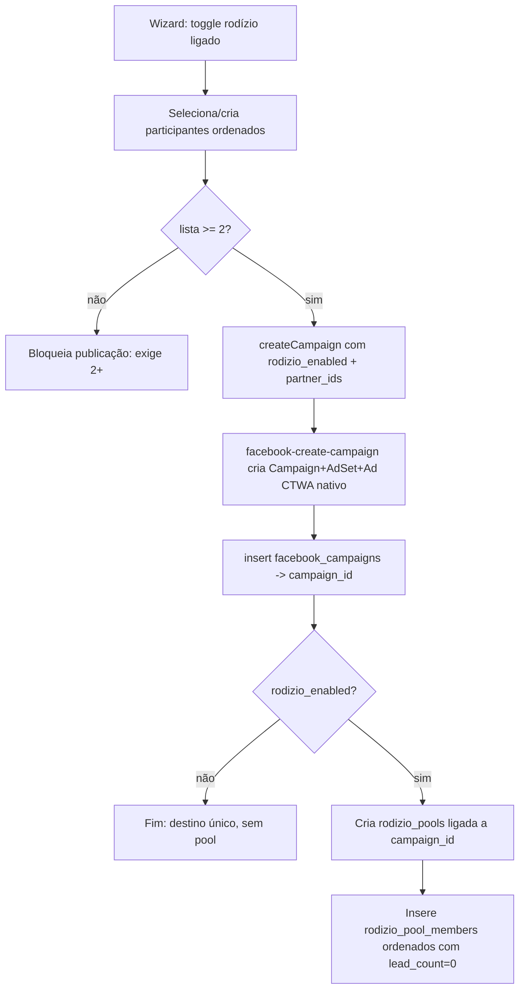
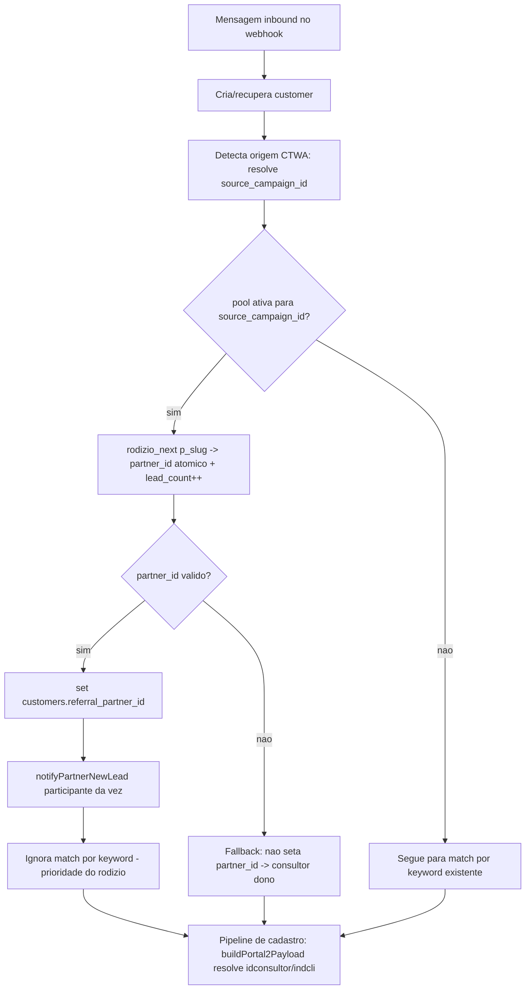

# Design — Rodízio de Leads de Anúncio

## Overview

Esta feature acrescenta um **rodízio (round-robin)** na criação de campanhas de
anúncio CTWA (Click-to-WhatsApp). Hoje, todo lead de anúncio vira "dono" do
consultor da instância central. Com o rodízio ligado, os leads daquele anúncio
passam a ser distribuídos em ordem circular entre vários **participantes**
escolhidos pelo dono. Para cada lead novo: (a) o participante da vez recebe um
aviso no WhatsApp dele e (b) o cadastro iGreen do cliente roda sob o código
(`idconsultor`/`indcli`) do participante da vez.

O princípio central do design é **REUSO**. A regra de negócio mais sensível — a
resolução de `idconsultor`/`indcli` — já existe e funciona em produção; a feature
NÃO a reimplementa. A feature apenas garante que setar `customers.referral_partner_id`
aciona essa regra. Da mesma forma, a detecção de origem do lead (CTWA), o aviso ao
parceiro e as tabelas `referral_partners` / `customers.referral_partner_id` já
existem e são reaproveitadas.

### Objetivos

- Ligar/desligar rodízio por campanha, sem mudar o comportamento atual quando
  desligado (destino único `whatsapp_destination_number`).
- Distribuir leads de anúncio em ordem circular **justa** e **atômica** entre os
  participantes, sem repetição na mesma volta e sem corrida entre leads simultâneos.
- Atribuir o participante da vez via `customers.referral_partner_id`, deixando o
  pipeline existente resolver o `idconsultor`/`indcli`.
- Avisar o participante da vez reusando `notifyPartnerNewLead`.
- Nunca perder um lead: fallback seguro para o consultor dono.

### Escopo: NOVO vs ADAPTAÇÃO vs REUSO

| Item | Classificação |
|------|---------------|
| Tabela `rodizio_pools` (existe com `phones text[]`) | **ADAPTAÇÃO** — passa a referenciar uma campanha e membros ordenados |
| Tabela `rodizio_pool_members` | **NOVO** |
| Função `rodizio_next(p_slug)` (retorna phone/message) | **ADAPTAÇÃO** — passa a receber `p_campaign_id uuid`, retornar `partner_id` e incrementar `lead_count` |
| Edge function `rodizio-redirect` + entrada no `config.toml` (link de rodízio, abordagem descartada nesta sessão) | **REMOVER** — substituída pela atribuição no webhook |
| Toggle + bloco de participantes no wizard | **NOVO** |
| Form inline de criar participante (CONSULTOR / PARCEIRO) | **NOVO** |
| Atribuição por rodízio no `evolution-webhook` | **NOVO** (inserido antes do bloco de keyword existente) |
| Novos campos em `facebook-create-campaign` + criação da pool | **ADAPTAÇÃO** |
| Tabela `referral_partners` e `customers.referral_partner_id` | **REUSO** |
| Regra `idconsultor`/`indcli` em `_shared/portal-worker.ts` | **REUSO (não duplicar)** |
| `notifyPartnerNewLead` em `_shared/notify-consultant.ts` | **REUSO** |
| Detecção CTWA / `source_campaign_id` no webhook | **REUSO** |

## Architecture

A feature toca três camadas, todas já existentes:

1. **Front (wizard de campanha)** — coleta o toggle e a lista ordenada de
   participantes, e envia ao `createCampaign()`.
2. **Edge function `facebook-create-campaign`** — após criar a campanha CTWA
   nativa (sem mudança no anúncio em si), cria/associa a pool de rodízio à
   `facebook_campaigns`.
3. **Webhook (`evolution-webhook` e `whapi-webhook`)** — ao detectar um lead novo
   de anúncio, chama `rodizio_next` para escolher o participante da vez, seta
   `customers.referral_partner_id` e avisa o participante. O pipeline de cadastro
   existente (Portal 2 / `buildPortal2Payload`) resolve `idconsultor`/`indcli`.

### Fluxo 1 — Criar campanha com rodízio



### Fluxo 2 — Lead novo entra pelo anúncio



A conversa continua no número central (limitação do CTWA/Meta). O
`customers.consultant_id` permanece o da instância central; o participante entra
apenas como `referral_partner_id`.

## Components and Interfaces

### Banco (Supabase Postgres)

- **`rodizio_pools`** (ADAPTADA): de "lista de telefones" para "pool ligada a uma
  campanha". Ganha `campaign_id`; perde a dependência de `phones text[]` (mantido
  por compatibilidade, mas não mais usado pelo novo fluxo).
- **`rodizio_pool_members`** (NOVA): lista ordenada de participantes da pool, cada
  um apontando para um `referral_partners`, com `position` e `lead_count`.
- **`rodizio_next(p_campaign_id uuid)`** (ADAPTADA): atribuição atômica via
  `UPDATE ... RETURNING` no contador da pool **da campanha** (busca a pool por
  `campaign_id`, não por slug), retornando o `partner_id` do membro da vez e
  incrementando o `lead_count` desse membro. O webhook já tem o `source_campaign_id`
  do lead, então passa esse id direto — sem precisar inventar/converter slug.

### Limpeza: remover a abordagem de "link de rodízio" (descartada)

Nesta sessão, antes de fechar a abordagem por aviso, foram criados (e devem ser
**removidos**): a edge function `supabase/functions/rodizio-redirect/index.ts` e a
sua entrada `[functions.rodizio-redirect]` no `supabase/config.toml`. Aquele caminho
(link público que redireciona por telefone, usando `rodizio_next(p_slug)` com
`phones`/`message`) foi substituído pela atribuição no webhook. Como a assinatura de
`rodizio_next` muda e as colunas `phones`/`message`/`slug` deixam de ser usadas,
manter a `rodizio-redirect` deixaria um arquivo órfão e quebrado. A remoção entra
junto da Migração 1.

### Edge function `facebook-create-campaign`

- Aceita novos campos no `Body`: `rodizio_enabled: boolean` e
  `rodizio_partner_ids: string[]` (lista ordenada).
- Após o `insert` em `facebook_campaigns`, quando `rodizio_enabled` e
  `partner_ids.length >= 2`, cria a `rodizio_pools` ligada ao `campaign_id` e
  insere os `rodizio_pool_members` na ordem recebida.

### Acesso a `referral_partners` pelo wizard (listar/criar)

Decisão: **usar `supabase-js` direto do front**, sem nova edge function. A tabela
`referral_partners` já tem RLS `consultants_own_partners` (`consultant_id = auth.uid()`),
que cobre exatamente o que o wizard precisa (listar/criar os próprios participantes).
Criar uma edge function só para isso seria duplicar o que a RLS já garante. Os
endpoints ficam encapsulados num serviço novo `src/services/referralPartners.ts`.

> **`cli` é NOT NULL** em `referral_partners`. Portanto o serviço NUNCA grava `cli`
> nulo: quando o tipo é CONSULTOR e o usuário não informa indicador, grava `cli = '0'`
> (string). Quando o tipo é PARCEIRO/INDICADOR, `cli` é obrigatório no form.
> `partner_igreen_id` aceita vazio/null (é o caso do tipo PARCEIRO).

> **Ownership:** o INSERT roda sob o `auth.uid()` do consultor logado (o dono do
> número central), e a RLS exige `consultant_id = auth.uid()`. O serviço seta
> `consultant_id` com esse mesmo id, mantendo participantes, pool e membros sob o
> mesmo dono.

### Front (wizard)

- Novos campos no `WizardState`.
- Novo step ou bloco dentro de `StepBudget` (ver Modelo de Dados → Front).
- Novo componente de bloco de rodízio + form inline de participante, mantendo a
  regra do projeto (arquivos ≤ 250 linhas, lógica em hooks).

### Webhook (`evolution-webhook` / `whapi-webhook`)

- Novo bloco de atribuição por rodízio, inserido ANTES do bloco de match por
  keyword, usando o `source_campaign_id` já resolvido.

## Data Models

### Estado atual (criado nesta sessão, a ser adaptado)

```sql
-- rodizio_pools atual: lista de telefones avulsa
-- id uuid, slug text unique, label text, phones text[], message text,
-- counter bigint, is_active bool, consultant_id uuid, created_at, updated_at
-- rodizio_next(p_slug) RETURNS TABLE(phone text, message text)
```

### Decisão de schema: tabela filha vs array

Foram consideradas duas opções para guardar os participantes ordenados:

- **Opção A — `partner_ids uuid[]` na própria pool.** Simples, mas mistura ordem
  e contagem em estruturas paralelas (um array de ids + um array de contadores),
  o que é frágil para o Requisito 10 (métricas por participante) e para integridade
  referencial (não há FK de elemento de array para `referral_partners`).
- **Opção B — tabela filha `rodizio_pool_members`.** Cada membro é uma linha com
  FK para `referral_partners`, `position` (ordem) e `lead_count` (métrica). Dá
  integridade referencial, unicidade por posição, e o `lead_count` por participante
  sai de graça (Requisito 10).

**Decisão: Opção B.** A justiça do rodízio (Requisito 9) depende apenas do
`counter` da pool (atômico). A tabela filha resolve ordem, métricas e integridade
sem comprometer a atomicidade.

### Migração 1 — adaptar `rodizio_pools` + remover `rodizio-redirect`

```sql
-- ADAPTAÇÃO: pool passa a referenciar uma campanha.
alter table public.rodizio_pools
  add column if not exists campaign_id uuid
    references public.facebook_campaigns(id) on delete cascade;

-- Uma pool por campanha (Requisito 6.1 — criar OU associar).
create unique index if not exists rodizio_pools_campaign_id_uniq
  on public.rodizio_pools(campaign_id)
  where campaign_id is not null;

-- Colunas do antigo "link de rodízio" deixam de ser usadas. Tornadas opcionais
-- (sem DROP, para não exigir reescrita destrutiva): slug, phones e message.
-- A pool nova é identificada por campaign_id; slug fica NULL no novo fluxo.
alter table public.rodizio_pools
  alter column slug drop not null,
  alter column phones drop not null,
  alter column phones set default '{}',
  alter column message drop not null;
```

> A edge function `supabase/functions/rodizio-redirect/index.ts` e a entrada
> `[functions.rodizio-redirect]` no `supabase/config.toml` (criadas nesta sessão
> para a abordagem de link, depois descartada) são **removidas** junto desta
> migração, pois dependiam de `rodizio_next(p_slug)` e das colunas `phones`/`message`.

> **Ownership da pool:** ao criar a pool (Tarefa 5.2), o `consultant_id` recebe o
> `auth.id` do consultor que cria a campanha (o `facebook-create-campaign` resolve
> via `authConsultant(req)`). Esse é o mesmo id usado pela RLS de
> `referral_partners` (`consultant_id = auth.uid()`), o que mantém pool, membros e
> participantes coerentes sob o mesmo dono — o consultor do número central.

### Migração 2 — criar `rodizio_pool_members`

```sql
create table if not exists public.rodizio_pool_members (
  id uuid primary key default gen_random_uuid(),
  pool_id uuid not null references public.rodizio_pools(id) on delete cascade,
  partner_id uuid not null references public.referral_partners(id) on delete cascade,
  position int not null,            -- ordem circular: 0,1,2,...
  lead_count bigint not null default 0,
  created_at timestamptz not null default now()
);

-- Ordem determinística e sem buracos por pool.
create unique index if not exists rodizio_pool_members_pool_pos_uniq
  on public.rodizio_pool_members(pool_id, position);

-- Um participante não se repete na mesma pool.
create unique index if not exists rodizio_pool_members_pool_partner_uniq
  on public.rodizio_pool_members(pool_id, partner_id);

-- Lookup do membro da vez (por pool + posição) e métricas.
create index if not exists rodizio_pool_members_pool_idx
  on public.rodizio_pool_members(pool_id);
```

### RLS

A `rodizio_pools` **hoje** tem apenas a policy `rodizio_pools_admin_all`
(`has_role(auth.uid(),'super_admin')`) — criada nesta sessão. Não há policy de
"dono via `consultant_id`". Isso não quebra o fluxo, porque tanto a edge function
`facebook-create-campaign` quanto o webhook acessam via **`service_role`**, que
ignora RLS. As policies abaixo existem para leitura/gerência pelo painel.

Para a `rodizio_pool_members`, a policy de dono depende da pool ter `consultant_id`
preenchido (garantido na Tarefa 5.2). `service_role` faz tudo (edge functions e
webhook).

```sql
alter table public.rodizio_pool_members enable row level security;

-- Dono lê/gerencia os membros das pools das suas campanhas
-- (requer rodizio_pools.consultant_id preenchido na criação da pool).
create policy rodizio_members_owner on public.rodizio_pool_members
  for all
  using (
    exists (
      select 1 from public.rodizio_pools p
      where p.id = rodizio_pool_members.pool_id
        and p.consultant_id = auth.uid()
    )
  )
  with check (
    exists (
      select 1 from public.rodizio_pools p
      where p.id = rodizio_pool_members.pool_id
        and p.consultant_id = auth.uid()
    )
  );

-- service_role faz tudo (edge functions e webhook).
create policy rodizio_members_service on public.rodizio_pool_members
  for all to service_role using (true) with check (true);
```

> Em paralelo, adicionar à `rodizio_pools` uma policy de dono
> (`consultant_id = auth.uid()`) para que o painel do consultor consiga listar suas
> pools/métricas — a policy `super_admin` atual sozinha não cobre o consultor comum.

### Função SQL `rodizio_next` adaptada

Assinatura nova: recebe o **`campaign_id`** do lead e devolve o `partner_id` da vez.
O webhook já resolve `source_campaign_id`, então passa esse id direto (sem slug). A
atomicidade vem do `UPDATE ... RETURNING` sobre o `counter` da pool — duas chamadas
simultâneas pegam contadores distintos (Postgres serializa o `UPDATE` da mesma
linha), garantindo que dois leads nunca peguem o mesmo participante na mesma volta
(Requisito 9.1).

```sql
create or replace function public.rodizio_next(p_campaign_id uuid)
returns table(partner_id uuid, position int, pool_id uuid)
language plpgsql
security definer
set search_path to 'public'
as $$
declare
  v_pool_id uuid;
  v_counter bigint;
  v_len int;
  v_idx int;          -- posição 0-based do membro da vez
  v_partner_id uuid;
begin
  -- 1) Avança o contador da pool DA CAMPANHA de forma ATÔMICA e captura o novo
  --    valor. Só avança se a pool estiver ativa e tiver pelo menos 1 membro.
  update public.rodizio_pools rp
     set counter = counter + 1,
         updated_at = now()
   where rp.campaign_id = p_campaign_id
     and rp.is_active = true
     and exists (select 1 from public.rodizio_pool_members m where m.pool_id = rp.id)
  returning rp.id, rp.counter into v_pool_id, v_counter;

  -- Pool inexistente, inativa ou vazia → retorna vazio (fallback no chamador).
  if v_pool_id is null then
    return;
  end if;

  select count(*) into v_len
    from public.rodizio_pool_members where pool_id = v_pool_id;
  if v_len = 0 then
    return;
  end if;

  -- 2) Ordem circular: (counter-1) % len dá 0,1,2,...,len-1,0,1...
  v_idx := (v_counter - 1) % v_len;

  -- 3) Incrementa o lead_count do membro da vez e retorna seu partner_id.
  update public.rodizio_pool_members m
     set lead_count = lead_count + 1
   where m.pool_id = v_pool_id
     and m.position = v_idx
  returning m.partner_id into v_partner_id;

  if v_partner_id is null then
    return; -- buraco de posição (não deve ocorrer pela unique index) → fallback
  end if;

  partner_id := v_partner_id;
  position := v_idx;
  pool_id := v_pool_id;
  return next;
end;
$$;
```

Notas:
- A atomicidade do `counter` é o que garante a justiça e a ausência de corrida; o
  `position` é derivado do contador, não lido-e-depois-escrito.
- `lead_count` por membro cobre o Requisito 10 (métricas) sem estrutura extra.
- Retorno vazio sinaliza fallback (Requisito 11): o webhook não seta
  `referral_partner_id` e o lead segue para o consultor dono.

### Modelo de dados no Front (`WizardState`)

Novos campos adicionados a `WizardState` (em `useWizardState.ts`):

```typescript
// Step de rodízio (novo)
rodizioEnabled: boolean;                 // toggle; inicial false
rodizioPartners: RodizioPartnerDraft[];  // lista ORDENADA de participantes
rodizioPartnersLoading: boolean;         // carregando referral_partners do dono
rodizioInlineForm: RodizioInlineForm | null; // form inline aberto (ou null)

// Tipos auxiliares
interface RodizioPartnerDraft {
  id: string;            // referral_partners.id (existente ou recém-criado)
  nome: string;
  tipo: "consultor" | "parceiro";
  partner_igreen_id: string | null;
  cli: string | null;
  notification_phone: string | null;
}

interface RodizioInlineForm {
  tipo: "consultor" | "parceiro";
  nome: string;
  notification_phone: string;
  partner_igreen_id: string;  // obrigatório quando tipo=consultor
  cli: string;                // obrigatório quando tipo=parceiro
}
```

`INITIAL_STATE` recebe `rodizioEnabled: false`, `rodizioPartners: []`,
`rodizioPartnersLoading: false`, `rodizioInlineForm: null`.

### Onde encaixa no wizard

**Decisão: bloco dentro do `StepBudget` (Step 4)**, não um step novo.

Justificativa: o rodízio é uma decisão de **distribuição/destino** dos leads, da
mesma natureza dos placements ("onde publicar") que já moram no Step 4. Criar um
6º step quebraria a numeração `WizardStep = 1..5`, o `WizardSidebar` e a animação
de slide, com custo alto para pouco ganho. O bloco entra colapsável, no mesmo
padrão visual do bloco "Onde publicar", logo abaixo dele.

Para respeitar o limite de 250 linhas por arquivo:
- `StepBudget.tsx` apenas renderiza `<RodizioBlock state={state} patch={patch} />`.
- `RodizioBlock.tsx` (novo) — toggle + multi-select + lista ordenada + botão "criar participante".
- `RodizioInlineForm.tsx` (novo) — form de criar participante (2 tipos).
- `useRodizioLogic.ts` (novo hook) — carrega `referral_partners` do dono, valida,
  cria participante via `referralPartners.ts`, adiciona/remove/evita duplicado.

Multi-select de participantes existentes: reaproveita o componente
`src/components/ui/combobox.tsx` (multi-select já usado no projeto). Toggle: usa o
`Switch` do shadcn/ui já presente em `src/components/ui`.

### Passagem para `createCampaign`

`CreateCampaignBody` (em `src/services/facebookAds.ts`) ganha:

```typescript
rodizio_enabled?: boolean;
rodizio_partner_ids?: string[];  // ordem = ordem da lista no wizard
```

Em `usePublish.ts`, o `payload` passa a incluir, quando `state.rodizioEnabled`:
`rodizio_enabled: true` e `rodizio_partner_ids: state.rodizioPartners.map(p => p.id)`.

## Correctness Properties

*Uma propriedade é uma característica ou comportamento que deve valer em todas as
execuções válidas do sistema — uma afirmação formal sobre o que o sistema deve
fazer. Propriedades servem de ponte entre a especificação legível por humanos e
garantias de correção verificáveis por máquina.*

As propriedades abaixo focam no núcleo testável da feature: a justiça e a
atomicidade do rodízio (a função `rodizio_next` e o seletor circular puro), que é
lógica nossa, varia com a entrada e se beneficia de centenas de iterações. As
demais partes (toggle de UI, criação de pool, IaC de RLS, integração com Portal 2)
são cobertas por testes de exemplo/integração, conforme a Estratégia de Testes.

### Property 1: Ordem circular

*Para toda* pool com P participantes (P ≥ 2) e *qualquer* sequência de N chamadas
consecutivas de `rodizio_next`, a sequência de posições retornadas é
`0, 1, ..., P-1, 0, 1, ...` (o índice retornado é `(k mod P)` para a k-ésima
chamada, começando em 0), retornando ao primeiro após o último.

**Validates: Requirements 9.2**

### Property 2: Distribuição justa (desvio máximo 1)

*Para toda* pool com P participantes e *qualquer* N de chamadas consecutivas, ao
final a diferença entre o participante que mais recebeu leads e o que menos recebeu
é no máximo 1; e a soma dos `lead_count` dos membros é igual a N.

**Validates: Requirements 9.3, 10.1**

### Property 3: Sem repetição na mesma volta sob concorrência

*Para toda* pool com P participantes e *qualquer* lote de K chamadas concorrentes
de `rodizio_next` (K ≤ P), os participantes retornados são todos distintos (nenhum
participante é atribuído duas vezes dentro da mesma volta).

**Validates: Requirements 9.1**

### Property 4: Atribuição reflete o participante da vez

*Para todo* lead novo de anúncio cuja campanha tem pool ativa e `rodizio_next`
retorna um `partner_id` válido, ao final `customers.referral_partner_id` é igual ao
`partner_id` retornado e `customers.consultant_id` permanece o consultor da
instância central.

**Validates: Requirements 7.2, 7.4**

### Property 5: Prioridade do rodízio sobre keyword

*Para todo* lead novo de anúncio cuja campanha tem pool ativa e a atribuição por
rodízio foi aplicada, o resultado de `referral_partner_id` é o participante do
rodízio, independentemente de a mensagem conter alguma keyword de outro participante
(o match por keyword é ignorado para aquele lead).

**Validates: Requirements 8.1, 8.2**

### Property 6: Fallback seguro nunca perde o lead

*Para todo* lead novo de anúncio em que a pool está vazia, inativa, inexistente, ou
`rodizio_next` retorna vazio/ inválido, o lead é registrado normalmente com
`referral_partner_id` nulo (cai no consultor dono) e o vínculo com a campanha
(`source_campaign_id`) é preservado.

**Validates: Requirements 11.1, 11.2, 11.3, 11.4**

### Property 7: Resolução de idconsultor/indcli pelo tipo do participante

*Para todo* participante da vez, o payload de cadastro produzido pelo pipeline
existente tem `idconsultor` igual ao `partner_igreen_id` quando este é maior que 0,
e igual ao `igreen_id` do consultor dono caso contrário; e `indcli` igual ao `cli`
do participante, ou 0 quando ausente.

**Validates: Requirements 12.1, 12.2, 12.3**

> Esta propriedade valida a função `buildPortal2Payload` JÁ existente
> (`_shared/portal-worker.ts`). O teste protege a regra contra regressões, mas a
> implementação NÃO é duplicada (Requisito 12.4).

## Error Handling

O princípio é **fail-open**: o anúncio e o lead nunca se perdem por causa do rodízio.

1. **Pool ausente/ inativa/ vazia** — `rodizio_next` retorna vazio. O webhook não
   seta `referral_partner_id`; o lead segue como hoje (consultor dono). (Req 11.1, 11.2)
2. **`partner_id` inválido retornado** — tratado como vazio: fallback ao dono. (Req 11.3)
3. **Erro de banco ao chamar `rodizio_next`** — o bloco de rodízio fica dentro de
   `try/catch` que apenas loga e segue o fluxo (sem `throw`), exatamente como o
   bloco de keyword atual. O lead continua sendo criado e vinculado à campanha. (Req 11.4)
4. **Falha no aviso ao participante** — `notifyPartnerNewLead` já é best-effort
   (`.catch` que loga e não bloqueia); a atribuição não é desfeita se o aviso falhar.
5. **Criação da pool na publicação** — se `rodizio_enabled` mas a lista tiver < 2
   participantes, o front bloqueia ANTES de publicar (Req 5.2). No servidor, se por
   algum motivo a criação da pool falhar após a campanha já ter sido criada, a
   campanha permanece válida (CTWA nativo no número central); o erro é logado e o
   consultor é avisado via `notifyConsultant`, sem reverter a campanha. (Req 6.4)

### Espelhamento no `whapi-webhook`

O `evolution-webhook` resolve `source_campaign_id` (~linha 786) ANTES do bloco de
keyword (~linha 984), então a atribuição por rodízio entra naturalmente entre os
dois. no `whapi-webhook`, a ordem dos blocos é invertida: o match por keyword
(~linha 726) vem ANTES da detecção de origem (~linha 1227). Para aplicar o rodízio
com a mesma prioridade, no `whapi-webhook` o **MVP** é o tratamento mínimo: no bloco
de keyword, pular o match quando a campanha do lead tiver pool ativa (consultando a
origem CTWA mais cedo só o suficiente para saber se há pool). O refator completo
(mover toda a resolução de `source_campaign_id` para antes do bloco de keyword e
inserir o bloco de rodízio idêntico ao do evolution) fica como tarefa separada, por
ter maior risco de regressão.

## Testing Strategy

Abordagem dupla: testes de exemplo/integração para o que é específico (UI,
criação de pool, RLS) + testes baseados em propriedade (PBT) para o núcleo de
justiça/atomicidade do rodízio.

### Testes baseados em propriedade (PBT)

- Biblioteca: **fast-check** (ecossistema TS/Vitest já usado no projeto). NÃO
  implementar PBT do zero.
- Mínimo de **100 iterações** por teste de propriedade.
- Cada teste leva uma tag referenciando a propriedade do design.
  Formato: `// Feature: rodizio-leads-anuncio, Property {n}: {texto}`.
- Propriedades 1, 2, 3 testam o **seletor circular puro** (uma função TS que
  modela `(counter, len) -> position` e o acumulador de `lead_count`), de baixo
  custo, ideal para centenas de iterações. A versão concorrente (Prop. 3) também é
  validada com um teste de integração contra a `rodizio_next` real (poucas
  execuções) para confirmar a atomicidade no Postgres.
- Propriedade 7 testa `buildPortal2Payload` com participantes gerados (variando
  `partner_igreen_id` e `cli`), com o cliente Supabase mockado.
- Propriedades 4, 5, 6 testam o ramo de atribuição do webhook com Supabase e
  `rodizio_next` mockados, gerando estados de pool variados (ativa/inativa/vazia,
  com/sem keyword na mensagem).

### Testes de exemplo / unitários

- Front: validações do form inline (CONSULTOR exige `partner_igreen_id`;
  PARCEIRO exige `cli`; ambos exigem nome e telefone de aviso) — Req 3.2, 3.3,
  4.2, 4.3. Toggle liga/desliga o bloco e descarta seleção (Req 1.2, 1.3).
  Bloqueio de duplicado (Req 2.4). Bloqueio de publicação com < 2 (Req 5.2).
- Edge function: ao publicar com `rodizio_enabled`, cria 1 pool ligada à campanha
  com os membros na ordem certa e `lead_count=0` (Req 6.1, 6.2); sem
  `rodizio_enabled`, nenhuma pool é criada (Req 6.3).

### Testes de integração / smoke

- RLS: dono enxerga só suas pools/membros; `service_role` enxerga tudo.
- Anúncio permanece CTWA nativo no número central independentemente do toggle
  (Req 6.4) — verificado por inspeção do payload enviado à Meta (não muda).

## Mapeamento de Requisitos para Componentes

| Requisito | Componentes do design |
|-----------|------------------------|
| 1. Toggle de rodízio | `WizardState.rodizioEnabled`, `RodizioBlock.tsx`, `StepBudget.tsx`, `Switch` shadcn |
| 2. Selecionar participantes existentes | `useRodizioLogic.ts`, `combobox.tsx`, `referralPartners.ts` (RLS), `RodizioBlock.tsx` |
| 3. Criar participante CONSULTOR | `RodizioInlineForm.tsx`, `useRodizioLogic.ts`, `referralPartners.ts` (insert `partner_igreen_id`) |
| 4. Criar participante PARCEIRO/INDICADOR | `RodizioInlineForm.tsx`, `useRodizioLogic.ts`, `referralPartners.ts` (insert `cli`) |
| 5. Mínimo de 2 participantes | `useRodizioLogic.ts` (validação), `WizardFooter`/`usePublish` (bloqueio) |
| 6. Criar a pool ao publicar | `facebook-create-campaign` (novos campos + insert pool/members), Migração 1 e 2 |
| 7. Atribuir lead ao participante da vez | `evolution-webhook` (bloco rodízio), `rodizio_next`, `notifyPartnerNewLead` |
| 8. Prioridade sobre keyword | `evolution-webhook` / `whapi-webhook` (ordem dos blocos) |
| 9. Atribuição atômica e justa | `rodizio_next` (`UPDATE ... RETURNING`), `rodizio_pool_members` |
| 10. Métricas de distribuição | `rodizio_pool_members.lead_count`, `rodizio_next` (incremento) |
| 11. Fallback seguro | `evolution-webhook`/`whapi-webhook` (try/catch fail-open), retorno vazio de `rodizio_next` |
| 12. Regra idconsultor/indcli (reuso) | `_shared/portal-worker.ts` `buildPortal2Payload` (REUSO, não duplicar) |
