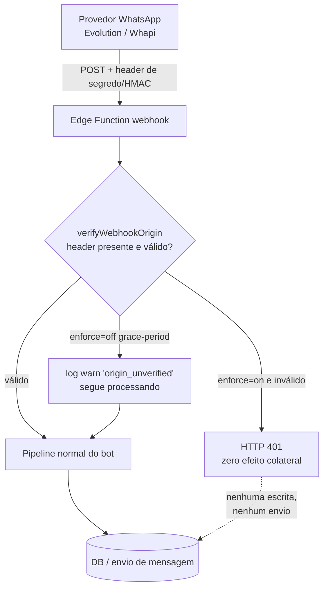
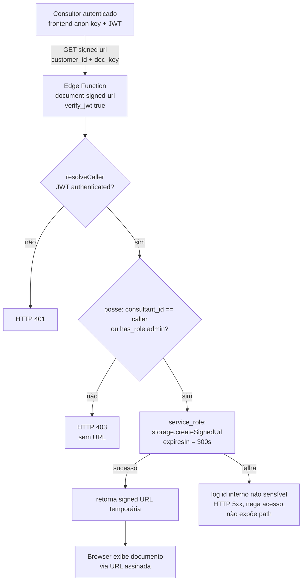

# Design Document

## Overview

Este documento descreve o **design de implementação da Fase 1** do roteiro de remediação de segurança e LGPD do SaaS multi-tenant iGreen. Ele traduz os 11 requisitos aprovados em `requirements.md` em um plano técnico preciso, pronto para implementação, **sem** escrever as migrações e funções finais (apenas descrevê-las com exatidão).

### Princípio organizador: 10 workstreams independentes e reversíveis

A Fase 1 é decomposta em **10 workstreams de remediação** (correspondendo aos Requisitos 1 a 10; o Requisito 11 é transversal e governa o processo de todos eles). Cada workstream é projetado para ser:

- **Independente:** aplicável e revertível sem depender dos demais. Não há acoplamento de migração entre workstreams — cada um vive em sua própria migração focada (Requisito 11.3).
- **Reversível:** possui um plano de rollback explícito e documentado (Requisito 11.2).
- **Gated (com portão):** nenhuma mudança é aplicada automaticamente. Toda alteração de banco de dados, política RLS, bucket de armazenamento ou webhook exige **backup do estado atual + aprovação humana explícita** antes da aplicação (Requisito 11.1 e 11.6).
- **Não-destrutivo por padrão:** quando uma operação é destrutiva ou de difícil reversão (ex.: revogar grants, reconfigurar bucket), ela é sinalizada explicitamente e tratada com backup adicional.

### Pré-condição global: reconciliação da árvore git suja

Antes de qualquer aplicação (Requisito 11.7), a árvore de trabalho git — atualmente suja, com alterações não commitadas — **deve ser reconciliada** (commit, stash ou descarte consciente). Esta é uma pré-condição registrada e bloqueante: nenhuma migração ou deploy de Edge Function desta fase pode iniciar enquanto a árvore não estiver limpa e em um branch dedicado de remediação. O objetivo é impedir mistura de mudanças não relacionadas e perda de contexto.

### Postura "read-only-first"

Todo o levantamento que embasou este design foi feito em modo somente-leitura (consultas a `pg_policy`, `pg_proc`, `storage.buckets`, leitura de código). O design **não** aplica mudanças; ele descreve o que será aplicado mediante aprovação. Os fatos abaixo foram verificados em produção durante a elaboração deste documento e são tratados como verdade de base:

- `customers` → política `Owner update customers` com `WITH CHECK` nulo (confirmado em `pg_policy`). Políticas `Assigned consultant select/update customers` e `managers can read customers` têm `roles = NULL` (aplicam-se a `PUBLIC`, incluindo `anon`).
- `v_bot_engine_health` → `security_mode = definer` (confirmado).
- **66 funções** `SECURITY DEFINER` no schema `public` com `EXECUTE` concedido a `anon` e/ou `authenticated` (confirmado por `has_function_privilege`).
- Buckets públicos confirmados: `whatsapp-media`, `consultant-photos`, `ai-agent-media`, `IMAGE`, `video igreen`. Bucket privado já existente: `simulator-uploads`.
- `storage.objects` possui políticas SELECT amplas: `Public read whatsapp-media`, `whatsapp-media public read by url` (`anon`+`authenticated`), `whatsapp-media auth list` (`authenticated`).
- Helpers RLS `SECURITY DEFINER` confirmados: `has_role(_user_id uuid, _role app_role)`, `is_super_admin(_user_id uuid)`, `can_view_consultant(_user uuid, _consultant uuid)`, `is_team_member(_leader uuid, _member uuid)`.
- Frontend usa **somente** a chave anon/publishable (`src/integrations/supabase/client.ts`). Consequência de design: a criação de URLs assinadas para bucket privado **não pode** depender de `service_role` no cliente; precisa de um caminho autenticado (Edge Function com verificação de posse, ou `createSignedUrl` autorizado por política RLS de `storage.objects`).

### Escopo

Em escopo: exclusivamente correções de segurança e conformidade LGPD (Requisitos 1–10) e o processo que as governa (Requisito 11). Fora de escopo (Fases 2–6): flow-engine, captação funcional, UX de administração e desempenho. **Este design não inclui código para as Fases 2–6.**

## Architecture

### Visão de alto nível

As correções tocam quatro planos do sistema, cada plano com seu mecanismo de defesa:

1. **Plano de armazenamento (Storage):** bucket privado + políticas `storage.objects` por posse + URLs assinadas (Req 1).
2. **Plano de borda (Edge Functions):** dois helpers compartilhados novos em `supabase/functions/_shared/` — `verifyWebhookOrigin` (Req 2) e `resolveCaller` (Req 3, 4) — além do kill switch no Evolution (Req 5) e redação de PII (Req 10).
3. **Plano de banco (Postgres/RLS):** `WITH CHECK` em `customers` (Req 6), criptografia de credenciais (Req 7), `REVOKE`/`security_invoker` em funções e visão `SECURITY DEFINER` (Req 8).
4. **Plano de configuração (Auth/Dashboard):** proteção contra senha vazada (Req 9).

### Tabela de rastreabilidade: Requisito → mudança

| Req | Arquivos / objetos afetados | Abordagem de mudança | Migração / segredo necessário | Estratégia de rollback | Risco / blast-radius |
|-----|------------------------------|----------------------|-------------------------------|------------------------|----------------------|
| **1 — Docs privados** | `src/components/captacao/CaptureDocumentTiles.tsx`, `supabase/functions/upload-documents-minio/`, nova Edge Function `document-signed-url`, `storage.buckets`, `storage.objects` | Criar bucket privado `customer-documents`; policies de `storage.objects` por posse via `customers.consultant_id`; geração de signed URL (≤300s) por caminho autenticado; backfill copy-then-repoint dos arquivos legados | Migração de bucket+policies (1 migração focada); nenhum segredo novo (usa `service_role` já existente nas funções) | Re-tornar bucket público + restaurar policies antigas (backup do inventário de objetos/policies); URLs legadas preservadas pois só houve cópia | **Alto** — toca dados sensíveis e fluxo de captação ativo |
| **2 — Origem webhook** | `supabase/functions/_shared/webhook-origin.ts` (novo), `evolution-webhook/index.ts`, `whapi-webhook/index.ts` | Helper `verifyWebhookOrigin` com segredo compartilhado/HMAC em header; feature-flag de grace-period (log-only → enforce) | Segredos `EVOLUTION_WEBHOOK_SECRET`, `WHAPI_WEBHOOK_SECRET`; flag `app_settings.webhook_origin_enforced` | Setar flag para `false` (volta a log-only) sem redeploy; sem migração destrutiva | **Alto** — risco de derrubar tráfego legítimo de ambos os canais |
| **3 — IDOR service_role** | `supabase/functions/_shared/caller-auth.ts` (novo), `capture-extract/`, `upload-documents-minio/`, `ai-agent-router/`, `ai-sales-agent/`, `facebook-capi/` | Helper `resolveCaller` (JWT ou segredo de serviço) + checagem de posse; preserva invocação interna via header de serviço | Segredo `SERVICE_SHARED_SECRET` | Reverter funções para versão anterior (deploy do artefato prévio); sem mudança de schema | **Alto** — risco de quebrar invocações internas webhook→router |
| **4 — CAPI** | `supabase/functions/facebook-capi/index.ts` | Aplicar `resolveCaller` + autorização por consultor antes de enviar ao Meta/gravar `facebook_capi_events` | Reusa `SERVICE_SHARED_SECRET` | Redeploy do artefato anterior | **Médio** — afeta atribuição de conversões/verba |
| **5 — Kill switch Evolution** | `evolution-webhook/index.ts`, reusa `_shared/bot/global-flag.ts` | Adicionar `isBotGloballyEnabled` no topo, espelhando whapi; fail-open em erro | Nenhum | Remover a checagem (redeploy anterior) | **Médio** — canal usado por todos os consultores |
| **6 — WITH CHECK customers** | RLS de `public.customers` | DROP/CREATE da policy `Owner update customers` adicionando `WITH CHECK (consultant_id = auth.uid())`; nota: opcionalmente endurecer `roles` de `public`→`authenticated` nas policies `Assigned consultant*`/`managers` como defesa em profundidade | 1 migração focada | Backup das definições via `pg_policy`; recriar policy sem `WITH CHECK` | **Médio** — erro de policy pode bloquear updates legítimos |
| **7 — Credenciais portal** | `consultants` (colunas novas), `sync-igreen-customers/index.ts`, `worker-portal/playwright-automation.mjs`, `src/components/admin/DadosTab.tsx` (+ hooks), reusa padrão `_shared/fb-crypto.ts` | Adicionar colunas `igreen_portal_password_encrypted`; migrar valores; readers descriptografam; UI para de carregar/echoar senha | Migração de colunas + backfill; segredo `PORTAL_CRED_ENC_KEY` (ou reuso de chave de cofre) | Manter coluna plaintext durante transição; rollback = voltar readers para coluna antiga | **Alto** — quebra de login no portal interrompe sync e worker |
| **8 — SECURITY DEFINER** | `v_bot_engine_health`, ~66 funções `SECURITY DEFINER` | `ALTER VIEW ... SET (security_invoker=on)`; `REVOKE EXECUTE` de `anon`/`authenticated` em funções de gatilho/internas; enumerar allowlist do que permanece chamável | 1+ migrações focadas (separar view de grants) | Backup dos grants via `information_schema.role_routine_grants`; re-GRANT em rollback | **Alto** — revogar grant de função em uso quebra feature |
| **9 — Senha vazada** | Config do Supabase Auth (dashboard/management API) | Habilitar `auth_leaked_password_protection` | Nenhuma migração (config) | Desabilitar a flag | **Baixo** — só afeta definição de novas senhas |
| **10 — PII em logs** | `supabase/functions/_shared/pii-redaction.ts` (novo), `evolution-webhook/`, `whapi-webhook/`, `sync-igreen-customers/` | Helper `maskPhone/maskCpf/maskOtp/redactPayload`; aplicar antes de cada `console.log` de payload/OTP/credencial | Nenhum segredo | Reverter call-sites (redeploy anterior) | **Baixo** — apenas muda conteúdo de log |

### Diagrama: fluxo de validação de origem do webhook (Req 2)



### Diagrama: fluxo de URL assinada para documento privado (Req 1)



### Padrões de autenticação canônicos reutilizados

O design **não inventa** novos padrões de auth; reaproveita os existentes e comprovados no repositório:

- **JWT + `has_role` (admin):** `admin-reset-password` — `anonClient.auth.getUser(token)` seguido de `adminClient.rpc("has_role", {_user_id, _role:"admin"})`. Base do modo `jwt` do `resolveCaller`.
- **Segredo compartilhado (back-end):** `worker-callback` (`settings.worker_secret`/`WORKER_SECRET`) e `recover-stuck-otp` (`CRON_SECRET`). Base do modo `service` do `resolveCaller` e do `verifyWebhookOrigin`.
- **Verificação de assinatura:** `wallet-stripe-webhook` (`constructEventAsync`). Referência conceitual para a opção HMAC do `verifyWebhookOrigin`.
- **Criptografia AES-GCM:** `_shared/fb-crypto.ts` (`encryptToken`/`decryptToken`, chave derivada via SHA-256 de um segredo de ambiente). Base para a criptografia das credenciais do portal (Req 7).
- **Client service_role centralizado:** `_shared/admin-client.ts` (`getAdminClient`). Usado pelas Edge Functions onde bypass de RLS é necessário.

## Components and Interfaces

### Novos módulos compartilhados (`supabase/functions/_shared/`)

#### `webhook-origin.ts` (Req 2)

```text
verifyWebhookOrigin(req: Request, opts: {
  channel: "evolution" | "whapi",
  secretEnvVar: string,          // EVOLUTION_WEBHOOK_SECRET | WHAPI_WEBHOOK_SECRET
  headerNames: string[],         // ex.: ["apikey","x-evolution-token"] / ["x-whapi-token"]
  enforce: boolean,              // vem de app_settings.webhook_origin_enforced
}): Promise<{ ok: boolean; reason?: string }>
```

- Compara em tempo constante o header recebido com o segredo de ambiente; opcionalmente valida HMAC-SHA256 do corpo (reaproveita o estilo de `fb-crypto.signState`/`verifyState`).
- **Grace-period:** quando `enforce=false`, retorna sempre `{ok:true}` mas emite log estruturado (`webhook_origin_unverified`) para medir tráfego que falharia. Permite rollout sem derrubar tráfego legítimo.
- Nunca loga o valor do segredo (Req 2.5).

#### `caller-auth.ts` (Req 3, 4)

```text
type Caller =
  | { mode: "jwt"; consultantId: string; isAdmin: boolean }
  | { mode: "service" }

resolveCaller(req: Request, admin: SupabaseClient): Promise<
  { ok: true; caller: Caller } | { ok: false; status: 401 }
>

assertOwnership(caller: Caller, target: {
  consultantId?: string,
  customerId?: string,
}, admin: SupabaseClient): Promise<
  { ok: true } | { ok: false; status: 403 | 400 }
>
```

- `resolveCaller`:
  1. Se header `x-service-secret` == `SERVICE_SHARED_SECRET` → `{mode:"service"}` (chamadas back-end/cron). Comparação em tempo constante.
  2. Senão, se `Authorization: Bearer <jwt>` válido (via `anonClient.auth.getUser`) → resolve `consultantId = user.id`, `isAdmin = has_role(user.id,'admin')` → `{mode:"jwt",...}`.
  3. Senão → `{ok:false, status:401}` (Req 3.3).
- `assertOwnership` (apenas para modo `jwt`; modo `service` dispensa — Req 3.5):
  - Se `isAdmin` → ok.
  - Se `consultantId` informado != `caller.consultantId` → 403 (Req 3.4).
  - Se `customerId` informado → buscar `customers.consultant_id`; se != `caller.consultantId` → 403; se cliente não existe/malformado → 400 (Req 3.7).
- `SERVICE_SHARED_SECRET` é segredo de ambiente, nunca logado (Req 3.8).

#### `pii-redaction.ts` (Req 10)

```text
maskPhone(v: string): string   // mantém DDD + 2 últimos: 55**********34
maskCpf(v: string): string     // ***.***.***-XX (só dígitos finais)
maskOtp(v: string): string     // "******" (omite totalmente)
redactPayload(obj: unknown): unknown  // walk recursivo, mascara chaves sensíveis
                                       // (phone, telefone, cpf, otp, code, password, token)
```

- Funções puras, determinísticas, sem efeito colateral — alvo ideal para PBT (ver Correctness Properties).
- `redactPayload` substitui o atual `JSON.stringify(body).substring(0,500)` dos webhooks por `JSON.stringify(redactPayload(body)).substring(0,500)`.

### Nova Edge Function: `document-signed-url` (Req 1)

- `verify_jwt = true` em `config.toml` (caminho autenticado obrigatório, dado que o frontend só tem a chave anon).
- Body: `{ customer_id: string, doc_key: "document_front_url" | "document_back_url" | "electricity_bill_photo_url" }`.
- Fluxo: `resolveCaller` → `assertOwnership({customerId})` → resolve o `path` interno do objeto no bucket privado → `getAdminClient().storage.from("customer-documents").createSignedUrl(path, 300)` → retorna `{ url }`.
- Erros: posse falha → 403 sem URL (Req 1.7); falha de assinatura → loga id interno não sensível, 5xx, não expõe path, nega conteúdo (Req 1.5).

### Edge Functions modificadas

| Função | Mudança | Requisito |
|--------|---------|-----------|
| `evolution-webhook/index.ts` | `verifyWebhookOrigin` no topo; `isBotGloballyEnabled` (fail-open) espelhando whapi; `redactPayload` no log de inbound | 2, 5, 10 |
| `whapi-webhook/index.ts` | `verifyWebhookOrigin`; `redactPayload` no log; `maskOtp` no log de OTP | 2, 10 |
| `capture-extract` | `resolveCaller` + `assertOwnership` | 3 |
| `upload-documents-minio` | `resolveCaller` + `assertOwnership`; gravar no bucket privado `customer-documents` em vez do público | 1, 3 |
| `ai-agent-router` | `resolveCaller` (aceita `service` para a chamada interna do webhook) + `assertOwnership` para chamadas JWT | 3 |
| `ai-sales-agent` | `resolveCaller` + `assertOwnership` | 3 |
| `facebook-capi` | `resolveCaller` + autorização por consultor antes do envio ao Meta | 3, 4 |
| `sync-igreen-customers` | descriptografar credencial; `maskPhone`/`maskCpf` nos logs | 7, 10 |

### Frontend modificado

| Arquivo | Mudança | Requisito |
|---------|---------|-----------|
| `src/components/captacao/CaptureDocumentTiles.tsx` | Upload para bucket privado (via Edge Function autenticada); exibição via `document-signed-url` em vez de `getPublicUrl` | 1 |
| `src/components/admin/DadosTab.tsx` | Não carregar `igreen_portal_password` do banco para o campo; campo de senha vira "write-only" (em branco; só grava se preenchido) | 7 |
| `src/hooks/useAdminAuth.ts`, `useConsultantForm.ts` | Parar de hidratar `igreen_portal_password` a partir do banco | 7 |

## Data Models

### Storage (Req 1)

- **Novo bucket:** `customer-documents` com `public = false`.
- **Convenção de path:** `captacao/{consultant_id}/{customer_id}/{doc_key}-{timestamp}.{ext}` — o `consultant_id` no path habilita policies de `storage.objects` baseadas em prefixo, alinhadas à posse.
- **Policies de `storage.objects` (novas, somente para `customer-documents`):**
  - SELECT/INSERT/UPDATE/DELETE restritos a `service_role` e ao consultor dono (derivado do `customer_id` no path via subconsulta a `customers`, ou do `consultant_id` do prefixo do path validado contra `auth.uid()`), além de `has_role(auth.uid(),'admin')`.
  - **Nenhuma** policy ampla de leitura pública/listagem por `anon` (Req 1.3).

### `customers` (Req 6)

- Sem mudança de coluna. Apenas substituição da policy de UPDATE:
  - Atual: `Owner update customers` → `USING (consultant_id = auth.uid())`, `WITH CHECK = NULL`.
  - Novo: mesma `USING`, com `WITH CHECK (consultant_id = auth.uid())`.
- Preservar inalteradas: `Owner select/insert/delete customers`, `Admins read all customers`, `Leader reads team customers`, `managers can read customers`, `Assigned consultant select/update customers`.
- **Defesa em profundidade (nota, verificar antes):** as policies `Assigned consultant select/update customers` e `managers can read customers` têm `roles = NULL` (PUBLIC, incl. `anon`). O design recomenda endurecer para `TO authenticated`, **mas** somente após confirmar que nenhum fluxo anônimo legítimo depende delas (verificado: `anon` retorna 0 linhas hoje, pois as expressões usam `auth.uid()`). Tratar como sub-tarefa opcional dentro do mesmo workstream, com rollback trivial.

### `consultants` (Req 7)

- **Nova coluna:** `igreen_portal_password_encrypted text` (ciphertext AES-GCM base64, formato idêntico ao de `facebook_connections.access_token_encrypted`).
- **Transição:** manter `igreen_portal_password` (plaintext) durante a janela de migração; backfill criptografa os valores existentes para a nova coluna; readers passam a usar a coluna criptografada; só então a coluna plaintext é zerada/removida (em migração separada e posterior, fora do caminho crítico).
- **Segredo:** `PORTAL_CRED_ENC_KEY` (ou reuso de chave de cofre/pgsodium se já disponível). O email do portal permanece em claro (não é segredo).

### `app_settings` (Req 2)

- **Nova chave:** `webhook_origin_enforced boolean` (default `false` no rollout → `true` após validação). Lida pelos webhooks para alternar grace-period/enforce sem redeploy. Segue o padrão de `bot_global_enabled`/`resolver_strict_mode` já existente em `app_settings` (linha `id='global'`).

### `facebook_capi_events` (Req 4)

- Sem mudança de schema. A autorização ocorre **antes** do `insert`; eventos não autorizados não geram linha (Req 4.3).

### Funções e visão `SECURITY DEFINER` (Req 8)

- `v_bot_engine_health`: `ALTER VIEW ... SET (security_invoker = on)`.
- **Allowlist de funções RPC legítimas** (mantêm `EXECUTE`): helpers chamados via PostgREST pelo frontend autenticado (a enumerar com a query de levantamento abaixo). **Denylist** (revogam `EXECUTE` de `anon`/`authenticated`): funções de gatilho (`customers_gamify_on_insert`, `apply_force_bot_on_customer_insert`) e auxiliares internas (`clone_bot_flow_as`, `seed_flow_d`, `reset_lead_conversation`, `consume_gemini_token`, etc.).
- Query de enumeração (levantamento, read-only) para classificar as 66 funções:

```sql
select p.proname, pg_get_function_identity_arguments(p.oid) as args,
       has_function_privilege('anon', p.oid, 'EXECUTE')          as anon_exec,
       has_function_privilege('authenticated', p.oid, 'EXECUTE') as auth_exec
from pg_proc p join pg_namespace n on n.oid = p.pronamespace
where n.nspname = 'public' and p.prosecdef
order by p.proname;
```

A classificação (manter vs. revogar) é revisada por humano e versionada junto à migração.

## Correctness Properties

*Uma propriedade é uma característica ou comportamento que deve ser verdadeiro em todas as execuções válidas de um sistema — essencialmente, uma afirmação formal sobre o que o sistema deve fazer. Propriedades servem de ponte entre especificações legíveis por humanos e garantias de correção verificáveis por máquina.*

Nem todos os requisitos desta fase são adequados a teste baseado em propriedades (PBT). Mudanças de configuração (Req 9), reconfiguração de bucket/policies (parte do Req 1) e revogação de grants (Req 8) são verificadas por testes de integração/smoke e por re-execução do advisor — não por PBT. As propriedades abaixo cobrem a **lógica do nosso código** (helpers puros e guardas de autorização/RLS), onde a variação de entrada revela bugs e é barato rodar 100+ iterações. A análise de classificação por critério foi conduzida via prework e está refletida na seleção a seguir.

### Property 1: Documentos privados nunca legíveis por anon

*Para toda* combinação de objeto no bucket `customer-documents` e requisição com a role `anon`, a operação de SELECT/listagem deve retornar zero objetos (nenhum conteúdo, nenhuma enumeração).

**Validates: Requirements 1.1, 1.3**

### Property 2: URL assinada só é emitida para chamador autorizado e expira em ≤300s

*Para todo* par (chamador, customer_id), `document-signed-url` deve emitir uma URL assinada com expiração ≤ 300s se e somente se o chamador é o consultor dono do `customer_id` ou tem papel admin; em qualquer outro caso, deve negar (403) sem emitir URL.

**Validates: Requirements 1.2, 1.7**

### Property 3: Falha de assinatura nunca vaza o path interno

*Para toda* falha na geração de URL assinada, a resposta ao usuário não deve conter o caminho interno do objeto e o acesso deve ser negado.

**Validates: Requirements 1.5**

### Property 4: Webhook sem origem válida não produz efeito colateral

*Para toda* requisição a `evolution-webhook` ou `whapi-webhook` com `enforce=on` e header de origem ausente/inválido, a função deve responder 401 e não produzir nenhum efeito colateral (sem criar cliente, sem enviar mensagem, sem gravar conversa).

**Validates: Requirements 2.1, 2.2, 2.3**

### Property 5: Origem válida preserva comportamento funcional

*Para toda* requisição com header de origem válido, o resultado do processamento deve ser idêntico ao do pipeline atual para o mesmo payload legítimo.

**Validates: Requirements 2.4**

### Property 6: Autenticação obrigatória nas cinco Edge Functions

*Para toda* requisição às funções `capture-extract`, `upload-documents-minio`, `ai-agent-router`, `ai-sales-agent` ou `facebook-capi` sem JWT válido `authenticated` E sem segredo de serviço válido, a função deve retornar 401 sem nenhum efeito colateral (incluindo nenhuma chamada externa).

**Validates: Requirements 3.1, 3.3, 4.1, 4.3**

### Property 7: Verificação de posse impede acesso cruzado (IDOR)

*Para todo* chamador autenticado por JWT que informe um `consultant_id`/`customer_id` que não lhe pertence e não sendo admin, a função deve retornar 403 sem ler, modificar ou produzir efeito colateral sobre o recurso.

**Validates: Requirements 3.2, 3.4, 4.2**

### Property 8: Segredo de serviço dispensa posse mas exige validade

*Para toda* requisição que apresente o segredo de serviço, a função deve aceitá-la como autenticada e dispensar a verificação de posse; e *para todo* segredo de serviço ausente/inválido, o modo `service` não deve ser concedido.

**Validates: Requirements 3.5, 3.6**

### Property 9: Identificadores ausentes/malformados são rejeitados com 400

*Para todo* `customer_id`/`consultant_id` ausente, malformado ou inexistente em chamada autenticada por JWT, a função deve retornar 400 sem efeito colateral.

**Validates: Requirements 3.7**

### Property 10: Kill switch global silencia o Evolution

*Para toda* mensagem de entrada no `evolution-webhook` enquanto `bot_global_enabled = false`, a função não deve enviar nenhuma resposta automática (zero outbound) e deve retornar sucesso neutro; quando `true`, deve processar normalmente.

**Validates: Requirements 5.1, 5.2, 5.3**

### Property 11: Leitura do kill switch falha em fail-open

*Para toda* falha de leitura de `bot_global_enabled`, o `evolution-webhook` deve assumir o bot habilitado (consistente com whapi).

**Validates: Requirements 5.4, 5.5**

### Property 12: UPDATE não pode alterar consultant_id

*Para toda* linha de `customers` e todo consultor autenticado dono, um UPDATE que tente alterar `consultant_id` para um valor diferente de `auth.uid()` deve ser rejeitado; e qualquer UPDATE que preserve `consultant_id` em outros campos deve continuar permitido.

**Validates: Requirements 6.1, 6.2, 6.3**

### Property 13: Round-trip de criptografia de credenciais

*Para toda* senha de portal, `decrypt(encrypt(senha))` deve ser igual à senha original, e o ciphertext nunca deve conter a senha em claro.

**Validates: Requirements 7.1, 7.4**

### Property 14: Falha ao recuperar credencial não vaza valor e interrompe operação

*Para toda* falha de descriptografia/recuperação de credencial, o processo de back-end deve registrar a falha sem expor o valor e interromper a operação dependente.

**Validates: Requirements 7.5**

### Property 15: Redação remove toda PII dos logs

*Para todo* payload contendo CPF, telefone, OTP ou senha/token, a string de log produzida por `redactPayload`/`maskPhone`/`maskCpf`/`maskOtp` não deve conter o valor completo do dado sensível, preservando identificadores internos não sensíveis.

**Validates: Requirements 10.1, 10.2, 10.3, 10.4, 10.5**

### Property 16: Idempotência da redação

*Para todo* payload, `redactPayload(redactPayload(x))` deve ser igual a `redactPayload(x)` (redigir o já-redigido não muda nada).

**Validates: Requirements 10.1, 10.4**

## Error Handling

| Situação | Comportamento | Requisito |
|----------|---------------|-----------|
| Origem de webhook inválida (enforce on) | HTTP 401, zero efeito colateral, log `webhook_origin_rejected` sem expor segredo | 2.3, 2.5 |
| Origem inválida em grace-period (enforce off) | Processa normalmente + log `webhook_origin_unverified` (métrica de rollout) | 2.4 |
| JWT ausente/inválido e sem segredo de serviço | HTTP 401, nenhuma chamada externa | 3.3, 4.3 |
| Posse negada | HTTP 403, sem leitura/escrita/efeito | 3.4, 4.2 |
| `customer_id`/`consultant_id` ausente/malformado/inexistente | HTTP 400, sem efeito | 3.7 |
| Falha ao gerar URL assinada | Log com id interno não sensível; 5xx; não expõe path; nega conteúdo | 1.5 |
| Upload ao bucket privado falha | Mensagem de falha; não persiste URL pública; preserva estado anterior do registro | 1.8 |
| Chamador não autorizado pede documento | Nega; não gera URL; não retorna conteúdo | 1.7 |
| Falha de leitura do kill switch | Fail-open (bot habilitado) | 5.4 |
| Falha de descriptografia de credencial | Loga falha sem valor; interrompe operação dependente | 7.5 |
| `JSON.stringify` circular no logger | Fallback texto puro (comportamento atual do `logger.ts` preservado) | 10.4 |

Princípios transversais: mensagens de erro ao usuário **nunca** expõem paths internos, segredos, PII ou credenciais; toda rejeição de autenticação/autorização ocorre **antes** de qualquer efeito colateral (incluindo chamadas a serviços externos como Meta/Evolution/MinIO).

## Testing Strategy

### Abordagem dual

- **Testes unitários / exemplos:** casos concretos, edge cases e erros (ex.: header de origem ausente, JWT expirado, payload sem `customer_id`, OTP de 6 dígitos no log).
- **Testes de propriedade (PBT):** propriedades universais sobre a lógica do nosso código, com geração aleatória de entradas.

### Ferramentas (já presentes no repositório)

- **Frontend / helpers TS:** `vitest` + `@fast-check/vitest` + `fast-check` (confirmados em `package.json`). Mínimo **100 iterações** por teste de propriedade.
- **Edge Functions (Deno):** testes Deno (`*_test.ts`), seguindo os exemplos já existentes em `_shared/__tests__/` e arquivos `*_test.ts`. Para PBT em Deno, usar `fast-check` via import ESM.
- **RLS:** testes contra um banco de teste/branch usando `set role`/`set request.jwt.claims` para simular `anon`, `authenticated` (consultor A, consultor B, admin) e verificar `USING`/`WITH CHECK`.

### Cobertura por workstream

| Workstream | Tipo de teste | O que verifica |
|------------|---------------|----------------|
| 1 — Docs privados | Integração RLS + PBT (Props 1–3) | `anon` lê 0 objetos; URL assinada só para dono/admin, expira ≤300s; falha não vaza path; backfill preserva acesso legado |
| 2 — Origem webhook | PBT (Props 4–5) + integração dois canais | 401 sem efeito quando inválido; comportamento idêntico quando válido; **supressão de duplicatas validada em Evolution e Whapi** (Req 2.6/11.5) |
| 3 — IDOR | PBT (Props 6–9) por função | 401/403/400 corretos; modo serviço preserva chamada interna webhook→router |
| 4 — CAPI | PBT (Props 6–7) + exemplo | Nenhum evento ao Meta nem linha em `facebook_capi_events` sem autorização; dedup por `event_id` preservado |
| 5 — Kill switch | PBT (Props 10–11) | Zero outbound com flag off em ambos os canais; fail-open em erro |
| 6 — WITH CHECK | Integração RLS (Prop 12) | Consultor não consegue reatribuir lead; updates legítimos seguem funcionando; admin/líder preservados |
| 7 — Credenciais | PBT (Props 13–14) + integração sync/worker | Round-trip cripto; UI não carrega senha; sync/worker autenticam via descriptografia; outro consultor não lê |
| 8 — SECURITY DEFINER | Integração + advisor | `anon`/`authenticated` não executam funções de gatilho via `/rpc/`; view vira invoker; advisor limpo |
| 9 — Senha vazada | Smoke + advisor | Definir senha conhecida vazada falha; advisor não reporta mais a flag |
| 10 — PII em logs | PBT (Props 15–16) | Nenhuma linha de log contém CPF/telefone/OTP completos; redação idempotente; consistente nos dois canais |

### Configuração de testes de propriedade

- Mínimo de 100 iterações por propriedade.
- Cada teste de propriedade referencia a propriedade do design via comentário no formato:
  **Feature: security-hardening-lgpd, Property {número}: {texto da propriedade}**
- Cada propriedade de correção é implementada por **um único** teste de propriedade.

## Rollout & Rollback

### Pré-condição (bloqueante)

1. Reconciliar a árvore git suja (commit/stash/descarte consciente) e criar branch dedicado de remediação (Req 11.7). Nenhuma aplicação inicia antes disso.

### Ordem de aplicação recomendada

Aplicar do **menor blast-radius para o maior**, validando cada workstream isoladamente antes do próximo (cada um em sua própria migração/deploy — Req 11.3):

1. **Req 9 — Senha vazada** (config, baixo risco, sem migração).
2. **Req 10 — PII em logs** (só muda logs; sem schema).
3. **Req 6 — WITH CHECK customers** (1 migração focada; rollback trivial).
4. **Req 5 — Kill switch Evolution** (mudança de código localizada, fail-open).
5. **Req 2 — Origem webhook** (deploy com `enforce=false`; medir; só então `enforce=true`).
6. **Req 3/4 — IDOR + CAPI** (helper `resolveCaller`; testar invocação interna primeiro).
7. **Req 8 — SECURITY DEFINER** (view e grants em migrações separadas; backup de grants).
8. **Req 7 — Credenciais portal** (colunas + backfill; manter plaintext até readers migrarem).
9. **Req 1 — Docs privados** (maior risco; bucket + policies + backfill copy-then-repoint + nova função + frontend).

### O que exige backup antes de aplicar

| Workstream | Backup necessário |
|------------|-------------------|
| 1 | Inventário de objetos + definições de policies de `storage.objects`/`storage.buckets` |
| 6 | Definições de policy de `customers` (`pg_policy`) |
| 7 | Dump das colunas `igreen_portal_email/password` de `consultants` |
| 8 | Grants atuais (`information_schema.role_routine_grants`) + definição da view |
| 2 | Config atual dos webhooks nos provedores (Evolution/Whapi) |

### Operações destrutivas / de difícil reversão (sinalizar — Req 11.6)

- **Req 8:** `REVOKE EXECUTE` — reversível via re-GRANT, mas pode quebrar features em uso; exige allowlist revisada por humano.
- **Req 7:** remoção futura da coluna plaintext — destrutiva; só após confirmação de que todos os readers usam a coluna criptografada (migração separada e posterior).
- **Req 1:** reconfiguração de bucket — a cópia é não-destrutiva, mas tornar o bucket privado altera o acesso; o repoint só ocorre após a cópia validada.

### Rollback por workstream

| Req | Rollback |
|-----|----------|
| 1 | Restaurar policies/bucket do backup; URLs legadas intactas (apenas cópia foi feita, originais preservadas) |
| 2 | `app_settings.webhook_origin_enforced = false` (volta a log-only, sem redeploy) |
| 3/4 | Redeploy do artefato anterior das funções (sem mudança de schema) |
| 5 | Redeploy anterior do `evolution-webhook` |
| 6 | Recriar `Owner update customers` sem `WITH CHECK` (a partir do backup) |
| 7 | Readers voltam à coluna plaintext (mantida na janela de transição) |
| 8 | Re-GRANT a partir do backup; `ALTER VIEW ... SET (security_invoker = off)` |
| 9 | Desabilitar a flag no dashboard/Auth |
| 10 | Redeploy anterior dos call-sites de log |

### Critério de validação (Req 2.6 / 11.5)

Mudanças de webhook só vão a produção após validação em **ambos** os canais (Evolution e Whapi), confirmando supressão de duplicatas — pré-requisito explícito antes de `enforce=true`.
