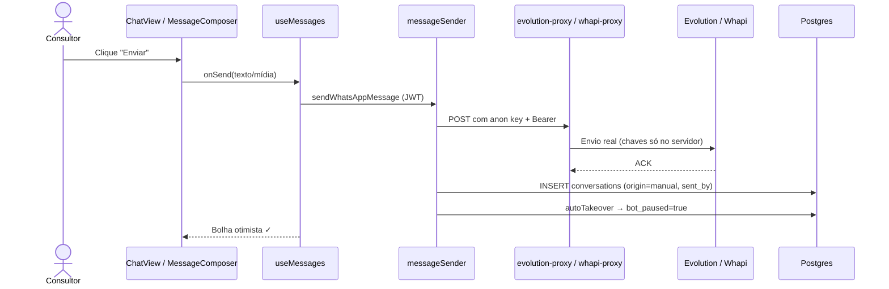
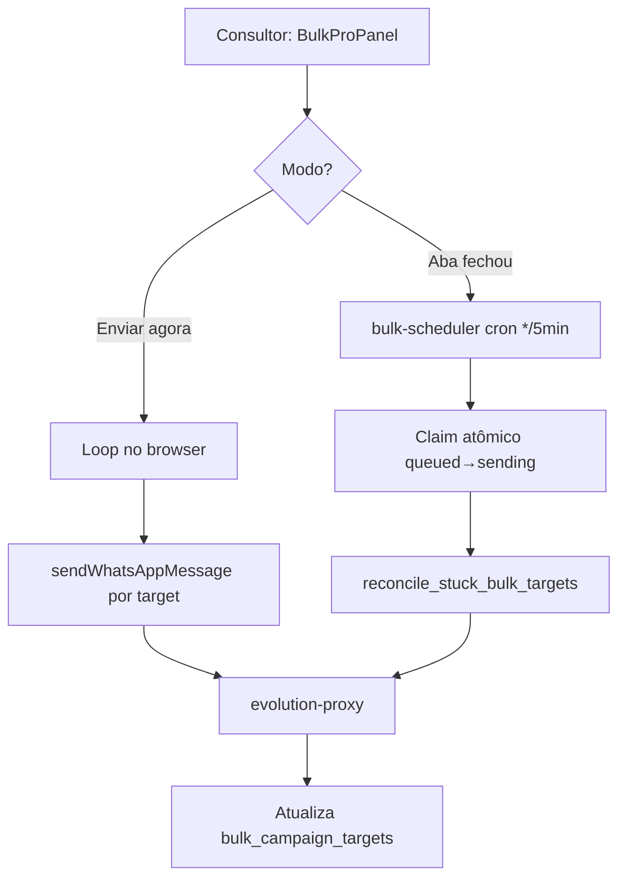
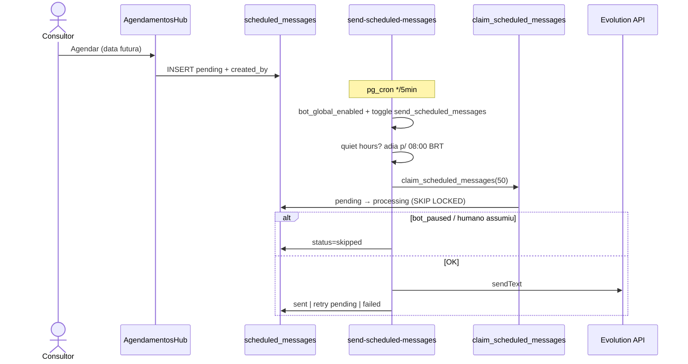
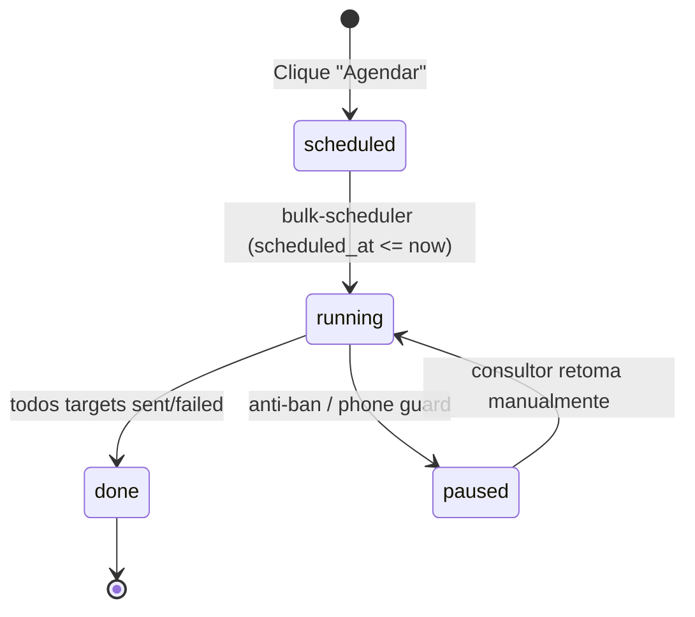
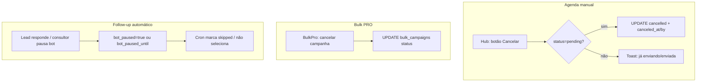
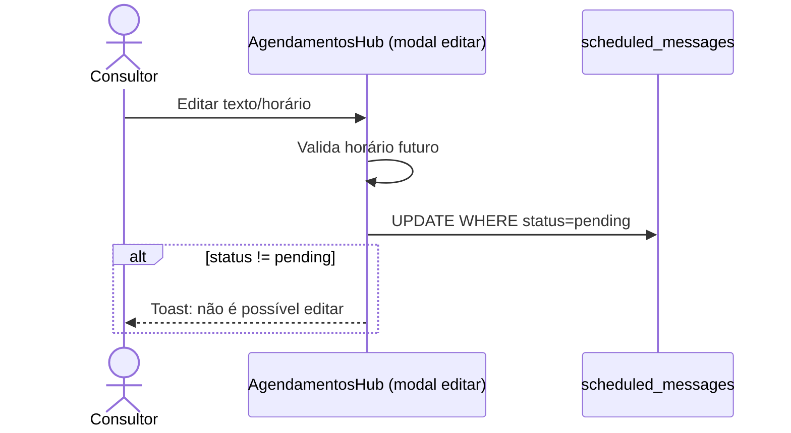
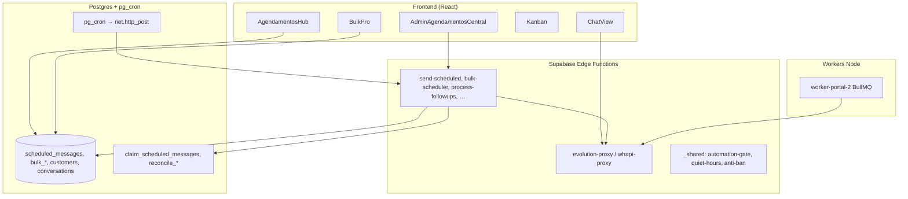

# 02 — Fluxos e Arquitetura

- **Data:** 12/07/2026
- **Complementa:** [`01-MAPA-GERAL.md`](./01-MAPA-GERAL.md) (inventário e classificação)
- **Escopo:** diagramas ponta a ponta, tabela consolidada de fluxos e riscos residuais

---

## 1. Legenda de classificação

| Classificação | Definição |
|---|---|
| **Manual individual** | Clique humano dispara envio imediato para um destinatário |
| **Manual em lote** | Clique humano dispara envio imediato para N destinatários (loop no browser ou batch) |
| **Agendado** | Clique humano cria registro com `scheduled_at` futuro; execução posterior por cron/worker |
| **Automático por regra** | Cron ou evento de sistema dispara sem novo clique (follow-up, cadência, pós-venda…) |
| **Assistido** | Humano autoriza na UI, mas execução futura é automática (ex.: batch com auto-close) |
| **Desconhecido** | Classificação implícita no código; sem coluna `execution_mode` unificada |

---

## 2. Tabela consolidada de fluxos

| Fluxo | Origem | Execução | Arquivos principais | Tabela | Classificação correta | Status atual | Riscos |
|---|---|---|---|---|---|---|---|
| Chat — texto/mídia | Clique "Enviar" | Imediata | `ChatView.tsx` → `useMessages.ts` → `messageSender.ts` → `evolution-proxy` / `whapi-proxy` | `conversations` | Manual individual | ✅ Corrigido (`origin`, `sent_by`) | Sem idempotência backend; takeover pausa bot |
| Passos do fluxo (⚡) | Clique no passo | Imediata | `FlowQuickBar.tsx` → `manual-step-send` | `conversations`, `customers` | Manual individual | ⚠️ Híbrido | `manual-step-send` **despausa** bot após chat pausar |
| Iniciar atendimento | Clique "Iniciar" | Imediata | `useCustomerAttendance.ts` → `start-customer-attendance` | `customers`, `conversations` | Manual individual | ✅ Corrigido (bypass JWT) | Toggle ainda bloqueia chamadas sem operador |
| Finalizar atendimento | Clique "Finalizar" | Imediata | `end-customer-attendance` → `attendance-flow.ts` | `customers` | Manual individual | ✅ Manual | — |
| Batch de atendimento | Seleção + clique | Imediata + auto-close futuro | `runAttendanceBatch.ts` → `OpenAttendanceBatchDialog.tsx` | `customers` (`attendance_auto_close_at`) | Assistido | ⚠️ Parcial | Auto-close oculto na UI |
| Disparo PRO "agora" | Clique "Enviar" | Imediata (browser) | `BulkProPanel.tsx` | `bulk_campaigns`, targets | Manual em lote | ✅ Manual | Fallback cron se aba fechar; `isWhapi` não repassado |
| Disparo PRO "agendar" | Clique "Agendar" | Futura (cron) | `ScheduleStep.tsx` → `bulk-scheduler` | `bulk_campaigns` | Agendado | ✅ Corrigido (texto UI) | Depende toggle `bulk_campaigns_runner` OFF |
| Agenda manual (hub) | Clique "Agendar" | Futura (cron */5min) | `AgendamentosHub.tsx` → `send-scheduled-messages` | `scheduled_messages` | Agendado | ✅ Corrigido (claim, autoria, cancel soft) | Só Evolution; sujeito a `bot_global_enabled` |
| Kanban CRM | Drag + confirmação | Imediata | `KanbanBoard.tsx` | `crm_auto_message_log` | Manual individual | ✅ Corrigido (toast) | Envio direto via proxy, sem agenda |
| Ligação agendada | Clique "Agendar ligação" | Futura (cron) | `ScheduleCallButton` → `voice-dialer-enqueue` → `voice-dialer-cron` | `voice_campaigns` | Agendado | ✅ Agendado | Secret hardcoded em migration antiga |
| Follow-up postpone | Lead pede "amanhã" | Cron */5min | `postpone-intent.ts` → `process-followups` | `customers.next_followup_at` | Automático por regra | ✅ Corrigido (`bot_paused_until`, "segunda") | Dois crons de follow-up coexistem |
| Follow-up "sumido" | Regra 6–48h | Cron diário | `bot-followup-checker` | `customers` | Automático por regra | ✅ Corrigido (toggle próprio) | Toggle nasce OFF |
| Pós-venda D+N | Regra por data | Cron diário | `pos-venda-auto-progress` | `customer_auto_message_log` | Automático por regra | ⚠️ Cron adicionado em migration | Toggle OFF; job precisa deploy |
| Reaquecimento | Regra 24h+ | Cron horário | `reactivation-cron` | `reactivation_sends` | Automático por regra | ⚠️ Cron adicionado | Sem filtro `assigned_human_id` |
| Cadência | Regra por estágio | Cron */5min | `cadence-tick` → `cadence-engine.ts` | `lead_cadence_state` | Automático por regra | ⚠️ Mitigado (toggle OFF) | Avança estágio mesmo com falha |
| Nudge FAQ | Regra 20min | Cron */30min | `faq-reengagement-nudge` | `customers` | Automático por regra | ✅ Corrigido (toggle) | Toggle nasce OFF |
| Watchdog loop | Regra >N msgs | Cron 1×/h | `bot-loop-watchdog` | `bot_handoff_alerts` | Automático por regra | ⚠️ Sem toggle | Envia sem quiet hours |
| Auto-close atendimento | `attendance_auto_close_at` | Cron */5min | `close-attendance-scheduled` | `customers` | Automático por regra | ⚠️ Cron adicionado | Flag pode ficar presa em exception |
| Worker portal | Submit cadastro | Fila BullMQ | `worker-portal-2/server.mjs` | Redis, `customers` | Automático por evento | ✅ Aceitável | Transacional, sem anti-ban |

---

## 3. Diagramas por fluxo

### 3.1 Manual individual (chat)



**Características:** sem cron, sem agenda, sem `bot_global_enabled`. Rate-limit 5s por contato no frontend.

---

### 3.2 Manual em lote (Disparo PRO imediato)



**Rede de segurança:** campanha `running` continua no servidor se o browser fechar. Claim atômico e reconciliador implementados na auditoria.

---

### 3.3 Agendado — agenda manual (`scheduled_messages`)



**Cancelamento:** `status=cancelled` + `canceled_at`/`canceled_by` (soft cancel). Só funciona enquanto `pending`.

---

### 3.4 Agendado — Disparo PRO (`bulk_campaigns`)



Execução: `bulk-scheduler` promove `scheduled→running`, processa targets com claim `queued→sending` atômico, reconcilia presos >20min.

---

### 3.5 Automático por regra — follow-ups

```mermaid
flowchart LR
  subgraph Entrada
    L[Lead: "me chama segunda"]
    W[Webhook detecta postpone]
  end
  subgraph Agendamento
    W --> P[postpone-intent.ts]
    P --> C[customers.next_followup_at + bot_paused_until]
  end
  subgraph Execução
    CRON[process-followups */5min]
    CRON --> G{Gates}
    G -->|quiet hours| SKIP[Pula tick]
    G -->|bot_paused_until futuro| SKIP2[Filtra lead]
    G -->|TERMINAL_STEPS| SKIP3[Filtra lead]
    G -->|OK| SEND[Envia via Whapi/Evolution]
  end
  C --> CRON
  L --> W
```

**Paralelo:** `bot-followup-checker` (toggle `bot_followup_checker`, separado desde a auditoria) cobre leads "sumidos" 6–48h.

---

### 3.6 Cancelamento



Não existe cancelamento unificado — cada domínio tem sua semântica.

---

### 3.7 Edição / reagendamento



**Bulk PRO:** edição de campanha `scheduled` antes do horário; após `running`, só pausar ou aguardar conclusão.

**Follow-up:** lead pode pedir novo postpone → `postpone-intent` recalcula `next_followup_at`.

---

## 4. Camadas de arquitetura



---

## 5. Gates universais (ordem típica nos crons)

1. `bot_global_enabled` — kill switch global (fail-open ⚠️)
2. `automation_toggles.<key>` — granular, default **OFF**
3. `quiet-hours` / `business-window` — janela BRT
4. `anti-ban` (`check_send_quota` / `register_send`) — dia contábil BRT ✅
5. Filtros de lead: `bot_paused`, `bot_paused_until`, `assigned_human_id`, `TERMINAL_STEPS`

Envios **manuais via proxy** (chat, Kanban, passos ⚡) **não passam** por esses gates — correto por design.

---

## 6. Riscos arquiteturais residuais

| Risco | Severidade | Notas |
|---|---|---|
| Classificação implícita (sem `execution_mode`) | Média | Mitigado parcialmente com `origin`/`sent_by` |
| Agenda manual bloqueada por `bot_global_enabled` | Média | Decisão de produto pendente |
| `send-scheduled-messages` só Evolution | Alta | Consultor Whapi-only não recebe agenda |
| Dois crons de follow-up | Média | Toggles separados; critérios ainda sobrepostos |
| `bot-loop-watchdog` sem toggle | Média | Envia fora de quiet hours |
| Jobs pg_cron novos precisam deploy | Alta | Migration `20260712234500` no repositório |

---

*Próximo: [`03-BANCO-E-ESTADOS.md`](./03-BANCO-E-ESTADOS.md) — schema, máquinas de estado e RLS.*
