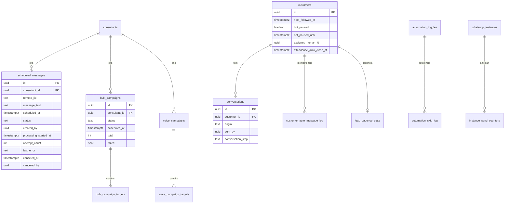
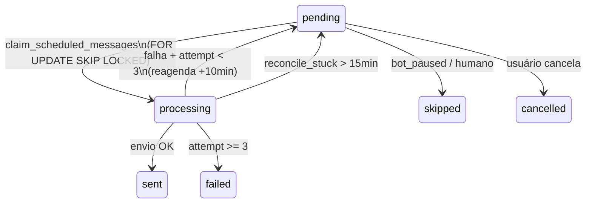

# 03 — Banco de Dados e Estados

- **Data:** 12/07/2026
- **Migrations de correção:** `20260712233000_auditoria_agendamentos_claim_rastreio.sql`, `20260712234500_auditoria_agendamentos_pg_cron_jobs.sql`
- **Princípio:** 100% aditivo — nenhuma coluna/tabela removida

---

## 1. Diagrama entidade-relacionamento (domínio de agendamentos)



---

## 2. Tabelas principais

### 2.1 `scheduled_messages` — agenda manual do hub

| Campo | Tipo | Descrição |
|---|---|---|
| `id` | uuid | PK |
| `consultant_id` | uuid | Dono (RLS) |
| `instance_name` | text | Instância Evolution |
| `remote_jid` | text | Destino WhatsApp |
| `message_text` | text | Corpo da mensagem |
| `scheduled_at` | timestamptz | Quando executar |
| `status` | text | Ver máquina de estados abaixo |
| `sent_at` | timestamptz | Quando enviou |
| `created_by` | uuid | **Novo** — quem agendou |
| `processing_started_at` | timestamptz | **Novo** — início do claim |
| `attempt_count` | int | **Novo** — tentativas (máx 3) |
| `last_error` | text | **Novo** — última falha |
| `canceled_at` / `canceled_by` | timestamptz/uuid | **Novo** — cancelamento soft |

**Índice:** `idx_scheduled_messages_pending_due` em `(scheduled_at) WHERE status='pending'`.

**Problemas históricos (corrigidos):** sem claim atômico, sem autoria, cancelamento era DELETE, sem retry.

---

### 2.2 `bulk_campaigns` + `bulk_campaign_targets`

**Campanha:**

| Campo | Relevante para |
|---|---|
| `status` | `scheduled → running → done \| paused` |
| `scheduled_at` | Promoção automática pelo cron |
| `config` | Janela horária, weekdaysOnly, mediaOrder |
| `total`, `sent`, `failed` | Métricas |

**Target (novos campos da auditoria):**

| Campo | Descrição |
|---|---|
| `claimed_at` | Quando entrou em `sending` |
| `claim_attempts` | Tentativas de destravamento |

---

### 2.3 `conversations` — rastreabilidade manual × automático

| Campo | Valores | Preenchido por |
|---|---|---|
| `origin` | `manual`, `scheduled`, `automation:<cron>`, `bot`, NULL (legado) | `messageSender`, crons |
| `sent_by` | uuid do operador | Envios manuais com JWT |
| `conversation_step` | `consultor_manual`, passos do fluxo, etc. | Vários |

Registros anteriores à auditoria permanecem com `origin=NULL`.

---

### 2.4 `automation_skip_log` — log de toggles desligados

Substitui tentativa falha de gravar em `cadence_action_log` com colunas inexistentes.

```sql
CREATE TABLE automation_skip_log (
  id uuid PRIMARY KEY,
  key text NOT NULL,        -- ex: 'send_scheduled_messages'
  meta jsonb DEFAULT '{}',
  created_at timestamptz
);
```

RLS: admin pode SELECT; service_role INSERT.

---

### 2.5 `customers` — colunas de agendamento implícito

| Coluna | Uso |
|---|---|
| `next_followup_at` | Follow-up de postpone |
| `bot_paused` / `bot_paused_until` | Pausa temporária ou permanente |
| `followup_count`, `followup_hook` | Sequência de nudges |
| `assigned_human_id` | Humano assumiu — bloqueia automação |
| `attendance_auto_close_at` | Auto-close do batch de atendimento |
| `customer_origin` | Filtro carteira iGreen |

---

### 2.6 `automation_toggles` — chaves relevantes

| Key | Categoria | Default | Função |
|---|---|---|---|
| `send_scheduled_messages` | agenda | OFF | Agenda manual |
| `bulk_campaigns_runner` | agenda | OFF | Disparo PRO |
| `process_followups` | ia | OFF | Follow-up postpone |
| `bot_followup_checker` | ia | **OFF (novo)** | Follow-up "sumido" |
| `faq_reengagement_nudge` | ia | **OFF (novo)** | Nudge pós-FAQ |
| `start_customer_attendance` | atendimento | OFF | Só chamadas sem JWT |
| `end_customer_attendance_auto` | atendimento | OFF | Auto-close |
| `cadence_engine` | ia | OFF | Motor cadência |
| `reactivation_cron` | ia | OFF | Reaquecimento |
| `pos_venda_auto_messages` | ia | OFF | Pós-venda D+N |

**Regra de segurança:** todos os toggles novos nascem **OFF**.

---

## 3. Funções RPC (migration `20260712233000`)

### 3.1 `claim_scheduled_messages(p_limit)`



- **SECURITY DEFINER**, só `service_role`
- Dois workers paralelos recebem conjuntos disjuntos
- Limite: 1–200 (default 50)

### 3.2 `reconcile_stuck_scheduled_messages()`

- `processing` > 15 min → `pending` (incrementa `attempt_count`) ou `failed` na 3ª
- Chamada no início de cada tick de `send-scheduled-messages`

### 3.3 `reconcile_stuck_bulk_targets()`

- `sending` > 20 min → `queued` ou `failed` na 3ª
- Chamada no início de cada tick de `bulk-scheduler`

### 3.4 `check_send_quota` / `register_send` (atualizados)

- **Correção:** `v_today := (now() AT TIME ZONE 'America/Sao_Paulo')::date`
- Antes: dia UTC → reset do anti-ban às 21h BRT

---

## 4. Máquinas de estado por entidade

### 4.1 `scheduled_messages.status`

| Estado | Terminal? | Transições |
|---|---|---|
| `pending` | Não | → `processing` (claim), → `cancelled` (usuário) |
| `processing` | Não | → `sent`, → `pending` (retry), → `failed`, → `skipped` |
| `sent` | Sim | — |
| `failed` | Sim | — |
| `skipped` | Sim | Lead pausado/humano assumiu |
| `cancelled` | Sim | **Novo** — soft cancel |

> **Nota:** não há CHECK constraint — valores são texto livre gerenciado pelo código.

### 4.2 `bulk_campaigns.status`

```
scheduled → running → done
              ↓
            paused (anti-ban, phone guard)
```

`draft` existe no schema mas nunca é usado pelo app.

### 4.3 `bulk_campaign_targets.status`

```
queued → sending → sent | failed
         ↑________↓ (reconcile_stuck_bulk_targets)
```

### 4.4 `voice_campaign_targets.status`

```
queued → dialing → completed | no_answer | failed
```

Estados `answered`/`busy`/`machine` são lidos mas nunca escritos (mapeados para `completed`).

---

## 5. pg_cron — jobs registrados

### 5.1 Já existentes (consolidação `20260708014208`)

| Job | Frequência | Edge function |
|---|---|---|
| `send-scheduled-messages-every-5min` | */5min | send-scheduled-messages |
| `bulk-scheduler-tick` | */5min | bulk-scheduler |
| `voice-dialer-tick` | */5min | voice-dialer-cron |
| `bot-followup-checker-daily` | 12:00 UTC | bot-followup-checker |
| `faq-reengagement-nudge-30min` | */30min | faq-reengagement-nudge |
| `bot-stuck-recovery-hourly` | 1×/h | bot-stuck-recovery |
| `bot-loop-watchdog-hourly` | 1×/h :05 | bot-loop-watchdog |

### 5.2 Adicionados na auditoria (`20260712234500`)

| Job | Frequência | Edge function | Observação |
|---|---|---|---|
| `process-followups-tick` | */5min | process-followups | Envia `x-internal-secret` de `settings.embed_internal_token` |
| `cadence-tick-5min` | */5min | cadence-tick | — |
| `reactivation-cron-hourly` | 0 * * * * | reactivation-cron | — |
| `pos-venda-auto-progress-daily` | 10:00 UTC (07h BRT) | pos-venda-auto-progress | — |
| `close-attendance-scheduled-5min` | */5min | close-attendance-scheduled | — |

**Reversão:** `cron.unschedule('<jobname>')` para cada job.

**⚠️ Deploy:** migrations no repositório ≠ jobs ativos em produção. Validar via `admin-cron-status` ou `SELECT * FROM cron.job`.

---

## 6. RLS e segurança

| Tabela | Política | Avaliação |
|---|---|---|
| `scheduled_messages` | `consultant_id = auth.uid()` | ✅ Isolamento correto |
| `bulk_campaigns` / targets | Por consultor | ✅ |
| `voice_campaigns` / targets | Por consultor | ✅ |
| `conversations` | Por customer/consultor | ✅ |
| `automation_skip_log` | Admin SELECT | ✅ |
| `automation_toggles` | Admin write, consultor read | ✅ |
| Crons | `service_role` | ✅ Bypass RLS |

**Frontend:** chaves Evolution/Whapi **nunca** expostas — apenas JWT + anon key nos proxies.

**Problema residual:** `ai_decisions` INSERT policy `TO public WITH CHECK true` — ampla demais (fora do escopo imediato).

---

## 7. Problemas de schema identificados

| # | Problema | Status |
|---|---|---|
| S1 | Sem CHECK em `scheduled_messages.status` | PENDENTE (baixo risco) |
| S2 | `holidays` — tabela morta, zero referências | DOCUMENTADO |
| S3 | `source_step_id` / `pause_on_holiday` prometidos, cron não lê | DOCUMENTADO |
| S4 | `bulk_campaigns.status='draft'` nunca usado | DOCUMENTADO |
| S5 | Secret voice-dialer hardcoded em migration antiga | PENDENTE |
| S6 | `logSkipped` antigo falhava 100% | ✅ CORRIGIDO (`automation_skip_log`) |

---

## 8. Propostas de migration futuras (aditivas)

| Prioridade | Proposta | Justificativa |
|---|---|---|
| Média | CHECK constraint em `scheduled_messages.status` | Integridade |
| Média | Coluna `execution_mode` unificada | Relatórios |
| Baixa | `provider_message_id` em `scheduled_messages` | Rastreio de duplicata no provedor |
| Baixa | Deprecar `holidays` via COMMENT (sem DROP) | Clareza |
| Média | Mover secret voice-dialer para `settings` | Segurança |

**Nunca:** DROP, TRUNCATE ou remoção de colunas existentes sem pedido explícito.

---

## 9. Queries úteis para diagnóstico

```sql
-- Mensagens presas
SELECT id, status, processing_started_at, attempt_count, scheduled_at
FROM scheduled_messages
WHERE status IN ('processing', 'pending')
  AND scheduled_at < now() - interval '1 hour';

-- Toggles ativos
SELECT key, enabled FROM automation_toggles ORDER BY category, key;

-- Skips recentes
SELECT key, meta, created_at FROM automation_skip_log
ORDER BY created_at DESC LIMIT 20;

-- Jobs pg_cron
SELECT jobname, schedule, active FROM cron.job ORDER BY jobname;

-- Campanhas pausadas invisíveis antes da correção
SELECT id, name, status, consultant_id FROM bulk_campaigns WHERE status = 'paused';
```

---

*Próximo: [`04-MOTOR-DE-AGENDAMENTO.md`](./04-MOTOR-DE-AGENDAMENTO.md) — quem dispara, quando e confiabilidade.*
