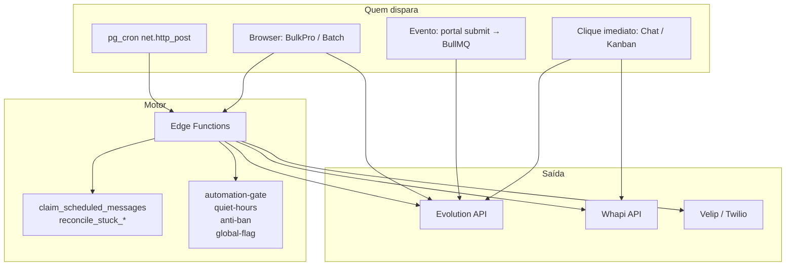
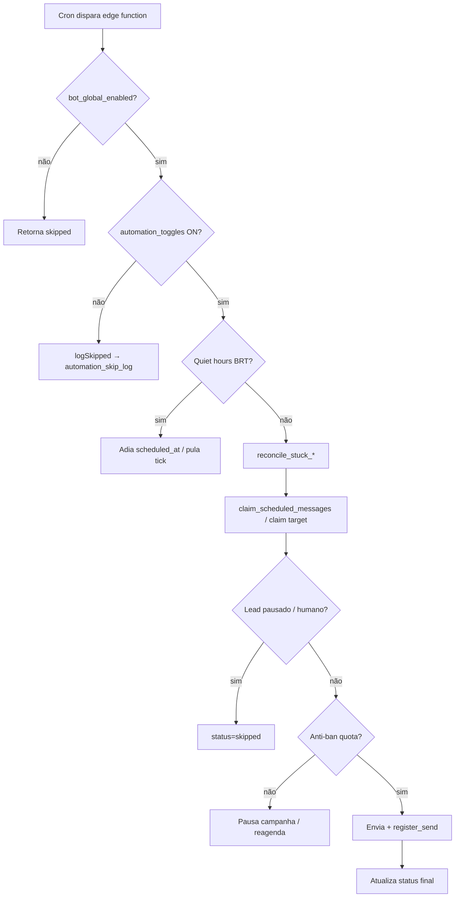
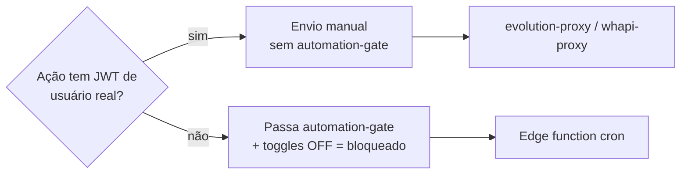

# 04 — Motor de Agendamento

- **Data:** 12/07/2026
- **Pergunta central:** quem dispara o quê, quando, com que garantias?

---

## 1. Visão geral do motor

O "motor de agendamento" **não é um único serviço**. É a combinação de:

1. **pg_cron** (Postgres) — agenda HTTP POST para edge functions
2. **Edge functions** — lógica de gates, claim, envio
3. **RPCs Postgres** — claim atômico e reconciliação
4. **Browser** — Disparo PRO imediato e batch de atendimento (com fallback cron)
5. **BullMQ** — worker-portal-2 (evento de cadastro, não cron)

---

## 2. Quem dispara cada tipo

| Tipo | Disparador primário | Disparador secundário | Frequência |
|---|---|---|---|
| Agenda manual | `send-scheduled-messages-every-5min` | — | */5min |
| Bulk agendado | `bulk-scheduler-tick` | Browser se aba aberta | */5min |
| Bulk imediato | Browser (`BulkProPanel`) | `bulk-scheduler-tick` se `running` | Contínuo no browser |
| Follow-up postpone | `process-followups-tick` | — | */5min |
| Follow-up sumido | `bot-followup-checker-daily` | — | 1×/dia 09h BRT |
| Nudge FAQ | `faq-reengagement-nudge-30min` | — | */30min |
| Pós-venda | `pos-venda-auto-progress-daily` | — | 1×/dia 07h BRT |
| Reaquecimento | `reactivation-cron-hourly` | — | 1×/h |
| Cadência | `cadence-tick-5min` | Admin "forçar tick" | */5min |
| Auto-close | `close-attendance-scheduled-5min` | — | */5min |
| Voz | `voice-dialer-tick` | — | */5min |
| Chat manual | Clique consultor | — | Sob demanda |
| Portal pós-cadastro | BullMQ worker | — | Sob demanda |

---

## 3. Quando executa (gates em ordem)

### 3.1 Pipeline típico de cron de mensagem

### 3.2 O que **não** passa pelo motor

- Envio manual via `evolution-proxy` / `whapi-proxy` (JWT do consultor)
- Passos ⚡ via `manual-step-send`
- Kanban via `messageSender` direto
- Iniciar atendimento com JWT válido (bypass do toggle)

---

## 4. Idempotência

| Mecanismo | Onde | Eficácia |
|---|---|---|
| `claim_scheduled_messages` (SKIP LOCKED) | `scheduled_messages` | ✅ Forte — dois ticks não pegam a mesma linha |
| `UPDATE … WHERE status='queued'` | `bulk_campaign_targets` | ✅ Forte — claim condicional |
| `UNIQUE (customer_id, stage_key)` | `customer_auto_message_log` | ✅ Pós-venda |
| Rate-limit 5s por contato | `messageSender.ts` (frontend) | ⚠️ Fraca — só UI |
| `attempt_count` máx 3 | `scheduled_messages` | ✅ Limita retries |
| Idempotency keys Evolution | `_shared/evolution-api` | Parcial — nem todos os crons usam |

**Lacuna residual:** anti-ban `checkSendQuota` + `registerSend` são duas operações separadas (TOCTOU) — dois workers podem estourar cap no mesmo milissegundo.

---

## 5. Recuperação de falhas

### 5.1 Mensagens agendadas

| Cenário | Comportamento |
|---|---|
| Worker morre em `processing` | `reconcile_stuck_scheduled_messages` após 15min → `pending` ou `failed` |
| Falha de envio Evolution | `attempt_count++`, reagenda +10min; 3ª falha → `failed` + `last_error` |
| Quiet hours | Adia todos `pending` devidos para 08:00 BRT |
| Anti-ban cap | Reagenda `scheduled_at` (não consome tentativa) |
| Lead pausado no momento do envio | `status=skipped` |

### 5.2 Bulk PRO

| Cenário | Comportamento |
|---|---|
| Target preso em `sending` | `reconcile_stuck_bulk_targets` após 20min |
| Anti-ban / phone guard | Campanha → `paused` |
| Browser fecha | Cron continua campanha `running` |

### 5.3 Voz (referência — melhor padrão do sistema)

- Claim `queued→dialing` atômico
- Reconcilia `dialing` > 10min
- `attempts` / `max_attempts` / `next_attempt_at`

---

## 6. Timezone

| Módulo | Implementação | Status |
|---|---|---|
| `quiet-hours.ts` | `Intl` America/Sao_Paulo | ✅ Correto |
| `business-window.ts` | `Intl` America/Sao_Paulo | ✅ Correto |
| `nudge-quiet-hours.ts` | `Intl` (antes UTC-3 fixo) | ✅ Corrigido |
| `bulk-scheduler inWindow()` | `Intl` (antes UTC-3 fixo) | ✅ Corrigido |
| `check_send_quota` / `register_send` | Dia BRT | ✅ Corrigido |
| `postpone-intent.ts` | Âncoras BRT (segunda, à noite…) | ✅ Corrigido |
| pg_cron schedules | UTC no cron expression | ⚠️ Normal — funções convertem internamente |

**Armadilha:** `datetime-local` no browser grava ISO UTC — consultor deve estar ciente do fuso local.

---

## 7. O que é pouco confiável

| Item | Motivo | Mitigação atual |
|---|---|---|
| Jobs pg_cron sem migration antiga | Podem existir só em prod manual | Migration `20260712234500` adicionada |
| `bot_global_enabled` fail-open | Erro na query → assume ligado | Documentado; kill switch manual na UI |
| Toggles default OFF | Nada envia até ligar explicitamente | Por design (produção em ajuste) |
| `send-scheduled` só Evolution | Whapi-only não recebe agenda | PENDENTE |
| Dois crons de follow-up | Critérios sobrepostos | Toggles separados |
| `bot-loop-watchdog` | Sem toggle, sem quiet hours | PENDENTE |
| Context7 / Outono | MCP indisponíveis na auditoria | Análise limitada ao repositório |
| Estado real dos toggles em prod | Seed ≠ runtime | Verificar `admin-cron-status` |
| `process-followups` exige `x-internal-secret` | Cron sem token → 401 silencioso | Migration lê `embed_internal_token` |

---

## 8. Fluxo de decisão: manual vs automático no motor

Exceção implementada: `start-customer-attendance` com JWT de consultor **não** passa pelo toggle `start_customer_attendance`.

---

## 9. Conclusão

O motor de agendamento evoluiu de um conjunto de crons independentes para um padrão mais robusto com **claim atômico**, **reconciliadores**, **retry com limite**, **rastreabilidade** e **toggles granulares** — todos nascem **OFF** por segurança.

**Pontos fortes após a auditoria:**
- Dupla execução de `scheduled_messages` eliminada via `claim_scheduled_messages`
- Bulk targets com claim condicional e reconciliador
- Dia contábil anti-ban alinhado ao BRT
- Logs de skip funcionais em `automation_skip_log`
- Crons faltantes documentados e migration criada

**Pontos fracos que permanecem:**
- Motor fragmentado (não há orquestrador único)
- Agenda manual ainda depende de Evolution e de `bot_global_enabled`
- Fail-open do kill switch global
- Alguns crons sem toggle (`bot-loop-watchdog`)
- Deploy das migrations ainda necessário para efeito em produção

**Recomendação operacional:** antes de ligar qualquer toggle, validar via **Central de Agendamentos** (`AdminAgendamentosCentral`) que os jobs pg_cron existem e que `embed_internal_token` está configurado para `process-followups`.

---

*Próximo: [`05-INTERFACE-E-EXPERIENCIA.md`](./05-INTERFACE-E-EXPERIENCIA.md) — telas, componentes e correções de UX.*
