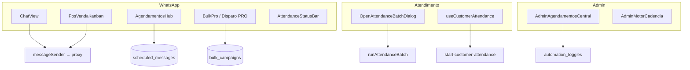

# 05 — Interface e Experiência do Usuário

- **Data:** 12/07/2026
- **Foco:** onde o consultor interage, classificação percebida vs real, correções aplicadas

---

## 1. Mapa de telas



---

## 2. Tabela tela × componente × ação

| Tela / Componente | Ação do usuário | Classificação correta | Classificação antes | Status UX | Correção recomendada / aplicada |
|---|---|---|---|---|---|
| **ChatView** + MessageComposer | Enviar texto/mídia/áudio | Manual individual | Manual individual | ✅ OK | `origin=manual`, `sent_by` no log — **CORRIGIDO** |
| **ChatView** | Iniciar atendimento (atalho) | Manual individual | "Automático" (bloqueado) | ✅ Corrigido | JWT bypass no edge — **CORRIGIDO** |
| **ChatView** | Pausar/reativar bot | Controle manual | Manual | ✅ OK | Takeover ao enviar — documentar conflito com ⚡ |
| **AgendamentosHub** | Agendar mensagem manual | Agendado (criação manual) | Agendado | ✅ Corrigido | `created_by`, validação data futura — **CORRIGIDO** |
| **AgendamentosHub** | Cancelar agendamento | Cancelamento manual | DELETE sem trilha | ✅ Corrigido | Soft cancel `cancelled` — **CORRIGIDO** |
| **AgendamentosHub** | Editar agendamento | Reagendamento manual | Sem validação na edição | ✅ Corrigido | Valida horário futuro — **CORRIGIDO** |
| **AgendamentosHub** | Timeline "Próximos envios" | Visão agendada | Campanhas `paused` sumiam | ✅ Corrigido | Badge "pausada" — **CORRIGIDO** |
| **AgendamentosHub** | Seção pós-venda / follow-up | Informativo (automático) | Automático | ⚠️ Parcial | Deixar claro que depende de toggles OFF |
| **BulkPro** ScheduleStep | Agendar campanha | Agendado | Agendado | ✅ Corrigido | Texto "aba aberta" errado — **CORRIGIDO** |
| **BulkPro** BulkProPanel | Enviar agora | Manual em lote | Manual em lote | ⚠️ Parcial | Avisar fallback cron; corrigir `isWhapi` — **PENDENTE** |
| **PosVendaKanban** KanbanBoard | Mover card + enviar msg | Manual individual | Toast dizia "automática" | ✅ Corrigido | Toast "msg(s) da coluna enviada(s)" — **CORRIGIDO** |
| **OpenAttendanceBatchDialog** | Batch iniciar atendimento | Manual em lote + assistido | Manual em lote | ⚠️ Parcial | Expor `attendance_auto_close_at` na UI — **PENDENTE** |
| **useCustomerAttendance** | Iniciar / Finalizar | Manual individual | Iniciar bloqueado por toggle | ✅ Corrigido | Bypass JWT — **CORRIGIDO** |
| **AttendanceStatusBar** | Ver protocolo / status | Informativo | OK | ✅ OK | — |
| **AdminAgendamentosCentral** | Ligar/desligar toggles | Controle de automação | OK | ✅ OK | Todos default OFF — por design |
| **ScheduleCallButton** | Agendar ligação | Agendado | Agendado | ✅ OK | — |
| **FlowQuickBar** | Clicar passo ⚡ | Manual individual | Manual (mas despausa bot) | ⚠️ Problema | Aviso ao consultor — **PENDENTE** |

---

## 3. Detalhamento por superfície

### 3.1 ChatView

**Fluxo:** compositor → `useMessages.sendMessage` → `messageSender` → proxy com JWT.

| Aspecto | Comportamento |
|---|---|
| Feedback | Bolha otimista ✓, confirmação em ~6s |
| Erro | Toast + texto preservado no compositor |
| Bot | Envio manual pausa bot (`autoTakeover`) |
| Rastreio | `conversations.origin='manual'`, `sent_by=auth.uid()` |

**Risco UX:** consultor envia no chat (pausa bot) e clica ⚡ no fluxo (religa bot) sem perceber.

---

### 3.2 AgendamentosHub

**Abas principais:** agenda manual, timeline unificada, pós-venda, follow-ups, campanhas bulk.

**Criação manual:**
- Exige WhatsApp conectado (`instanceName`)
- Valida `scheduledAt` no futuro (criação e edição)
- Grava `created_by`

**Cancelamento:**
- `UPDATE status='cancelled'` apenas se `pending`
- Toast específico se já está `processing`/`sent`

**Timeline (`buildAgendamentosTimeline`):**
- Mostra `pending` e `overdue` (vencido = "vai sair agora")
- Oculta `cancelled`, `sent`, `processing`, `skipped`
- Campanhas `paused` com badge de atenção

**Testes:** `src/lib/agendamentosHub.test.ts` (Vitest) cobre timeline e campanhas pausadas.

---

### 3.3 BulkPro (Disparo PRO)

**Modo "Enviar agora":** loop no browser — classificação **manual em lote**.

**Modo "Agendar":** grava `bulk_campaigns.scheduled_at` — classificação **agendado**.

**Texto corrigido (ScheduleStep):**
> "Envio agendado: o robô do servidor dispara no horário marcado, sem precisar da aba aberta — desde que a automação 'Campanhas em massa' esteja ligada na Central de Agendamentos."

**Pendência:** `BulkProPanel` não repassa `isWhapi` ao `sendWhatsAppMessage` no envio imediato.

---

### 3.4 Kanban (PosVendaKanban)

**Fluxo:** drag de card → confirmação → envio direto via `messageSender` (não é cron).

**Toast corrigido:**
- Antes: "msg automática(s)"
- Agora: "✅ N msg(s) da coluna 'X' enviada(s)"

Comentário no código (`KanbanBoard.tsx:62`): *"não automação. Os textos abaixo evitam o termo 'automática'."*

---

### 3.5 Iniciar atendimento

**Componentes:** `useCustomerAttendance`, `AttendanceStatusBar`, `runFastStartAttendance`, `OpenAttendanceBatchDialog`.

**Correção:** `start-customer-attendance` detecta JWT de usuário real (`isManualClick`) e **não** aplica `automation_toggles.start_customer_attendance`.

**Mensagem quando bloqueado (sem JWT):**
> "Abertura de chamado sem operador está DESLIGADA. Ative em Automações."

---

### 3.6 Central de Agendamentos (Admin)

**Papel:** único lugar para ligar automações com segurança.

| Informação para o consultor | Onde ver |
|---|---|
| Toggle está OFF? | Badge na Central |
| Cron rodou? | `admin-cron-status` (admin) |
| Mensagem não saiu? | Hub → status `skipped`/`failed`; `automation_skip_log` (admin) |

---

## 4. Classificação percebida vs correta (resumo)

```mermaid
quadrantChart
  title Matriz Percepção × Realidade
  x-axis Percebido como Manual --> Percebido como Automático
  y-axis É Manual --> É Automático
  quadrant-1 Rótulo errado (corrigir UX)
  quadrant-2 Correto
  quadrant-3 Correto
  quadrant-4 Bloqueio indevido (corrigir gate)
  Chat: [0.2, 0.9]
  Kanban antes: [0.8, 0.1]
  Kanban agora: [0.2, 0.1]
  Iniciar antes: [0.7, 0.1]
  Iniciar agora: [0.2, 0.1]
  Agenda hub: [0.3, 0.7]
  Bulk agendar: [0.4, 0.7]
```

---

## 5. Correções de UX pendentes

| # | Tela | Problema | Prioridade |
|---|---|---|---|
| U1 | OpenAttendanceBatchDialog | Auto-close invisível quando `autoCloseAfterMin > 0` | Média |
| U2 | FlowQuickBar | Despausa bot sem aviso após chat manual | Média |
| U3 | AgendamentosHub | Agenda manual bloqueada se kill switch global OFF | Baixa (decisão produto) |
| U4 | BulkProPanel | Envio imediato Whapi pode falhar silenciosamente | Alta |
| U5 | AgendamentosHub | Consultor Whapi-only não vê aviso "só Evolution na agenda" | Média |

---

## 6. Envio manual — contrato técnico (para devs de UI)

Todo envio manual deve:
1. Usar `evolution-proxy` ou `whapi-proxy` com **JWT do usuário** + anon key
2. **Não** criar registro em `scheduled_messages` (exceto se explicitamente agendando)
3. Gravar `conversations` com `origin='manual'` e `sent_by` quando possível
4. **Não** depender de toggle de automação (exceto integrações sem operador)

---

*Próximo: [`06-PROBLEMAS-ENCONTRADOS.md`](./06-PROBLEMAS-ENCONTRADOS.md) — inventário completo com status de correção.*
