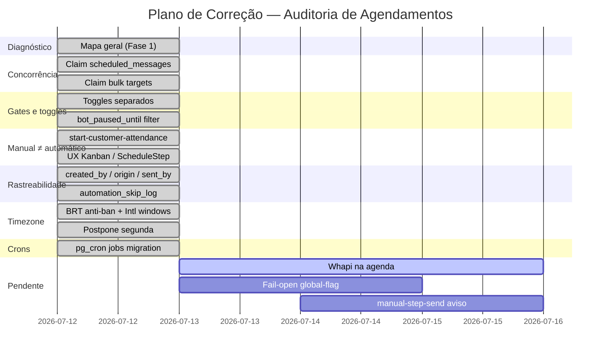

# 07 — Plano de Correção

- **Data:** 12/07/2026
- **Princípios:** aditivo, reversível, toggles nascem OFF, nada apagado, sem reativar envio automático em massa

---

## 1. Visão geral do progresso

---

## 2. Etapas detalhadas

### Etapa 0 — Diagnóstico em produção (leitura apenas)

| Item | Detalhe |
|---|---|
| **Objetivo** | Confirmar estado real antes de deploy |
| **Ações** | `admin-cron-status`; `SELECT * FROM cron.job`; `SELECT key, enabled FROM automation_toggles` |
| **Arquivos** | — |
| **Testes** | Nenhum (somente leitura) |
| **Rollback** | n/a |
| **Status** | ⬜ Pendente execução em produção |

---

### Etapa 1 — Claim atômico e reconciliadores

| Item | Detalhe |
|---|---|
| **Problemas** | C1, C2, M11, M14 |
| **Arquivos** | `20260712233000_auditoria_agendamentos_claim_rastreio.sql`, `send-scheduled-messages/index.ts`, `bulk-scheduler/index.ts` |
| **O que faz** | RPC `claim_scheduled_messages`, `reconcile_stuck_*`, retry 3×, índice parcial |
| **Testes** | Deploy migration; observar logs `[scheduled]`, `[bulk]`; query mensagens em `processing` |
| **Rollback** | Parar de chamar RPCs (git revert); colunas nullable permanecem |
| **Status** | ✅ **Concluído no código** — aguarda deploy migration |

---

### Etapa 2 — Toggles separados e filtros de follow-up

| Item | Detalhe |
|---|---|
| **Problemas** | C5, C3, M6 |
| **Arquivos** | Migration (seeds), `bot-followup-checker/index.ts`, `faq-reengagement-nudge/index.ts`, `process-followups/index.ts` |
| **O que faz** | `bot_followup_checker` e `faq_reengagement_nudge` próprios; filtro `bot_paused_until` |
| **Testes** | `deno test postpone-intent.test.ts`; invocar crons com toggle OFF → `automation_skip_log` |
| **Rollback** | Toggles OFF (default); git revert |
| **Status** | ✅ **Concluído no código** |

---

### Etapa 3 — Manual ≠ automático (UX e gates)

| Item | Detalhe |
|---|---|
| **Problemas** | A1, A5, M9 |
| **Arquivos** | `start-customer-attendance/index.ts`, `KanbanBoard.tsx`, `ScheduleStep.tsx` |
| **O que faz** | Bypass JWT em iniciar atendimento; toasts e textos corrigidos |
| **Testes** | Clicar "Iniciar" com toggle OFF → deve enviar; Kanban toast sem "automática" |
| **Rollback** | Git revert |
| **Status** | ✅ **Concluído no código** |

**Sub-etapa 3b (pendente):** expor auto-close do batch (`A4`) em `OpenAttendanceBatchDialog`.

---

### Etapa 4 — Rastreabilidade e cancelamento soft

| Item | Detalhe |
|---|---|
| **Problemas** | A3, M3, M4 |
| **Arquivos** | Migration, `AgendamentosHub.tsx`, `messageSender.ts`, `automation-gate.ts` |
| **O que faz** | `created_by`, `canceled_*`, `origin`, `sent_by`, `automation_skip_log` |
| **Testes** | `bun run test src/lib/agendamentosHub.test.ts`; cancelar agenda → `status=cancelled` |
| **Rollback** | Colunas nullable; código ignora se ausentes |
| **Status** | ✅ **Concluído no código** |

---

### Etapa 5 — Timezone unificado

| Item | Detalhe |
|---|---|
| **Problemas** | M1, M2 |
| **Arquivos** | Migration (`check_send_quota`), `postpone-intent.ts`, `bulk-scheduler/index.ts`, `nudge-quiet-hours.ts` |
| **O que faz** | Dia BRT no anti-ban; `Intl` em janelas; "segunda" → próxima segunda 09:00 |
| **Testes** | `deno test _shared/postpone-intent.test.ts`; `deno test _shared/bot/nudge-quiet-hours_test.ts` |
| **Rollback** | Reaplicar migrations antigas de `check_send_quota` (documentado na migration) |
| **Status** | ✅ **Concluído no código** |

---

### Etapa 6 — pg_cron para funções órfãs

| Item | Detalhe |
|---|---|
| **Problemas** | A7 |
| **Arquivos** | `20260712234500_auditoria_agendamentos_pg_cron_jobs.sql` |
| **O que faz** | Registra jobs: `process-followups`, `cadence-tick`, `reactivation-cron`, `pos-venda`, `close-attendance` |
| **Testes** | Após deploy: `SELECT jobname FROM cron.job WHERE jobname LIKE '%followups%'` |
| **Rollback** | `cron.unschedule('<jobname>')` para cada job |
| **Status** | ✅ **Concluído no código** — aguarda deploy |

---

### Etapa 7 — Hub: campanhas pausadas visíveis

| Item | Detalhe |
|---|---|
| **Problemas** | M10 |
| **Arquivos** | `useAgendamentosHub.ts`, `agendamentosHub.ts`, `agendamentosHub.test.ts` |
| **Testes** | `bun run test src/lib/agendamentosHub.test.ts` |
| **Rollback** | Git revert filtro |
| **Status** | ✅ **Concluído no código** |

---

### Etapa 8 — Guardas adicionais nos crons (pendente)

| Item | Detalhe |
|---|---|
| **Problemas** | M7, M8, C4 |
| **Arquivos** | `bot-loop-watchdog`, `reactivation-cron`, `cadence-tick`, `close-attendance-scheduled` |
| **O que faria** | Toggle para watchdog; TERMINAL_STEPS onde falta; não avançar cadência com falha |
| **Testes** | Deno tests por cron; dryRun |
| **Rollback** | Toggles OFF |
| **Status** | ⬜ **Pendente** |

---

### Etapa 9 — Correções de produto pendentes

| Item | Problemas | Arquivos | Status |
|---|---|---|---|
| Agenda só Evolution | A8 | `send-scheduled-messages` | ⬜ Pendente |
| `bot_global_enabled` fail-closed | M5, A6 | `global-flag.ts` | ⬜ Pendente |
| Anti-ban atômico | C6 | `_shared/anti-ban.ts` + migration | ⬜ Pendente |
| BulkPro `isWhapi` | M13 | `BulkProPanel.tsx` | ⬜ Pendente |
| Aviso ⚡ despausa bot | A2 | `FlowQuickBar`, `manual-step-send` | ⬜ Pendente |
| Auto-close visível no batch | A4 | `OpenAttendanceBatchDialog` | ⬜ Pendente |
| `close-attendance` flag stuck | M12 | `close-attendance-scheduled` | ⬜ Pendente |

---

### Etapa 10 — Testes de regressão

| Comando | O que valida |
|---|---|
| `bun run test src/lib/agendamentosHub.test.ts` | Timeline, paused, cancelados ocultos |
| `deno test supabase/functions/_shared/postpone-intent.test.ts` | "segunda", âncoras BRT |
| `deno test supabase/functions/_shared/bot/nudge-quiet-hours_test.ts` | Quiet hours FAQ |
| `bun run lint && bun run typecheck` | Tipos atualizados (`origin`, `sent_by`, etc.) |
| Invocação manual crons (staging) | toggle OFF → `automation_skip_log` |
| E2E vendedora dryRun (skill) | Fluxos conversacionais não regressam |

**Status testes no repo:** unitários de hub e postpone passam localmente; E2E não executado nesta auditoria.

---

## 3. Ordem de deploy recomendada

```mermaid
flowchart TD
  A[1. Backup / diagnóstico prod] --> B[2. Migration 20260712233000]
  B --> C[3. Migration 20260712234500]
  C --> D[4. Deploy edge functions]
  D --> E[5. Deploy frontend]
  E --> F[6. Validar crons + skip_log]
  F --> G{Operador autoriza?}
  G -->|não| H[Manter toggles OFF]
  G -->|sim| I[Ligar UM toggle por vez]
```

**Nunca** ligar todos os toggles de uma vez em produção.

---

## 4. Rollback por camada

| Camada | Ação de rollback | Impacto |
|---|---|---|
| Migration claim | Revert git; RPCs deixam de ser chamadas | Colunas ficam órfãs (ok) |
| Migration pg_cron | `cron.unschedule` por job | Crons param |
| Edge functions | Deploy versão anterior | Comportamento pré-auditoria |
| Frontend | Deploy versão anterior | UX antiga |
| Toggles | `UPDATE automation_toggles SET enabled=false` | Imediato, seguro |

---

## 5. Checklist pós-deploy

- [ ] `claim_scheduled_messages` existe: `\df claim_scheduled_messages`
- [ ] Índice `idx_scheduled_messages_pending_due` presente
- [ ] Toggles `bot_followup_checker`, `faq_reengagement_nudge` existem e estão OFF
- [ ] Jobs `process-followups-tick`, `close-attendance-scheduled-5min` ativos
- [ ] `automation_skip_log` recebe registros com toggles OFF
- [ ] Iniciar atendimento funciona com toggle OFF (JWT consultor)
- [ ] Hub mostra campanhas `paused`
- [ ] Nenhuma mensagem automática disparada sem autorização explícita

---

## 6. Status consolidado das etapas

| Etapa | Descrição | Status |
|---|---|---|
| 0 | Diagnóstico produção | ⬜ Pendente |
| 1 | Claim + reconciliadores | ✅ Código |
| 2 | Toggles + bot_paused_until | ✅ Código |
| 3 | Manual ≠ automático UX | ✅ Código |
| 4 | Rastreabilidade | ✅ Código |
| 5 | Timezone | ✅ Código |
| 6 | pg_cron jobs | ✅ Código |
| 7 | Hub paused | ✅ Código |
| 8 | Guardas crons | ⬜ Pendente |
| 9 | Correções produto | ⬜ Pendente |
| 10 | Testes regressão | ⚠️ Parcial |

---

*Próximo: [`08-RESULTADO-FINAL.md`](./08-RESULTADO-FINAL.md) — tabela de entregas e evidências.*
