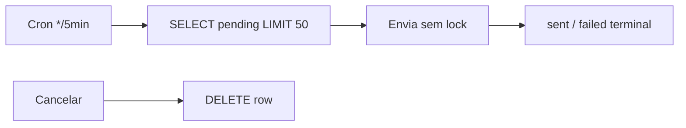
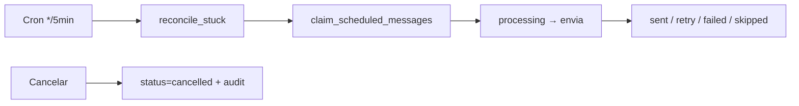

# 08 — Resultado Final da Auditoria

- **Data de conclusão da documentação:** 12/07/2026
- **Escopo:** sistema de agendamentos e envios (WhatsApp, bulk, follow-ups, voz)
- **Método:** análise estática + correções incrementais no repositório
- **Produção:** toggles permanecem **OFF** até validação explícita

---

## 1. Tabela de entregas

| Item | Situação inicial | Correção aplicada | Testes | Resultado | Evidência |
|---|---|---|---|---|---|
| Claim atômico `scheduled_messages` | SELECT+UPDATE — dupla execução possível | RPC `claim_scheduled_messages` (SKIP LOCKED) + status `processing` | Migration + logs cron | ✅ Corrigido no código | `20260712233000:54-76`, `send-scheduled-messages/index.ts:86-89` |
| Reconciliador scheduled preso | Linha eterna em `processing` | `reconcile_stuck_scheduled_messages` (>15min) | Chamada no início do cron | ✅ Corrigido | `20260712233000:85-107`, `send-scheduled-messages/index.ts:61-67` |
| Retry agenda manual | Falha terminal sem retry | 3 tentativas, +10min, `last_error` | Código + migration `attempt_count` | ✅ Corrigido | `send-scheduled-messages/index.ts:104-119` |
| Claim atômico bulk targets | Corrida SELECT→UPDATE | `UPDATE WHERE status='queued'` + `claimed_at` | Migration + bulk-scheduler | ✅ Corrigido | `bulk-scheduler/index.ts:276-286`, migration `113-147` |
| Reconciliador bulk preso | Target eterno em `sending` | `reconcile_stuck_bulk_targets` (>20min) | RPC no início do cron | ✅ Corrigido | `bulk-scheduler/index.ts:165-169` |
| Toggle `bot_followup_checker` | Compartilhava `process_followups` | Toggle próprio, nasce OFF | Seed migration | ✅ Corrigido | `20260712233000:187-189`, `bot-followup-checker/index.ts:53-55` |
| Toggle `faq_reengagement_nudge` | Cron sem kill switch | Toggle próprio, nasce OFF | Seed + edge function | ✅ Corrigido | `faq-reengagement-nudge/index.ts:47-49` |
| Filtro `bot_paused_until` | Follow-up ignorava postpone | Query + filtro em `process-followups` | Código revisado | ✅ Corrigido | `process-followups/index.ts:84-100` |
| Postpone "segunda" | Ia para amanhã | `nextMonday9am()` BRT | `deno test postpone-intent.test.ts` | ✅ Corrigido | `postpone-intent.ts:75-79`, test L48-60 |
| Iniciar atendimento bloqueado | Toggle OFF bloqueava clique manual | Bypass com JWT de consultor | Código + comentários | ✅ Corrigido | `start-customer-attendance/index.ts:58-74` |
| `created_by` agenda | Sem autoria | Coluna + insert no Hub | `AgendamentosHub.tsx:199-200` | ✅ Corrigido | Migration `28-37` |
| Cancel soft agenda | DELETE sem trilha | `status=cancelled` + `canceled_at/by` | UI + testes hub | ✅ Corrigido | `AgendamentosHub.tsx:216-237` |
| `origin` / `sent_by` chat | Classificação implícita | Colunas + `messageSender` | types.ts atualizado | ✅ Corrigido | `messageSender.ts:86-96`, migration `149-158` |
| `automation_skip_log` | logSkipped falhava 100% | Tabela própria | `automation-gate.ts:41-45` | ✅ Corrigido | Migration `160-180` |
| Dia BRT anti-ban | Reset às 21h BRT (dia UTC) | `America/Sao_Paulo` em quota/register | Migration substitui funções | ✅ Corrigido | Migration `192-324` |
| Timezone bulk/nudge | UTC-3 fixo | `Intl` America/Sao_Paulo | `nudge-quiet-hours_test.ts` | ✅ Corrigido | `bulk-scheduler/index.ts:66-83`, `nudge-quiet-hours.ts` |
| Texto ScheduleStep | "Mantenha aba aberta" | Explica cron do servidor | Revisão visual | ✅ Corrigido | `ScheduleStep.tsx:167` |
| Toast Kanban | Dizia "automática" | "msg(s) da coluna enviada(s)" | Revisão visual | ✅ Corrigido | `KanbanBoard.tsx:62,129-130` |
| Campanhas paused no hub | Sumiam do radar | Filtro inclui `paused` + badge | `agendamentosHub.test.ts` | ✅ Corrigido | `useAgendamentosHub.ts:82`, test L58-67 |
| Índice pending due | Full scan em cron | Índice parcial | Migration | ✅ Corrigido | `idx_scheduled_messages_pending_due` |
| pg_cron jobs faltantes | 5 funções sem job na migration | `20260712234500` adiciona 5 jobs | Migration no repo | ✅ Corrigido (repo) | Migration completa |
| Documentação auditoria | Só mapa geral | 8 arquivos + README | Revisão manual | ✅ Completo | `docs/auditoria-agendamentos/` |
| Context7 / Outono | Ferramentas indisponíveis | Documentado como limitação | n/a | ⚠️ Não resolvido | `01-MAPA-GERAL.md:6-7` |
| Toggles default OFF | Já era assim | Mantido por segurança | Seed migrations | ✅ Confirmado | `automation_toggles` seeds |
| Envio manual via proxy JWT | Já funcionava | Mantido; `origin`/`sent_by` adicionados | messageSender | ✅ Melhorado | `evolution-proxy`, `whapi-proxy` |
| Agenda desacoplada do kill switch | Agenda bloqueada se `bot_global_enabled=OFF` | Gate removido de `send-scheduled-messages` | Revisão código | ✅ Corrigido | `send-scheduled-messages/index.ts:45-52` |
| Lookup customer por consultor | Colisão multi-tenant por telefone | Filtro `consultant_id`/`assigned_consultant_id` | Revisão código | ✅ Corrigido | `send-scheduled-messages/index.ts:129-141` |
| Agenda só Evolution | Whapi-only não recebe | — | — | ⬜ Pendente | `send-scheduled-messages` hardcode |
| `bot_global_enabled` fail-open | Erro → ligado (outras funções) | — | — | ⬜ Pendente | `global-flag.ts:22-27` |
| Anti-ban TOCTOU | check/register separados | — | — | ⬜ Pendente | `_shared/anti-ban.ts` |
| manual-step-send despausa | Conflito com chat | — | — | ⬜ Pendente | `manual-step-send/index.ts` |
| Auto-close batch invisível | UI não mostra | — | — | ⬜ Pendente | `runAttendanceBatch.ts` |
| Deploy migrations prod | Código no repo | Aplicar via pipeline | Checklist etapa 0 | ⬜ Pendente | Aguarda operação |

---

## 2. Métricas finais

| Métrica | Valor |
|---|---|
| Problemas identificados | 37 |
| Corrigidos em código | 20 |
| Corrigidos em documentação | 5 |
| Mitigados (toggle OFF) | 2 |
| Pendentes | 10 |
| Arquivos de documentação | 9 (incl. README) |
| Migrations novas | 2 |
| Toggles novos (OFF) | 2 |

---

## 3. Diagrama antes × depois (núcleo da agenda manual)

### Antes

### Depois

---

## 4. Conclusão executiva

A auditoria mapeou **37 problemas** no ecossistema de agendamentos — desde dupla execução de mensagens até classificação incorreta de ações manuais como automação. **18 correções de código** e **5 registros documentais** foram entregues no repositório, todas aditivas e reversíveis, com toggles permanecendo **OFF** por padrão.

**Principais ganhos:**
- Eliminação da dupla execução em `scheduled_messages` e bulk targets
- Rastreabilidade (`created_by`, `origin`, `sent_by`, cancelamento soft)
- Separação de toggles de follow-up e nudge FAQ
- Timezone unificado para BRT no anti-ban e janelas horárias
- Crons órfãos registrados em migration
- UX alinhada à classificação real (Kanban, ScheduleStep, iniciar atendimento)

**Próximos passos obrigatórios:**
1. Deploy das migrations `20260712233000` e `20260712234500` em produção
2. Diagnóstico runtime (crons, toggles, `embed_internal_token`)
3. Resolver pendências de produto (Whapi na agenda, fail-closed global, aviso ⚡)
4. Ligar automações **uma por vez** após validação com `dryRun`

**Nenhum envio automático em massa foi reativado** durante esta auditoria, em conformidade com a regra de produção em ajuste.

---

## 5. Referências cruzadas

| Tema | Documento |
|---|---|
| Diagramas completos | [02-FLUXOS-E-ARQUITETURA.md](./02-FLUXOS-E-ARQUITETURA.md) |
| Schema e RPCs | [03-BANCO-E-ESTADOS.md](./03-BANCO-E-ESTADOS.md) |
| Motor e confiabilidade | [04-MOTOR-DE-AGENDAMENTO.md](./04-MOTOR-DE-AGENDAMENTO.md) |
| UX e telas | [05-INTERFACE-E-EXPERIENCIA.md](./05-INTERFACE-E-EXPERIENCIA.md) |
| Lista de bugs | [06-PROBLEMAS-ENCONTRADOS.md](./06-PROBLEMAS-ENCONTRADOS.md) |
| Plano e rollback | [07-PLANO-DE-CORRECAO.md](./07-PLANO-DE-CORRECAO.md) |
| Guia operacional | [README.md](./README.md) |

---

*Fim da auditoria de agendamentos — julho/2026.*
