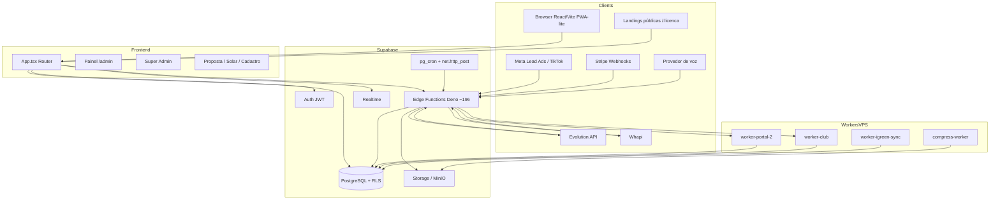
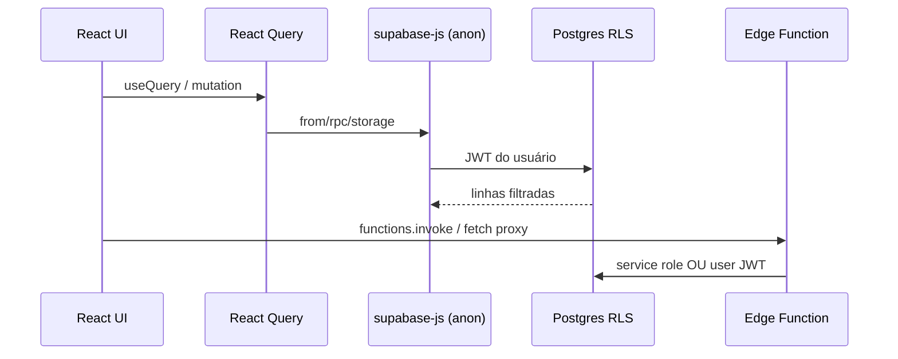
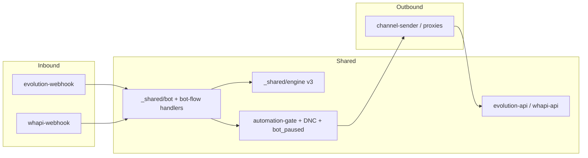
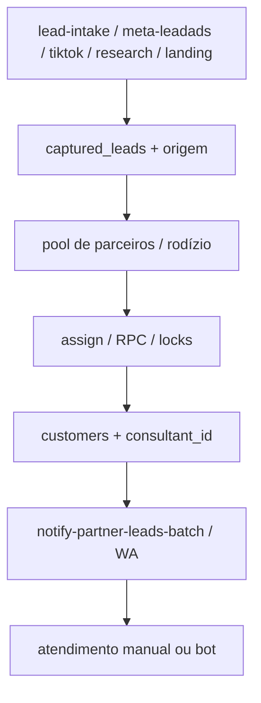
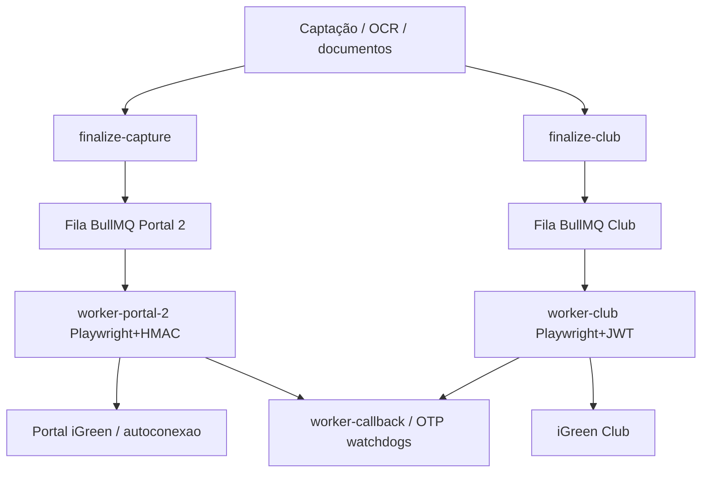
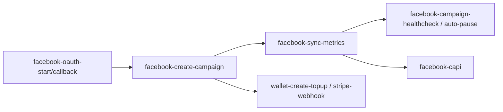
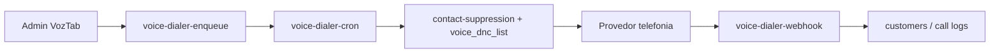
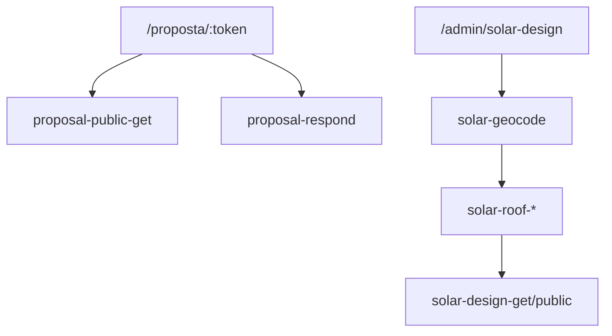
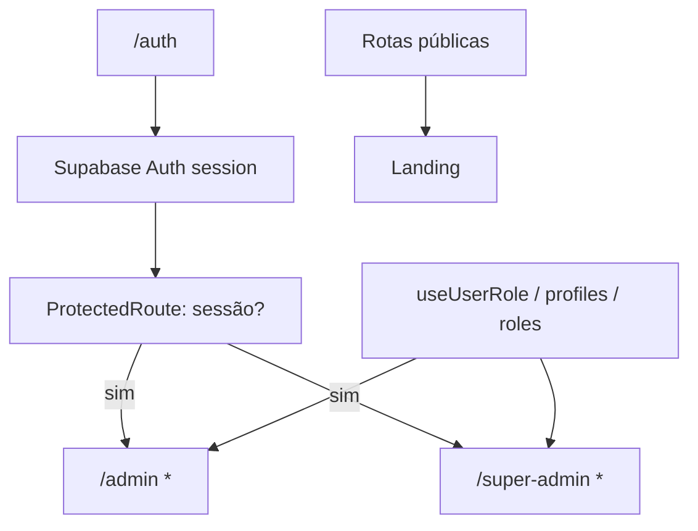

# 05 — Mapa da arquitetura real

**Fonte primária:** código executável (`src/`, `supabase/functions/`, workers, migrations).  
**Data:** 2026-07-16  
**Modo:** somente leitura  

Documentação antiga em `docs/auditoria/` e README **não** substituem este mapa. Divergências serão listadas em `14-divergencias-documentacao-codigo.md`.

---

## 1. Visão geral em camadas

---

## 2. Bootstrap do frontend

| Peça | Arquivo | Papel real |
|---|---|---|
| Entry | `src/main.tsx` | Hardening, Sentry opcional, recovery de chunk/SW, version gate via `/version.json`, **não registra** Service Worker de cache |
| App shell | `src/App.tsx` | React Query, Theme, Router, lazy routes, CookieBanner, Wallet dialog, Remote Support, Tour |
| Supabase client | `src/integrations/supabase/client.ts` | URL + **anon key hardcoded** (esperado para anon); timeout 15s; sessão em `localStorage` |
| Auth guard | `src/components/auth/ProtectedRoute.tsx` | Só checa **existência de sessão** — não valida papel (role) no guard |
| Contextos | `ThemeContext`, `PrivacyModeContext` | Tema + modo privacidade no admin |
| Features | `features/solar-3d`, `remote-support`, `onboarding`, `produtos`, `help` | Módulos isolados por domínio |

**Kill switch global de bot (já no projeto):** `app_settings.bot_global_enabled` + UI Super Admin + helper `isBotGloballyEnabled` (regra de workspace).

**Gate de automações:** `automation_toggles` via `_shared/automation-gate.ts` — default **false** (fail closed no toggle).

**DNC:** `_shared/contact-suppression.ts` (`assertCanContact`) + campo `customers.do_not_contact` + `voice_dnc_list`.

---

## 3. Frontend → Supabase

- Leituras/escritas diretas do browser passam por **RLS** (quando policy existe).
- Operações sensíveis (envio WA, OCR, Meta, voz, workers) tendem a ir para **Edge Functions**.
- Proxy de dev: `/functions-proxy` → projeto `zlzasfhcxcznaprrragl` (`vite.config.ts`).

---

## 4. Frontend → Edge Functions

Origens típicas (a detalhar por função na etapa 8):

| Origem UI | Exemplos de função |
|---|---|
| WhatsApp tab / manual send | `manual-step-send`, `start-customer-attendance`, `whapi-proxy`, `evolution-proxy` |
| Captação | `lead-intake`, `lead-research`, `leads-to-campaign`, `assign-lead-manual` |
| Meta Ads | `facebook-*`, `ad-creative-*`, `wallet-*` |
| Portal / Club | `finalize-capture`, `finalize-club`, `submit-otp`, `portal2-ai-audit` |
| Solar / Proposta | `solar-*`, `proposal-public-get`, `proposal-respond` |
| Voz | `voice-dialer-*`, `voice-sms-send` |

---

## 5. WhatsApp — dois caminhos ativos

Evidência de duplicação estrutural:

- `supabase/functions/evolution-webhook/handlers/bot-flow.ts` (~6.290 linhas)
- `supabase/functions/whapi-webhook/handlers/bot-flow.ts` (~6.590 linhas)

Ambos com `verify_jwt = false` no `config.toml` (webhooks de provedor).

---

## 6. Lead → rodízio → consultor

Código frontend de seleção circular: `src/lib/rodizio/` (com testes property/unit).  
Atribuição server-side: edge functions + SQL (etapa 10 aprofundará).

---

## 7. Captação → Portal 2 / iGreen Club

Isolamento pretendido: pastas, docs e entrypoints separados. **Comprovação de não-interferência** (Redis keys, tabelas, secrets) fica para etapa 12.

`worker-igreen-sync` é caminho legado (Tor/2captcha/VOffice) paralelo — não confundir com Portal 2.

---

## 8. Meta Ads → campanha → métricas → carteira

Muitas funções Meta com `verify_jwt = false` (crons/health) — autenticação interna a auditar.

---

## 9. Voz

---

## 10. Proposta pública e Solar 3D

Tokens públicos autenticam o recurso (não JWT de usuário). `verify_jwt = false` documentado no config.

---

## 11. Agendamentos / cadência / follow-ups

Processadores observados no inventário de funções (nomes):

| Tipo | Edge / mecanismo |
|---|---|
| Mensagens agendadas | `send-scheduled-messages`, `bulk-scheduler` |
| Follow-up bot | `bot-followup-checker`, `process-followups` |
| Cadência | `cadence-tick`, motor em `_shared` |
| Reaquecimento | `daily-reheat-cron`, `reactivation-cron` |
| Watchdogs | `bot-loop-watchdog`, `bot-stuck-recovery`, `flow-d-stuck-watchdog`, OTP watchdogs |
| Fechamento | `close-attendance-scheduled` |
| Toggle | `automation_toggles` + UI Central de Agendamentos |

UI central: `/admin/agendamentos-central` + aba `agendamentos` no Admin.

---

## 12. Autenticação → perfil → papel → acesso

**Risco estrutural a confirmar na etapa segurança:** `ProtectedRoute` não diferencia consultor vs super-admin — a autorização fina depende das páginas + RLS. Página `/assistente` **não** está sob `ProtectedRoute` em `App.tsx` (linha ~141).

---

## 13. Workers — filas, locks, retries (esqueleto)

| Worker | Entrypoint | Fila | Browser | Auth típica |
|---|---|---|---|---|
| portal-2 | `server.mjs` | BullMQ | Playwright | WORKER_SECRET / HMAC |
| club | `server.mjs` | BullMQ | Playwright | JWT Club + secret |
| igreen-sync | `server.mjs` | próprio | Playwright+Tor | legado |
| compress | `server.js` | HTTP sync | — | MinIO |

Detalhamento de locks/DLQ/heartbeat: etapa 12.

---

## 14. Pastas pedidas — status

| Pasta | Status |
|---|---|
| `src/App.tsx`, `src/main.tsx` | Presentes |
| `src/pages`, `components`, `hooks`, `contexts`, `services`, `lib`, `features`, `integrations` | Presentes |
| `supabase/functions`, `migrations` | Presentes |
| `worker-portal-2`, `worker-club`, `worker-igreen-sync`, `compress-worker` | Presentes |
| `scripts`, `.github/workflows` | Presentes |
| `docker-compose` | **Ausente** |

---

## 15. Escala que o mapa precisa carregar

- ~3.330 funções frontend + ~2.188 backend + 274 workers
- 196 edge function dirs / 71 no config.toml
- 722 migrations / ~180 funções SQL únicas / 72 cron names

Próximo documento: rotas e abas administrativas com validação página-a-página.
