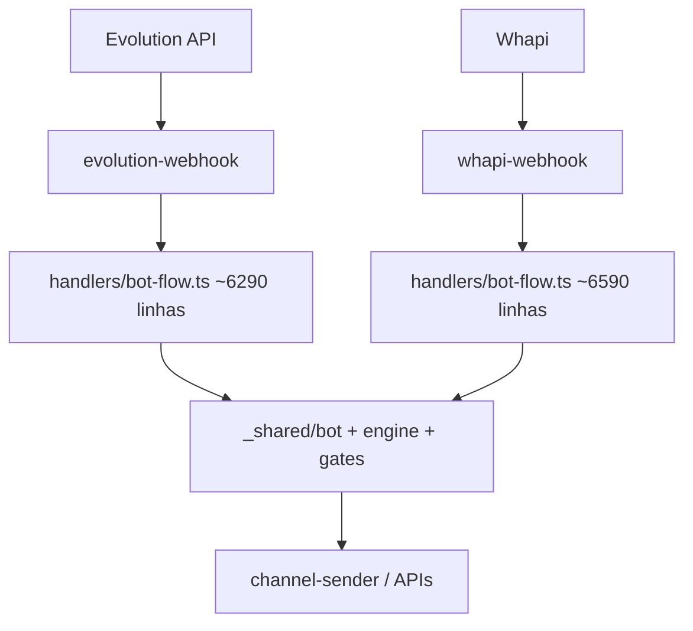

# WhatsApp, Captação e DNC (Etapas 8–9) — evidências

**Data:** 2026-07-16  
**Modo:** somente leitura  

---

## 1. Dois caminhos WhatsApp ativos

| Controle | Evolution webhook | Whapi webhook |
|---|---|---|
| verify_jwt | false | false |
| `isBotGloballyEnabled` | import + uso no index | idem |
| bot-flow monólito | sim | sim (cópia divergente provável) |

**Risco:** correção em um caminho não aplicada no outro.

---

## 2. Manual vs automação

| Caminho | Classificação | Evidência |
|---|---|---|
| `messageSender.ts` → chat UI | **manual** (`origin: "manual"` em conversations) | L91–100 |
| `manual-step-send` | manual (consultor) + `assertCanContact` | EF |
| `start-customer-attendance` | distingue `isManualClick` vs automation toggle | EF L68+ |
| Crons / cadence / followup / reheat | automação + `isAutomationEnabled` | vários |
| `reactivation-send` | proativo (manual em lote ou disparo) | **sem DNC no select** |

Kill switch automação: `automation_toggles` default **false**.  
Kill switch bot: `app_settings.bot_global_enabled`.

---

## 3. Camadas de DNC / pausa

| Camada | Arquivo | Escopo |
|---|---|---|
| Campo | `customers.do_not_contact` | Fonte da verdade WA |
| Lista voz | `voice_dnc_list` | Voz/SMS |
| Trigger DB | `enforce_do_not_contact_pause` | Impede `bot_paused=false` se DNC | Confirmado |
| `assertCanContact` | `_shared/contact-suppression.ts` | Gate unificado | **Só 2 EFs importam** |
| `checkCustomerCanSend` | `_shared/customer-pause-filter.ts` | Auto outbound + DNC | Poucos callers diretos |
| `isCustomerPaused` / bot paused | `_shared/bot/paused.ts` | Inclui DNC | Bot inbound |
| Front suppress | `src/services/contactSuppression.ts` | UI “nunca mais” | |
| Front send | `messageSender.ts` | Checa DNC | **fail-open em erro de rede** |

### Cobertura por canal (estado atual)

| Canal | DNC aplicado? | Como | Certeza |
|---|---|---|---|
| Envio manual chat (`messageSender`) | Sim (parcial) | select do_not_contact; fail-open se erro | Confirmado |
| `manual-step-send` | Sim | `assertCanContact` | Confirmado |
| `start-customer-attendance` | Sim | `assertCanContact` | Confirmado |
| `send-scheduled-messages` | Sim | campo + bot_paused | Confirmado |
| `bulk-scheduler` | Sim | filtro do_not_contact | Confirmado |
| `bot-followup-checker` | Sim | `.eq("do_not_contact", false)` | Confirmado |
| `process-followups` | Sim | idem | Confirmado |
| `reactivation-cron` | Sim | `.eq("do_not_contact", false)` | Confirmado |
| `reactivation-send` | **Não evidenciado** | select sem do_not_contact; guard só telefone instância | **Muito provável gap** |
| `daily-reheat` | Sim | plan.ts filtra DNC + voice_dnc | Confirmado |
| `faq-reengagement-nudge` | Sim | filtro | Confirmado |
| `voice-dialer-enqueue` | Sim | DNC + voice_dnc_list | Confirmado |
| `voice-sms-send` | Sim | voice_dnc + do_not_contact | Confirmado |
| `facebook-retarget-sync` | Sim | exclui do_not_contact | Confirmado |
| `notify-partner-leads-batch` | N/A parcial | Notifica **parceiro** (não lead); pode incluir dados de lead DNC | Possível vazamento informacional |
| Bot inbound (bot-flow) | Sim via paused.ts | do_not_contact → paused | Confirmado em helper |
| Mensagem inicial anúncio (CTWA) | N/A geração texto | `ad-initial-message` não envia WA | OK |
| Retry / reprocess | Parcial | Depende do caller | Necessita teste |

---

## 4. Gap crítico: `reactivation-send`

Arquivo: `supabase/functions/reactivation-send/index.ts`

- Usa `canSendProactive` (telefone consultor ↔ instância) — **não** DNC.
- Selects de customers (L199, L306) **sem** `do_not_contact` nem `assertCanContact`.
- Pode enviar reaquecimento para lead marcado “nunca mais contatar”.

**Prioridade sugerida:** P0/P1 — opt-out ignorado.

---

## 5. Gap: fail-open no front

`messageSender.ts` L177–179: se a query DNC falhar, o envio **continua**.  
Em rede instável, opt-out pode ser contornado sem intenção do consultor.

---

## 6. Idempotência / fromMe / mídia

Pendências (próxima execução — ler handlers webhook):

- [ ] Dedup `webhook_message_dedup` / message id  
- [ ] Filtro fromMe / eco  
- [ ] Normalização JID vs phone (DDI 55)  
- [ ] Concorrência bot vs humano (`assigned_human_id`, presence)  
- [ ] Download mídia / OCR retry crons  

---

## 7. Revogação de DNC

- UI: `NeverContactDialogs` + `suppressContact`  
- Trigger impede religar bot enquanto DNC true  
- **Quem pode zerar `do_not_contact`?** — auditar UPDATE policies + UI de revogação + auditoria (actor, motivo, data) na próxima passagem  

---

## 8. Captação (resumo)

- Porta HTTP: `lead-intake` (license + consent + service_role)  
- Meta/TikTok webhooks com assinatura  
- `captured_leads` → atendimento / Portal 2 / Club  
- Rodízio: `src/lib/rodizio/*` + EFs assign/notify  
