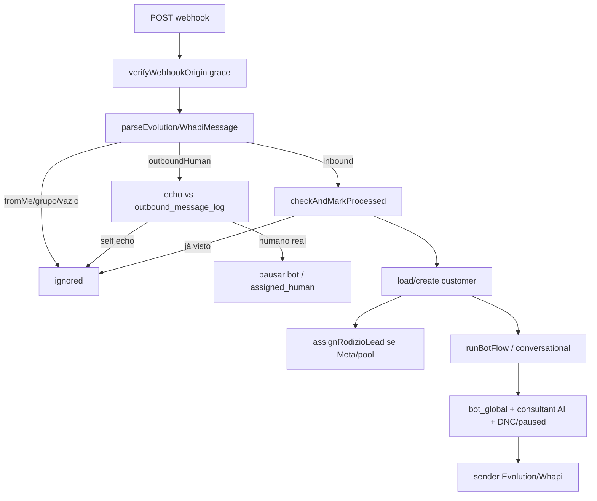

# WhatsApp webhooks — aprofundamento (Etapa 8)

**Data:** 2026-07-16  
**Arquivos lidos:** `evolution-webhook/index.ts`, `whapi-webhook/index.ts`, `_shared/webhook-auth.ts`, trechos de parse/dedup  

---

## 1. Autenticação de origem — modo GRACE

`verifyWebhookOrigin` em `_shared/webhook-auth.ts`:

- Sem env de secret → `ok: true` (fail-open).
- Com secret → exige header `x-webhook-secret` / `x-webhook-token` ou query `?secret=` / `?token=` (timing-safe).

**Nos dois webhooks o resultado NÃO bloqueia:**

```115:124:supabase/functions/evolution-webhook/index.ts
  // Validação de origem em modo GRACE (log-only).
  const originAuth = verifyWebhookOrigin(req, "EVOLUTION_WEBHOOK_SECRET");
  if (!originAuth.ok) {
    console.warn(
      "[evolution-webhook] origem sem secret (grace/log-only, NÃO bloqueia):",
      originAuth.reason,
    );
  }
```

Whapi: mesmo padrão (comentário explícito L68–80: Whapi Cloud não manda header por padrão).

| Situação | Comportamento real |
|---|---|
| Secret não configurado | Aceita qualquer POST |
| Secret configurado + token errado | **Só loga warn; processa mesmo assim** |
| Secret + token ok | Processa |

**Impacto:** URL pública + `verify_jwt=false` + grace = injeção de mensagens falsas possível se a URL vazar. Ver **AUD-007**.

---

## 2. Fluxo inbound (resumo comprovado)



---

## 3. Controles presentes (pontos fortes)

| Controle | Evolution | Whapi |
|---|---|---|
| Ignora fromMe / grupo | sim (parse) | sim |
| Eco de mensagem própria (`outbound_message_log`) | sim (~L459) | similar |
| Dedup `checkAndMarkProcessed` | sim (messageId+instance) | sim (messageId+`whapi-superadmin`) |
| Rate limit inbound | `isRateLimited(phone)` | (verificar paridade) |
| Customer lock RPC | sim (comentários L126–133) | a confirmar |
| Kill switch global outbound | `isBotGloballyEnabled` | sim |
| Log redacted | `summarizeWebhookBody` | sim |
| Rodízio atômico | `assignRodizioLead` | sim (paridade) |
| Envio conversacional idempotente | `makeIdempotentEnviarTexto` | sim |

---

## 4. Divergências Evolution vs Whapi

| Aspecto | Nota |
|---|---|
| bot-flow.ts | Dois monólitos (~6k linhas cada) — AUD-006 |
| Dedup scope | Evolution: `instanceName`; Whapi: string fixa `whapi-superadmin` |
| Rate limit helper | Import explícito no Evolution; Whapi a auditar |
| CORS | `*` em ambos |
| Público-alvo | Evolution = consultores; Whapi = super admin (comentário header) |

---

## 5. Manual vs automação no webhook

- `outboundHuman` = consultor digitou no app → **não** é automação; pode pausar bot.
- Respostas do `runBotFlow` = automação (sujeitas a kill switch / toggles / DNC via paused).
- Eco filtrado evita classificar envio da plataforma como “humano”.

---

## 6. Pendências WhatsApp

- [ ] Diff linha-a-linha dos dois bot-flow (DNC/gates)
- [ ] Confirmar rate-limit Whapi
- [ ] Ordem de eventos fora de ordem (timestamp)
- [ ] Mídia download + OCR retry path
- [ ] Enforce rígido do webhook secret (plano de ativação sem downtime)
