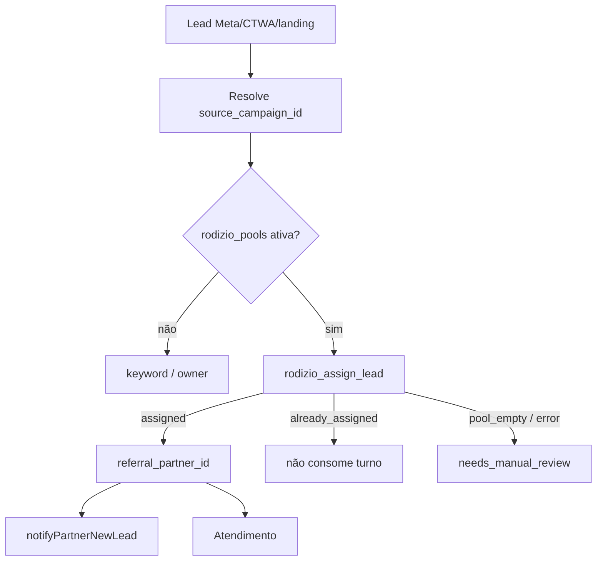

# Rodízio, parceiros e propriedade (Etapa 10)

**Data:** 2026-07-16  
**Fontes:** `_shared/rodizio-assign.ts`, migration `20260714130000_harden_rodizio_end_to_end.sql`, webhooks, `src/lib/rodizio/*`  

---

## 1. Fluxo real

---

## 2. RPC atômica `rodizio_assign_lead`

Arquivo SQL: `20260714130000_harden_rodizio_end_to_end.sql` L321–429.

| Propriedade | Evidência |
|---|---|
| SECURITY DEFINER | sim |
| `search_path` | `public` (seguro) |
| Lock customer | `FOR UPDATE` no select do customer |
| Isolamento tenant | campaign.consultant_id == customer.consultant_id → senão `tenant_mismatch` |
| Já atribuído | retorna `already_assigned` sem novo turno |
| Campanha inativa | `campaign_inactive` |
| Conflito de campanha | `campaign_conflict` se source_campaign_id diferente |
| Auth JWT | se `auth.uid()` presente, deve ser dono ou super_admin |
| Grants | EXECUTE para `authenticated` + `service_role`; revoga PUBLIC/anon |
| Ledger | INSERT em `rodizio_assignments` |

Wrapper TS: `assignRodizioLead` — nunca lança; normaliza outcomes.

`bindCustomerCampaign` — fixa campanha sem sobrescrever origem (CAS / RPC).

---

## 3. Frontend rodízio

`src/lib/rodizio/circular-selector.ts` + vários testes property/unit/integration — seleção circular testada no cliente (config de pool), atribuição server-side via RPC.

---

## 4. Riscos residuais

| Risco | Situação | Nota |
|---|---|---|
| Dupla atribuição sob concorrência | Mitigado | FOR UPDATE + already_assigned |
| Cross-tenant | Mitigado | tenant_mismatch |
| Webhook chama RPC com service_role | Esperado | bypassa check uid (uid null) — ok se só webhooks/service |
| authenticated pode chamar RPC | Confirmado | GRANT authenticated — UI precisa ownership (check no corpo) |
| Pool pausada | Tratado no webhook | não entra rodízio se pool não ativa |
| notify-partner sem DNC do lead | Possível | notifica parceiro com dados do lead mesmo se DNC (AUD candidato) |

---

## 5. Pontos fortes

- Atribuição atômica documentada e migrada.
- Outcomes explícitos (não só boolean).
- Testes frontend do seletor circular.
- Paridade Evolution/Whapi no bloco de rodízio (comentários de paridade no whapi).
