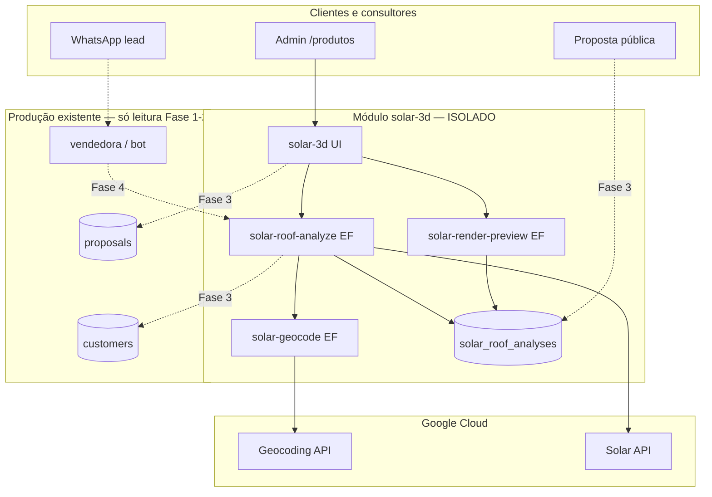

# 04 — Arquitetura técnica

## Diagrama de contexto



## Camadas

### 1. Apresentação (`experiments/` → `src/features/solar-3d/`)

| Componente | Responsabilidade |
|------------|------------------|
| `SolarDesignPage` | Shell admin — lista análises do consultor |
| `SolarAddressSearch` | Busca por customer ou endereço livre |
| `SolarMap2D` | Mapa satélite + contorno telhado (Maps JS ou static) |
| `SolarRoofViewer3D` | R3F — malha telhado + instancing painéis |
| `SolarMetricsPanel` | kWp, kWh/ano, economia R$ |
| `SolarDesignActions` | Salvar snapshot, anexar à proposta |
| `SolarSketchFallback` | Desenho manual de faces |

### 2. API (novas Edge Functions)

| Function | Método | Auth | Descrição |
|----------|--------|------|-----------|
| `solar-geocode` | POST | JWT consultor | Endereço → {lat,lng,formatted} |
| `solar-roof-analyze` | POST | JWT consultor | Orquestra Geocode + Solar + cache |
| `solar-render-preview` | POST | JWT ou token proposta | Gera PNG/WebP preview |
| `solar-design-get` | GET | JWT / public token | Lê snapshot por id |
| `solar-design-public` | GET | public_token proposta | Dados sanitizados para cliente |

**Padrão CORS** (Context7 Supabase):

```typescript
const corsHeaders = {
  "Access-Control-Allow-Origin": "*",
  "Access-Control-Allow-Headers": "authorization, x-client-info, apikey, content-type",
};
```

**Secrets** (Context7):

```typescript
const googleKey = Deno.env.get("GOOGLE_SOLAR_API_KEY");
```

### 3. Dados

Ver [07-BANCO-DADOS.md](./07-BANCO-DADOS.md).

### 4. Integrações (adapters)

| Adapter | Interface |
|---------|-----------|
| `CustomerAddressAdapter` | `customers` → string endereço + bill value |
| `ProposalSolarBlockAdapter` | `SolarDesignSnapshot` → `ProposalLineItem[]` |
| `VendedoraSolarTool` | `{ address }` → `{ summary, previewUrl }` |

Adapters vivem em `src/features/solar-3d/adapters/` — **único ponto** que toca código legado.

## Fluxo: consultor analisa telhado

```
1. Consultor abre lead (customer_id)
2. UI monta endereço de customers.*
3. POST solar-roof-analyze { customerId? | addressText }
4. EF verifica cache (hash lat/lng)
5. Se miss: geocode → findClosest → dataLayers (se preview 3D)
6. Persiste solar_roof_analyses + solar_design_snapshots
7. UI renderiza 3D + sliders (N painéis)
8. Consultor clica "Usar na proposta Placas"
9. Fase 3: OrcamentoBuilder pré-preenche projectAmountCents + line_items
```

## Fluxo: cliente vê na proposta pública

```
1. Proposta tem metadata.solar_design_id (Fase 3)
2. proposal-public-get inclui bloco solar sanitizado
3. ProposalPublicPage renderiza:
   - Imagem preview telhado
   - kWp / economia estimada
   - Disclaimer vistoria
```

## Decisões arquiteturais (ADRs)

| ID | Decisão | Alternativa rejeitada | Motivo |
|----|---------|----------------------|--------|
| ADR-01 | API Google só server-side | Key no browser | Segurança + custo |
| ADR-02 | Tabelas novas vs. JSON em customers | Coluna `roof_json` em customers | Isolamento + histórico |
| ADR-03 | PNG para WhatsApp, WebGL só admin | Só 3D | Mobile fraco + anti-ban mídia |
| ADR-04 | `requiredQuality=BASE` | Exigir HIGH | Mais cobertura BR |
| ADR-05 | Feature flag por consultor | Global on | Piloto controlado |
| ADR-06 | experiments/ primeiro | Direto em src/ | Não quebrar produção |

## Performance

| Alvo | Estratégia |
|------|------------|
| FCP admin | Lazy route `/admin/solar-design` |
| Bundle 3D | `import()` three/r3f só na rota solar |
| R3F mobile | `frameloop="demand"` (Context7 R3F) |
| API lenta | Skeleton UI + job async (opcional Fase 2b) |
| GeoTIFF pesado | Processar server-side; cliente recebe JSON leve |

## Observabilidade

- Log estruturado: `solar_analyze_duration_ms`, `imagery_quality`, `cache_hit`.
- Sentry/tag `feature=solar-3d` (se já usado no projeto).
- Dashboard super admin: chamadas/dia, taxa erro, custo estimado.
