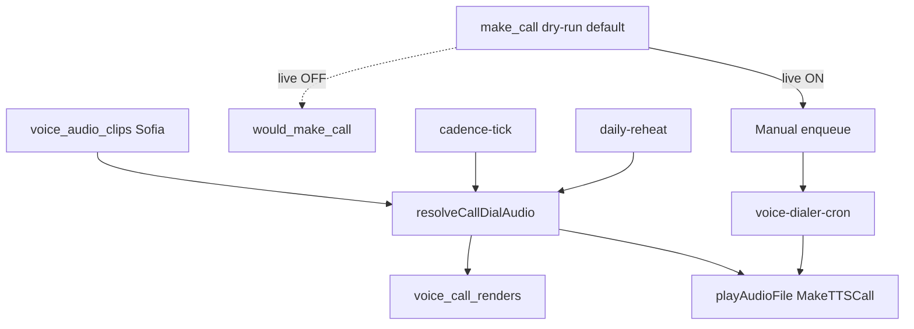

# Voice Dialer — Ligação PSTN + SMS (Velip)

Rota: `/admin?tab=voz` (sidebar → **Ligação**).

Módulo **isolado** do WhatsApp/bot (Evolution, Whapi, vendedora, Cérebro).
Nada aqui altera webhooks de chat.

## Fluxo — ligação

1. Consultor grava/envia áudio (~20s), UI converte para **MP3** (ou usa TTS).
2. Front chama `voice-dialer-enqueue` (JWT) → cria `voice_campaigns` + `voice_campaign_targets`.
3. Modo:
   - `single`: `voice-dialer-cron` (pg_cron 5 min) dispara `PlayAudioFile` / `MakeTTSCall` alvo por alvo.
   - `batch`: cria `CreateDestinationBase` + `CreateCampaign` na Velip; a Velip orquestra.
4. Velip envia callback → `voice-dialer-webhook` (auth por `?auth=<VELIP_WEBHOOK_AUTH>`).
5. Status Velip → interno; retry só p/ `NA` (Não Atendeu) até `max_attempts`.
6. Opcional: SMS fallback se terminar em `no_answer` e a campanha tiver `sms_on_no_answer_text`.

## Fluxo — SMS

| Origem | Edge / motor | Tracking |
|--------|--------------|----------|
| Manual (aba SMS) | `voice-sms-send` → Velip `MakeSMS` | `voice_sms_log` |
| Fallback pós-NA | `voice-dialer-webhook` | `voice_sms_log` (prefixo fallback) |
| Cadência `SMS_1` / `SMS_2` | `cadence-tick` | `voice_sms_log` + `cadence_action_log` |

- Números na `voice_dnc_list` (aba **Não Perturbe**) não recebem ligação nem SMS.
- OTP do cadastro iGreen **não** usa este módulo (API Portal).

## Stack

| Peça | Detalhe |
|------|---------|
| Tabelas | `voice_audio_clips`, `voice_campaigns`, `voice_campaign_targets`, `voice_call_logs`, `voice_sms_log`, `voice_contact_bases`, `voice_dnc_list` |
| Edges | `voice-dialer-enqueue`, `voice-dialer-cron`, `voice-dialer-webhook`, `voice-dialer-health`, `voice-campaign-control`, `voice-sms-send`, `voice-contact-base`, `voice-dashboard-metrics` |
| Shared | `supabase/functions/_shared/voice-dialer/velip.ts` |
| UI | `src/components/admin/voz/*` (VozTab · Dialer · SMS · Bases · DNC · Histórico · Painel · Ajuda) |

## Secrets

Preencher em Supabase → Project Settings → Edge Functions → Secrets
(ou `./scripts/setup-velip-secrets.sh` com `SUPABASE_ACCESS_TOKEN` + `VELIP_API_TOKEN`):

```bash
# Bearer da conta Velip (painel Velip → Integrações → API)
VELIP_API_TOKEN=

# String aleatória forte (32+ chars) usada como ?auth= dos callbacks
# Gerar: openssl rand -hex 32 → colar aqui e no painel Velip (URL de retorno)
VELIP_WEBHOOK_AUTH=

# OPCIONAL: BINA padrão E.164 (55DDNNNNNNNN)
VELIP_CALLER_ID=

# Mesmo valor de public.settings.key=voice_dialer_cron_secret
VOICE_DIALER_CRON_SECRET=
SERVICE_SHARED_SECRET=
```

**Status ops (2026-07-13):** `VELIP_WEBHOOK_AUTH` e `VOICE_DIALER_CRON_SECRET` já
gravados nas Edge secrets (cron alinhado com `public.settings`). Falta só
`VELIP_API_TOKEN` (o token no painel Velip **não** entra sozinho no Supabase).

**pg_cron:** o job `voice-dialer-tick` lê o header de
`public.settings` onde `key = 'voice_dialer_cron_secret'` (mesmo valor do Edge secret).
Não embutir o secret em migrations novas.

URL do callback a colar no painel Velip → Integrações → URLs para Retorno:

```
https://zlzasfhcxcznaprrragl.supabase.co/functions/v1/voice-dialer-webhook?auth=<VELIP_WEBHOOK_AUTH>
```

O valor exato de `?auth=` é o secret `VELIP_WEBHOOK_AUTH` (não versionar no git).
Recuperar: Dashboard → Edge Functions → Secrets, ou arquivo local gerado no setup.
## Mapa de status Velip → interno

| Velip `cd_called_status` | Interno | Retry? |
|--------------------------|---------|--------|
| `OK` | `completed` | não |
| `NA` | `no_answer` | **sim** (até `max_attempts`) |
| `EK` | `failed` (número inválido) | não |
| `CK` | `failed` (bloqueio operadora) | não |
| `BK` | `failed` (não perturbe) | não → auto-DNC |
| `IK` | `failed` (inexistente) | não → auto-DNC |

## Ligação individual (test_call)

`voice-dialer-enqueue` com `action: "test_call"`, `test_phone`, `audio_clip_id`.
Cria campanha efêmera + 1 target + `MakeTTSCall` imediato (com `content` p/ áudio).

## Protocolo Velip (armadilhas — corrigido em 2026-07-13)

Fonte: https://api.velip.com.br/ (repo `velipbr/velip-docs`). O driver
`_shared/voice-dialer/velip.ts` respeita:

- Resposta sempre no envelope `{"return": {...}}`; `status_code` é **string** ("0" = ok).
- **Ligação com áudio gravado = `MakeTTSCall` + `content=<id sem prefixo tf>`.**
  O endpoint `PlayAudioFile` só BAIXA/streama o áudio — não disca.
- Campos oficiais: `callerid`, `timelimit`, `block` (agendar), `voice`, `encoding=UTF-8`
  (form default é ISO-8859-1 → sem isso acentos corrompem no TTS).
- Upload (`CreateAudioFile`): campo `audio` + `name` + **`ttswrt=1`** (senão o áudio
  expira em 1 dia e o `velip_audio_id` salvo apodrece). Resposta: `return.cdw_file`.
- `GetUserID` **não retorna saldo** (API v2 não expõe saldo → banner mostra "ver painel Velip").
- `GetCallStatus`: resposta em `calls[].cd_status`; `cd_id` usa formato `<db>_<id>` — passar
  exatamente como veio do `MakeTTSCall`.
- `CreateDestinationBase` (`datajson`) retorna **erro 230** nesta conta → o enqueue faz
  fallback automático de `batch` para `single` (cron disca 1 a 1). Se a Velip habilitar
  listas na conta, o batch volta a funcionar sozinho.
- `ChangeCampaign`: só `active` 0/1 (não existe cancel na API; cancelar = pausar + status no banco).

## Reconciliação

Cron reconcilia targets em `dialing` há > 10 min sem callback via `GetCallStatus`.
Idempotente — chama sempre que passar.

## Cadência (automática)

`cadence-tick` dispara `CALL_*` / `SMS_*` só se:

1. `automation_toggles.cadence_engine` ON
2. `app_settings.cadence_engine_enabled` ON
3. Toggle do estágio ON (`cadence_call_1` … `cadence_sms_2`)
4. Config do estágio habilitada em `cadence_stage_config`

Default de todos os toggles: **OFF**.

### Áudio Sofia na cadência (wiring 2026-07-17)

- Preferir `cadence_stage_config.voice_audio_clip_id` (clip ElevenLabs em `voice_audio_clips`).
- `personalize_name` costura intro `"Olá, {Nome}."` via `resolveCallDialAudio` → `voice_call_renders` (ElevenLabs só se não houver cache).
- `velip_audio_id` permanece como fallback legado.
- UI: Admin → Motor Cadência — seletor de clip Sofia (TTS Velip bloqueado).

### Passo `make_call` no construtor

- Colunas: `bot_flow_steps.voice_audio_clip_id`, `personalize_name`.
- Runtime (Whapi/Evolution conversational): `handleMakeCallStep` em `_shared/bot/make-call-step.ts`.
- Fail-closed: exige `bot_global_enabled` **e** `automation_toggles.bot_flow_make_call` (default **OFF**).
- Com OFF: só log `would_make_call` (dry-run; **não** disca, **não** chama ElevenLabs).
- Com ON: enfileira campanha single (`voice_campaigns` + target queued) — o cron disca; não há `MakeTTSCall` síncrono no webhook.

### Checklist prontidão (sem gastar API)

```bash
# SQL read-only — gaps de clip / kills / make_call sem áudio
# Rodar no SQL Editor: scripts/voice-call-readiness.sql
```

### Mapa dos caminhos

| Caminho | ElevenLabs | Stitch nome | Disca via | Gate |
|---------|------------|-------------|-----------|------|
| Manual enqueue / ScheduleCall | UI `tts-proxy` | cron se `personalize_name` | cron `playAudioFile` | JWT consultor |
| Daily reheat | kit clip | `runCall` | `playAudioFile` | 4 cadeados OFF |
| Cadência CALL_* | `voice_audio_clip_id` | `personalize_name` | `dispatchVoiceCall` | cadence_* OFF |
| Bot `make_call` | clip do passo | opcional | enqueue → cron | bot + `bot_flow_make_call` OFF |



## Segurança

- `voice-dialer-webhook`: `?auth=` obrigatório; soft‑check dos IPs Velip (`35.232.103.91`, `35.184.30.236`).
- `voice-dialer-cron`: `x-voice-dialer-cron-secret` **ou** service_role **ou** `x-service-secret`.
- `voice-dialer-enqueue`, `voice-sms-send`, `voice-campaign-control`: JWT via `resolveCaller`.
- Contadores recontados a partir dos targets (idempotente).
- Claim atômico `queued → dialing` antes de chamar Velip.

## Deploy

```bash
./scripts/deploy-voice-dialer.sh
```

`config.toml`: `voice-dialer-cron`, `voice-dialer-webhook` e `voice-dialer-health` com `verify_jwt = false`.

## Custos

Cobrança 100% pelo saldo da conta Velip (mostrado no banner). Ver painel Velip.

## Legado Twilio

O driver `supabase/functions/_shared/voice-dialer/twilio.ts` foi mantido apenas
como referência histórica. Não é mais chamado por nenhuma edge.
